<!-- README.md is generated from README.Rmd. Please edit that file -->


# A model-free differences-in-differences framework

<!-- badges: start -->

[](https://cran.r-project.org/package=npsf) [](https://cran.r-project.org/package=npsf) [](https://cran.r-project.org/package=npsf) [](https://github.com/OlegBadunenko/didnp) [](https://cran.r-project.org/web/checks/check_results_npsf.html) [](https://github.com/OlegBadunenko/didnp/commits/main)

<!-- badges: end -->

<!-- README.md is generated from README.Rmd. Please edit that file -->

The **didnp** package contains tools for computing average treatment effect parameters in a Difference-in-Differences setup without specifying a model.  


## The framework

The **didnp** package implements the framework developed in

* 


## Installation

You can install **didnp** from CRAN with:


```r
install.packages("didnp", dependencies = TRUE)
```

or get the latest version from github with:


```r
if ( !require("devtools") ) install.packages("devtools"); library(devtools)
devtools::install_github("OlegBadunenko/didnp")
```

## Illustration

> The following is a simplified example ...,  which comes from [that](https://elsevier.com/).

Data set is shared by [Kuka et al, 2020](https://doi.org/10.1257/pol.20180352). Here we showcase the functionality of the package by using a subset, which is available in the package and can be loaded by


```r
  library(didnp)
  library(ggplot2)
  data(DACAsub, package = "didnp")
  head(DACAsub)
#R>    inschool hs scol post elig fem race var.bpl state year age yrimmig ageimmig a1418 a1922 a2330 htus perwt
#R>  1        0  1    1    1    0   1    3       4     1 2015  27    1988        0    NA    NA     1   NA    32
#R>  2        0  1    1    0    0   1    1       0     1 2007  29    1978        0    NA    NA     1   NA    39
#R>  3        1  0    0    1    0   1    4       4     1 2013  16    2000        3     1    NA    NA   NA   119
#R>  4        0  0    0    1    1   0    3       3     1 2012  23    1990        1    NA    NA     1   NA    11
#R>  5        0  1    1    1    0   1    3       3     1 2014  26    1987       -1    NA    NA     1   NA   111
#R>  6        0  1    0    0    0   1    2       3     1 2006  21    1986        1    NA     1    NA   NA   320
```

The description of the dataset can be found by typing


```r
  ?DACAsub
```

Although this can be done on the fly, the subsample can be prepared beforehand:


```r
# get the subsample
DACAsub$sub_a1418_all <- mysmpl <- 
  DACAsub$a1418==1 & !is.na(DACAsub$a1418)
table(DACAsub$sub_a1418_all)
#R>  
#R>   FALSE   TRUE 
#R>  215653 114453

# generate 'treatment_period'
DACAsub$treatment_period <- ifelse( DACAsub[,"year"] > 2011, 1, 0)
```

### Estimation

To estimate the average treatment effects, we use the **didnpreg** function. Define the formula that we will use:


```r
form1 <- inschool ~ fem + race + var.bpl + state + age + yrimmig + 
  ageimmig | inschool | year | elig | treatment_period | perwt
```

The **didnpreg** function allows using matrices. The manual explains how to use matrix syntax (type `?didnpreg`). To obtain standard errors,

> we will use a few number of bootstrap replicaitons here, but we advise to set `boot.num = 399` or larger. 


```r
B <- 99
```

To speed up the estimation

> on computers with multiple cores, use multiplrocessing by setting option `cores`. 

Suppress output by setting `print.level = 0`. The default value is 1.


```r
# suppress output
tym1a <- didnpreg(
  form1,
  data = DACAsub,
  subset = mysmpl,
  bwmethod = "opt",
  boot.num = B,
  TTx = "TTa",
  print.level = 2,
  digits = 8,
  cores = 16)
#R>  Number of Observations is  114453 
#R>  Number of Unordered Categorical Regressors is   4 
#R>  Number of Ordered Categorical Regressors is     3 
#R>  
#R>  Bandwidths are chosen via the plug-in method
#R>  
#R>    Regressor    Type    Bandwidth
#R>  1       fem  factor 1.901226e-04
#R>  2      race  factor 4.329600e-05
#R>  3   var.bpl  factor 2.897670e-05
#R>  4     state  factor 3.629340e-06
#R>  5       age ordered 4.737941e-05
#R>  6   yrimmig ordered 8.688889e-06
#R>  7  ageimmig ordered 1.697394e-05
#R>  
#R>  Calculating ATET: TTa
#R>  TTa = 0.0076709834, N(TTa) = 5387
#R>  Calculating ATET completed in 13 seconds
#R>  
#R>  Bootstrapping standard errors (99 replications)
#R>  Calculating residuals completed
#R>  Bootstrapping standard errors completed in 58 seconds
#R>  
#R>  TTa sd = 0.005820258
```

**didnpreg** returns a class **didnp** object.  This object contains estimates of the average treatment effects and their standard errors.  To see these, we can call the **summary** function.


```r
# Print the summary of estimation
summary(tym1a)
#R>  Number of Observations is  114453 
#R>  Number of Unordered Categorical Regressors is   4 
#R>  Number of Ordered Categorical Regressors is     3 
#R>  
#R>  Bandwidths are chosen via the plug-in method
#R>  
#R>    Regressor    Type    Bandwidth
#R>  1       fem  factor 1.901226e-04
#R>  2      race  factor 4.329600e-05
#R>  3   var.bpl  factor 2.897670e-05
#R>  4     state  factor 3.629340e-06
#R>  5       age ordered 4.737941e-05
#R>  6   yrimmig ordered 8.688889e-06
#R>  7  ageimmig ordered 1.697394e-05
#R>  
#R>  Bootstrapping standard errors (99 replications) completed in 58 seconds
#R>  
#R>  Unconditional Treatment Effect on the Treated (ATET):
#R>  Error in if (x$TTb) {: argument is of length zero
rm(tym1a)
```

Estimating $TT_b$ will take longer. The bandwidths is cross-validated.


```r
# Show output as the estimation goes
tym1b <- didnpreg(
  form1,
  data = DACAsub,
  subset = mysmpl,
  bwmethod = "CV",
  boot.num = B,
  TTx = "TTb",
  print.level = 2,
  digits = 8,
  cores = 16)
#R>  Number of Observations is  114453 
#R>  Number of Unordered Categorical Regressors is   4 
#R>  Number of Ordered Categorical Regressors is     3 
#R>  
#R>  Calculating cross-validated bandwidths
#R>  Kernel Type for Unordered Categorical Regressors is    Aitchison and Aitken
#R>  Kernel Type for Ordered Categorical is                 Li and Racine
#R>  Calculating cross-validated bandwidths completed in 1 minute and 39 seconds
#R>  
#R>    Regressor    Type    Bandwidth
#R>  1       fem  factor 1.827072e-04
#R>  2      race  factor 4.392238e-05
#R>  3   var.bpl  factor 2.273964e-05
#R>  4     state  factor 1.096748e-04
#R>  5       age ordered 4.768492e-05
#R>  6   yrimmig ordered 4.144541e-05
#R>  7  ageimmig ordered 4.216168e-05
#R>  
#R>  Calculating ATET: TTb
#R>  TTb = 0.02163795, N(TTb) = 56959
#R>  Calculating ATET completed in 2 minutes and 16 seconds
#R>  
#R>  Bootstrapping standard errors (99 replications)
#R>  Calculating residuals completed
#R>  Bootstrapping standard errors completed in 10 minutes and 13 seconds
#R>  TTb sd = 0.0072693185
```

### Plotting Heterogenous Treatment Effects

To plot the heterogenous treatment effects, use the **didnpplothte** command. Define three variables by and over which the treatment effects will be plotted:


```r
DACAsub[tym1b$esample, "race"] -> race
DACAsub[tym1b$esample, "fem"]  -> sex
as.numeric(DACAsub[tym1b$esample, "age"]) -> age
```

Here `age` is quasi-continuous. It will have only 4 values (in fact fewer than the Race variable), but we use it to showcase the functionality.

First, use one categorical `by` variable:


```r
tym1b_gr_race <- didnpplothte(
  obj = tym1b,
  level = 95,
  by = race[tym1b$sample1],
  xlab = "Race",
  ylab = "ATET",
  by.labels.values = data.frame(
    old = c(1,2,3,4,5),
    new = c("Hispanic", "White", "Black", "Asian", "Other")
  ))

tym1b_gr_race$data.a
#R>           atet     atet.sd by      by2
#R>  1 0.011993717 0.008270328  1    Asian
#R>  2 0.011270311 0.004412343  2    Black
#R>  3 0.022788871 0.007245476  3 Hispanic
#R>  4 0.003634539 0.007069134  4    Other
#R>  5 0.048865605 0.008149357  5    White
tym1b_gr_race$data.b
#R>            atet     atet.sd by      by2
#R>  1  0.030191044 0.010486907  1    Asian
#R>  2  0.009465986 0.003469228  2    Black
#R>  3  0.036553192 0.006863302  3 Hispanic
#R>  4 -0.011254826 0.007259213  4    Other
#R>  5  0.004476847 0.007394851  5    White

tym1b_gr_race$plot.a
```

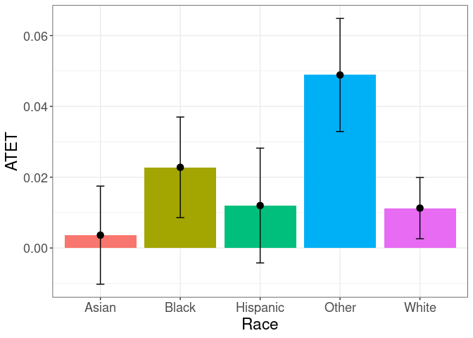

```r
tym1b_gr_race$plot.b
```

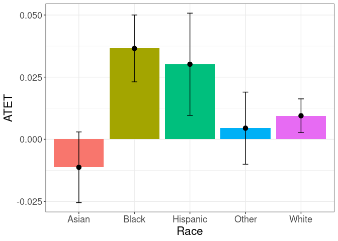

Here objects `data.a` and `data.b` contain data that is used to produce `plot.a` and `plot.b`. The graphs are `ggplot` objects and can be amended further.

Another example is the graph with treatment effects by sex. Note the sample object `tym1b` is used:


```r
tym1b_gr_sex <- didnpplothte(
  obj = tym1b,
  level = 95,
  by = sex[tym1b$sample1],
  xlab = "Sex",
  ylab = "ATET",
  by.labels.values = data.frame(c(1,0), c("Female", "Male"))
)

tym1b_gr_sex$data.a
#R>           atet     atet.sd by    by2
#R>  1 0.008272147 0.009344462  0 Female
#R>  2 0.015682133 0.006518702  1   Male
tym1b_gr_sex$data.b
#R>           atet     atet.sd by    by2
#R>  1 0.037992268 0.011913971  0 Female
#R>  2 0.003686988 0.009116154  1   Male

tym1b_gr_sex$plot.a
```

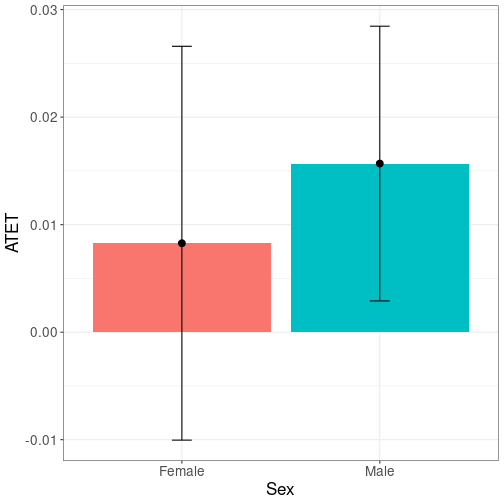

```r
tym1b_gr_sex$plot.b
```

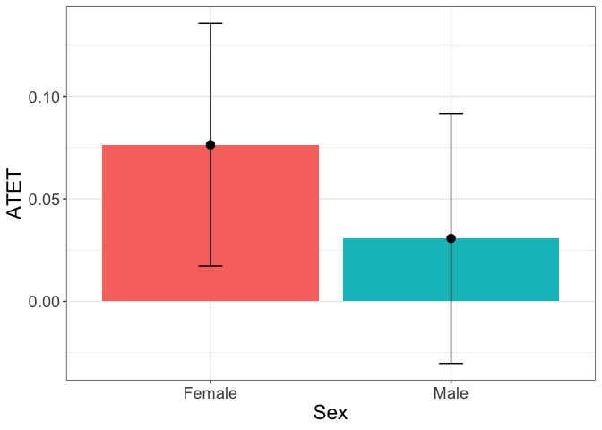

The **didnpplothte** command will recognize if `by` is continuous variable, split it into given number of intervals `n.intervals` and plot the treatment effects by the split variable.


```r
tym1b_gr_age <- didnpplothte(
  obj = tym1b,
  level = 95,
  by = age[tym1b$sample1],
  n.intervals = 10,
  xlab = "Age"
)

tym1b_gr_age$data.a
#R>             atet     atet.sd          by
#R>  1  -0.009763996 0.011617326 (0.996,1.4]
#R>  3  -0.034153071 0.007341389   (1.8,2.2]
#R>  5  -0.002217522 0.007659071     (2.6,3]
#R>  8   0.002805505 0.011864983   (3.8,4.2]
#R>  10  0.103344508 0.017867100     (4.6,5]
tym1b_gr_age$data.b
#R>             atet     atet.sd          by
#R>  1  -0.011711563 0.008598465 (0.996,1.4]
#R>  3  -0.008594248 0.005577546   (1.8,2.2]
#R>  5   0.019034473 0.006023782     (2.6,3]
#R>  8   0.033056671 0.009346651   (3.8,4.2]
#R>  10  0.082177748 0.016793647     (4.6,5]

tym1b_gr_age$plot.a
```

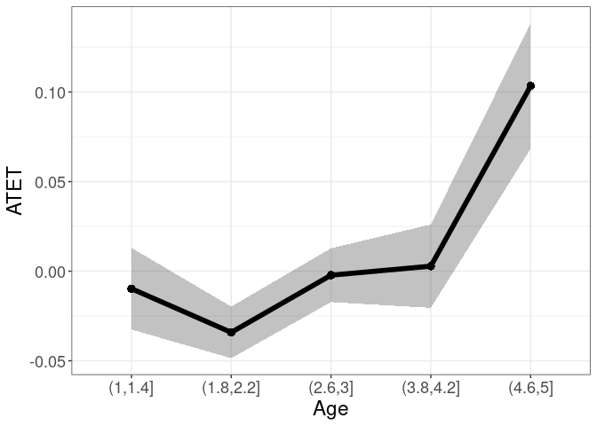

```r
tym1b_gr_age$plot.b
```

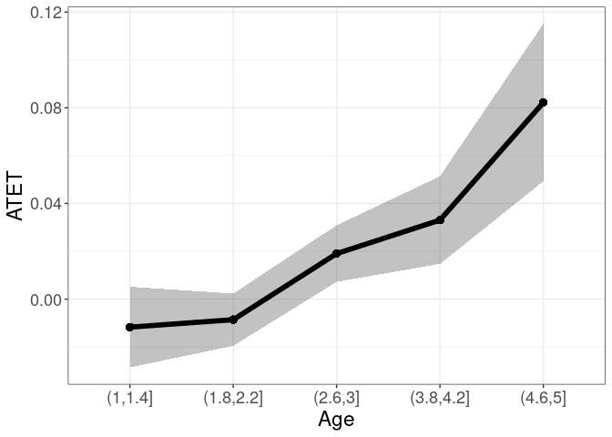

Ameding ggplot object is easy. For example adding a 0 horizontal line is


```r
tym1b_gr_age$plot.a +
  geom_hline(yintercept = 0)
```


> Anternatively, one can use the `data.a` and `data.b` objects to plot from scratch.

The treatment effects can be visualized by and over. Variable `by` can be both categorical and continuous, while `over` must be categorical. For example, to plot treatment effects by age over race, specify the `over` option:


```r
tym1b_gr_age_race <- didnpplothte(
  obj = tym1b,
  level = 90,
  by = age[tym1b$sample1],
  n.intervals = 7,
  over = race[tym1b$sample1],
  xlab = "Age",
  ylab = "ATET",
  point_size = 2,
  over.labels.values = data.frame(
    old = c(1,2,3,4,5),
    new = c("Hispanic", "White", "Black", "Asian", "Other")
  ),
  text_size = 15)

tym1b_gr_age_race$data.a
#R>             atet      atet.sd           by     over
#R>  1  -0.016768859 0.0150240621 (0.996,1.57]    Asian
#R>  2   0.012774575 0.0058123900 (0.996,1.57]    Black
#R>  3  -0.007039513 0.0172339593 (0.996,1.57] Hispanic
#R>  4  -0.019239967 0.0095726548 (0.996,1.57]    Other
#R>  5  -0.032891343 0.0073197309 (0.996,1.57]    White
#R>  6   0.001445857 0.0094433920  (1.57,2.14]    Asian
#R>  7  -0.062639092 0.0208847478  (1.57,2.14]    Black
#R>  8  -0.041935551 0.0107298586  (1.57,2.14] Hispanic
#R>  9   0.050267154 0.0035945665  (1.57,2.14]    Other
#R>  10 -0.030346989 0.0119942518  (1.57,2.14]    White
#R>  16  0.004486462 0.0084206127  (2.71,3.29]    Asian
#R>  17  0.021895735 0.0021465991  (2.71,3.29]    Black
#R>  18 -0.001365237 0.0107714326  (2.71,3.29] Hispanic
#R>  19 -0.034014171 0.0002677526  (2.71,3.29]    Other
#R>  20 -0.028598696 0.0018182087  (2.71,3.29]    White
#R>  26  0.022800879 0.0104912133  (3.86,4.43]    Asian
#R>  27  0.004154642 0.0088249859  (3.86,4.43]    Black
#R>  28 -0.002540638 0.0171598570  (3.86,4.43] Hispanic
#R>  29  0.162051767 0.0105645363  (3.86,4.43]    Other
#R>  30 -0.021056014 0.0005829334  (3.86,4.43]    White
#R>  31  0.008496514 0.0279074621     (4.43,5]    Asian
#R>  32  0.161803746 0.0207738025     (4.43,5]    Black
#R>  33  0.113148615 0.0252891431     (4.43,5] Hispanic
#R>  34  0.076987253 0.0286543029     (4.43,5]    Other
#R>  35  0.144732303 0.0142190691     (4.43,5]    White
tym1b_gr_age_race$plot.a
```


```r

tym1b_gr_age_race$data.b
#R>              atet     atet.sd           by     over
#R>  1   0.0042777679 0.005679847 (0.996,1.57]    Asian
#R>  2   0.0135585036 0.007607076 (0.996,1.57]    Black
#R>  3  -0.0178987726 0.013545149 (0.996,1.57] Hispanic
#R>  4   0.0086424091 0.002637867 (0.996,1.57]    Other
#R>  5  -0.0172003123 0.002950034 (0.996,1.57]    White
#R>  6  -0.0037632095 0.005535793  (1.57,2.14]    Asian
#R>  7   0.0110111496 0.011379642  (1.57,2.14]    Black
#R>  8  -0.0124467647 0.008118619  (1.57,2.14] Hispanic
#R>  9   0.0087777397 0.005509135  (1.57,2.14]    Other
#R>  10 -0.0058337479 0.003972801  (1.57,2.14]    White
#R>  16 -0.0083594589 0.006229344  (2.71,3.29]    Asian
#R>  17  0.0425241053 0.004037403  (2.71,3.29]    Black
#R>  18  0.0308134996 0.008716494  (2.71,3.29] Hispanic
#R>  19 -0.0340846852 0.006744155  (2.71,3.29]    Other
#R>  20 -0.0191948879 0.002797274  (2.71,3.29]    White
#R>  26 -0.0006320413 0.009655409  (3.86,4.43]    Asian
#R>  27  0.0325462907 0.007108259  (3.86,4.43]    Black
#R>  28  0.0426301730 0.013282137  (3.86,4.43] Hispanic
#R>  29  0.0358425120 0.009527052  (3.86,4.43]    Other
#R>  30  0.0170784015 0.004262117  (3.86,4.43]    White
#R>  31 -0.0542372818 0.019582282     (4.43,5]    Asian
#R>  32  0.1007822917 0.015526943     (4.43,5]    Black
#R>  33  0.1103688288 0.023482998     (4.43,5] Hispanic
#R>  34  0.0059464119 0.018826402     (4.43,5]    Other
#R>  35  0.0829565187 0.008679534     (4.43,5]    White
tym1b_gr_age_race$plot.b
```


Note that the graph shows the **90%** confidence interval. 

> Alternatively use the data from the object `tym1b_gr_age_race`

to produce another type of graph:


```r
crit.value <- 2
pd <- position_dodge(0.1) # move them .05 to the left and right
d1 <- tym1b_gr_age_race$data.b
d1$Race <- d1$over
ggplot(d1, aes(x = by, y = atet, color = Race, group = Race)) +
  geom_errorbar(aes(ymin = atet - crit.value*atet.sd, ymax = atet + crit.value*atet.sd), color = "black", width = .1, position = pd) +
  geom_line(position = pd) +
  geom_point(position = pd, size = 3, shape = 21, fill = "white") +
  xlab("Age") +
  ylab("ATET") +
  theme_bw() +
  theme(legend.position = "right", text = element_text(size = 17))
```

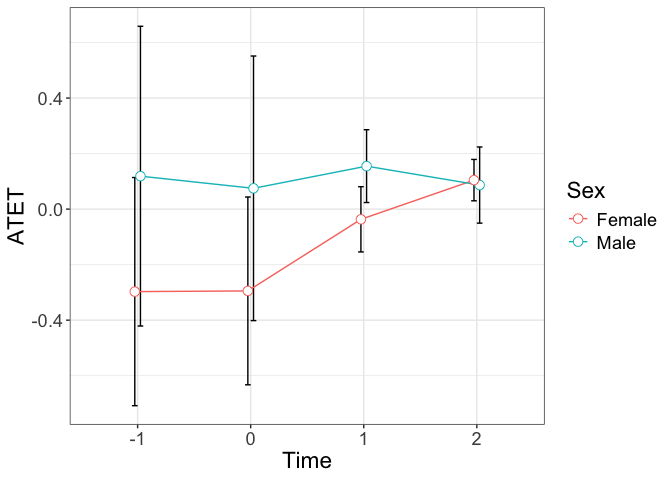

The next plot shows treatment effects by age over sex:


```r
tym1b_gr_age_sex <- didnpplothte(
  obj = tym1b,
  level = 90,
  by = age[tym1b$sample1],
  n.intervals = 7,
  over = sex[tym1b$sample1],
  xlab = "Age",
  ylab = "ATET",
  over.lab = "Sex",
  point_size = 2,
  over.labels.values = data.frame(c(1,0), c("Female", "Male")),
  text_size = 15)

tym1b_gr_age_sex$data.a
#R>              atet     atet.sd           by   over
#R>  1  -0.0289049436 0.006804722 (0.996,1.57] Female
#R>  2   0.0084251925 0.019625551 (0.996,1.57]   Male
#R>  3  -0.0224099298 0.010199053  (1.57,2.14] Female
#R>  4  -0.0455180791 0.011082620  (1.57,2.14]   Male
#R>  7  -0.0047640388 0.009112108  (2.71,3.29] Female
#R>  8   0.0002534017 0.011717491  (2.71,3.29]   Male
#R>  11  0.0356700572 0.017157482  (3.86,4.43] Female
#R>  12 -0.0281223862 0.013361511  (3.86,4.43]   Male
#R>  13  0.0944131556 0.024071741     (4.43,5] Female
#R>  14  0.1128394056 0.025844176     (4.43,5]   Male
tym1b_gr_age_sex$plot.a
```

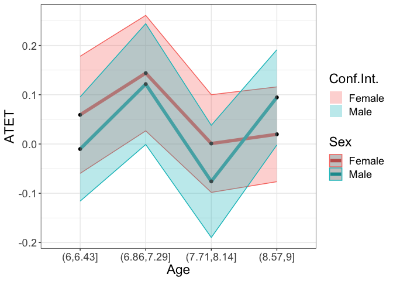

```r

tym1b_gr_age_sex$data.b
#R>             atet     atet.sd           by   over
#R>  1  -0.031641077 0.004780360 (0.996,1.57] Female
#R>  2   0.007001133 0.015882541 (0.996,1.57]   Male
#R>  3  -0.013490084 0.006143066  (1.57,2.14] Female
#R>  4  -0.003959683 0.009232123  (1.57,2.14]   Male
#R>  7  -0.003156313 0.007524146  (2.71,3.29] Female
#R>  8   0.039319598 0.009712359  (2.71,3.29]   Male
#R>  11  0.024921864 0.012189276  (3.86,4.43] Female
#R>  12  0.040067645 0.013426449  (3.86,4.43]   Male
#R>  13  0.048620186 0.026697396     (4.43,5] Female
#R>  14  0.112096184 0.024897568     (4.43,5]   Male
tym1b_gr_age_sex$plot.b
```

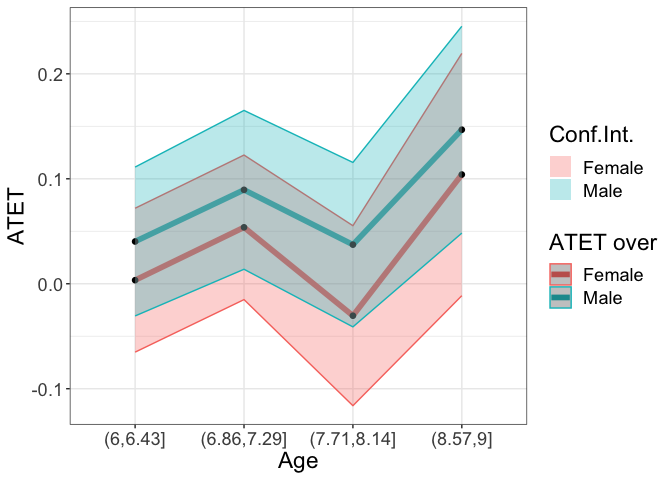

Finally, both `by` and `over` are both categorical:


```r
tym1b_gr_sex_race <- didnpplothte(
  obj = tym1b,
  level = 95,
  by = sex[tym1b$sample1],
  over = race[tym1b$sample1],
  xlab = "Sex",
  ylab = "ATET",
  over.lab = "Race",
  point_size = 3,
  by.labels.values = data.frame(c(1,0), c("Female", "Male")),
  over.labels.values = data.frame(
    old = c(1,2,3,4,5),
    new = c("Hispanic", "White", "Black", "Asian", "Other")
  ),
  text_size = 17)

tym1b_gr_sex_race$data.a
#R>             atet     atet.sd     by     over
#R>  1   0.009721911 0.009078210 Female    Asian
#R>  2   0.065237651 0.009809736 Female    Black
#R>  3   0.007827121 0.008996835 Female Hispanic
#R>  4   0.067214769 0.014719898 Female    Other
#R>  5   0.039770758 0.005462257 Female    White
#R>  6  -0.002761613 0.009593442   Male    Asian
#R>  7  -0.017730418 0.009387472   Male    Black
#R>  8   0.016041723 0.013442096   Male Hispanic
#R>  9   0.028431309 0.003980957   Male    Other
#R>  10 -0.014304234 0.006392819   Male    White
tym1b_gr_sex_race$plot.a
```

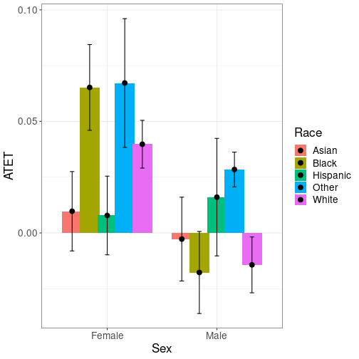

```r

tym1b_gr_sex_race$data.b
#R>             atet     atet.sd     by     over
#R>  1  -0.011550742 0.009671313 Female    Asian
#R>  2   0.047840628 0.009338561 Female    Black
#R>  3   0.000385125 0.013520005 Female Hispanic
#R>  4  -0.029138349 0.011503129 Female    Other
#R>  5   0.022905856 0.003249127 Female    White
#R>  6  -0.010981782 0.008903791   Male    Asian
#R>  7   0.025726336 0.009448019   Male    Black
#R>  8   0.057086535 0.017358836   Male Hispanic
#R>  9   0.035448152 0.005266577   Male    Other
#R>  10 -0.002906543 0.006026023   Male    White
tym1b_gr_sex_race$plot.b
```

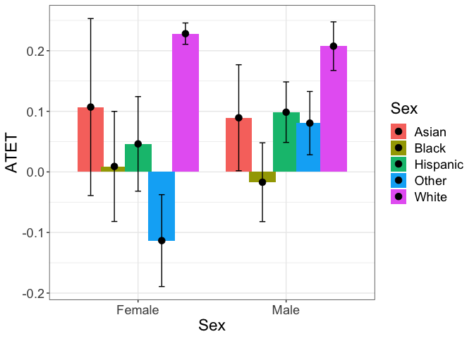

## Additional Resources

That 
