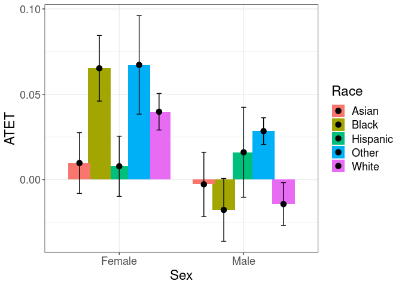
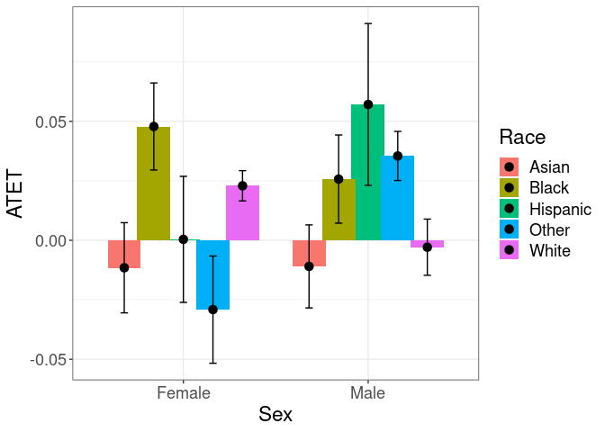

<!-- README.md is generated from README.Rmd. Please edit that file -->

# A model-free differences-in-differences framework

<!-- badges: start -->

[](https://cran.r-project.org/package=npsf)
[](https://cran.r-project.org/package=npsf)
[](https://cran.r-project.org/package=npsf)
[](https://github.com/OlegBadunenko/didnp)
[](https://cran.r-project.org/web/checks/check_results_npsf.html)
[](https://github.com/OlegBadunenko/didnp/commits/main)

<!-- badges: end -->
<!-- README.md is generated from README.Rmd. Please edit that file -->

The **didnp** package contains tools for computing average treatment
effect parameters in a Difference-in-Differences setup without
specifying a model.

## Getting Started

The **didnp** package implements the framework developed in

- 

## Installation

You can install **didnp** from CRAN with:

``` r
install.packages("didnp", dependencies = TRUE)
```

or get the latest version from github with:

``` r
if ( !require("devtools") ) install.packages("devtools"); library(devtools)
devtools::install_github("OlegBadunenko/didnp")
```

## An example

> The following is a simplified example …, which comes from
> [that](https://elsevier.com/).

Data set is shared by [Kuka et al,
2020](https://doi.org/10.1257/pol.20180352). Here we showcase the
functionality of the package by using a subset, which is available in
the package and can be loaded by

``` r
  library(didnp)
  library(ggplot2)
  data(DACAsub, package = "didnp")
  head(DACAsub)
#R>    inschool hs scol post elig fem race var.bpl state year age yrimmig ageimmig
#R>  1        0  1    1    1    0   1    3       4     1 2015  27    1988        0
#R>  2        0  1    1    0    0   1    1       0     1 2007  29    1978        0
#R>  3        1  0    0    1    0   1    4       4     1 2013  16    2000        3
#R>  4        0  0    0    1    1   0    3       3     1 2012  23    1990        1
#R>  5        0  1    1    1    0   1    3       3     1 2014  26    1987       -1
#R>  6        0  1    0    0    0   1    2       3     1 2006  21    1986        1
#R>    a1418 a1922 a2330 htus perwt treatment_period
#R>  1    NA    NA     1   NA    32                1
#R>  2    NA    NA     1   NA    39                0
#R>  3     1    NA    NA   NA   119                1
#R>  4    NA    NA     1   NA    11                1
#R>  5    NA    NA     1   NA   111                1
#R>  6    NA     1    NA   NA   320                0
```

The description of the dataset can be found by typing

``` r
  ?DACAsub
```

Although this can be done on the fly, the subsample can be prepared
beforehand:

``` r
# get the subsample
DACAsub$mysmpl <- mysmpl <-
  DACAsub$a1922==1 & !is.na(DACAsub$a1922) &
  DACAsub$htus==1 & !is.na(DACAsub$htus)

# generate 'treatment_period'
DACAsub$treatment_period <- ifelse( DACAsub[,"year"] > 2011, 1, 0)
```

To estimate the average treatment effects, we use the **didnpreg**
function. Define the formula that we will use:

``` r
form1 <- inschool ~ fem + race + var.bpl + state + age + yrimmig + 
  ageimmig | inschool | year | elig | treatment_period | perwt
```

The **didnpreg** function allows using matrices. The manual explains how
to use matrix syntax (type `?didnpreg`). To obtain standard errors,

> we will use a few number of bootstrap replicaitons here, but we advise
> to set `boot.num = 399` or more.

To speed up the estimation

> on computers with multiple cores, use multiplrocessing by setting
> option `cores`.

Suppress output by setting `print.level = 0`. The default value is 1.

``` r
# suppress output
tym1a <- didnpreg(
  form1,
  data = DACAsub,
  subset = mysmpl,
  bwmethod = "opt",
  boot.num = 7,
  TTb = FALSE,
  print.level = 0,
  cores = 8)
#R>  Bandwidths are chosen via the plug-in method
```

**didnpreg** returns a class **didnp** object. This object contains
estimates of the average treatment effects and their standard errors. To
see these, we can call the **summary** function.

``` r
# Print the summary of estimation
summary(tym1a)
#R>  Number of Observations is  34768 
#R>  Number of Unordered Categorical Regressors is   4 
#R>  Number of Ordered Categorical Regressors is     3 
#R>  
#R>  Bandwidths are chosen via the plug-in method
#R>  
#R>    Regressor    Type    Bandwidth
#R>  1       fem  factor 9.569206e-04
#R>  2      race  factor 5.831931e-05
#R>  3   var.bpl  factor 8.701817e-05
#R>  4     state  factor 1.772228e-05
#R>  5       age ordered 4.731888e-05
#R>  6   yrimmig ordered 2.763923e-05
#R>  7  ageimmig ordered 8.690101e-05
#R>  
#R>  Bootstrapping standard errors (7 replications) completed in 1 second
#R>  
#R>  Unconditional Treatment Effect on the Treated (ATET):
#R>  
#R>  TTa    = 0.03684
#R>  TTa sd = 0.6787
#R>  N(TTa) = 2337
```

Estimating $TT_b$ will take longer. The bandwidths is cross-validated.

``` r
# Show output as the estimation goes
tym1b <- didnpreg(
  form1,
  data = DACAsub,
  subset = mysmpl,
  bwmethod = "CV",
  boot.num = 99,
  TTb = TRUE,
  print.level = 1,
  cores = 8)
#R>  Number of Observations is  34768 
#R>  Number of Unordered Categorical Regressors is   4 
#R>  Number of Ordered Categorical Regressors is     3 
#R>  
#R>  Calculating cross-validated bandwidths
#R>  Kernel Type for Unordered Categorical Regressors is    Aitchison and Aitken
#R>  Kernel Type for Ordered Categorical is                 Li and Racine
#R>  Calculating cross-validated bandwidths completed in 21 second
#R>  
#R>    Regressor    Type    Bandwidth
#R>  1       fem  factor 0.0008408093
#R>  2      race  factor 0.0001004406
#R>  3   var.bpl  factor 0.0001518288
#R>  4     state  factor 0.0009238220
#R>  5       age ordered 0.0001532112
#R>  6   yrimmig ordered 0.0001297687
#R>  7  ageimmig ordered 0.0001553703
#R>  
#R>  Calculating ATET: TTa and TTb (may take some time)
#R>  TTa = 0.04365, N(TTa) = 2337
#R>  TTb = 0.05493, N(TTb) = 24018
#R>  
#R>  Bootstrapping standard errors (99 replications)
#R>  Bootstrapping standard errors completed in 2 minutes and 47 seconds
#R>  
#R>  TTa sd = 0.6344 
#R>  TTb sd = 0.5254
```

To plot the heterogenous treatment effects, use the **didnpplothte**
command. Define three variables by and over which the treatment effects
will be plotted:

``` r
DACAsub[tym1b$esample, "race"] -> race
DACAsub[tym1b$esample, "fem"]  -> sex
as.numeric(DACAsub[tym1b$esample, "age"]) -> age
```

Here `age` is quasi-continuous. It will have only 4 values (in fact
fewer than the Race variable), but we use it to showcase the
functionality.

First, use one categorical `by` variable:

``` r
tym1b_gr_race <- didnpplothte(
  obj = tym1b,
  level = 95,
  by = race[tym1b$sample1],
  xlab = "Race",
  ylab = "ATET",
  by.labels.values = data.frame(
    old = c(1,2,3,4,5),
    new = c("Hispanic", "White", "Black", "Asian", "Other")
  ))

tym1b_gr_race$data.a
#R>           atet    atet.sd by      by2
#R>  1  0.03973812 0.02329393  1    Asian
#R>  2  0.24731001 0.02776878  2    Black
#R>  3  0.07469281 0.02504381  3 Hispanic
#R>  4  0.70227835 0.12504263  4    Other
#R>  5 -0.05053639 0.04701475  5    White
tym1b_gr_race$data.b
#R>           atet    atet.sd by      by2
#R>  1  0.05464285 0.02308424  1    Asian
#R>  2  0.22616739 0.01240306  2    Black
#R>  3 -0.05820048 0.02823952  3 Hispanic
#R>  4  0.17977025 0.05264366  4    Other
#R>  5 -0.04620788 0.02864418  5    White

tym1b_gr_race$plot.a
```

<!-- -->

``` r
tym1b_gr_race$plot.b
```

<!-- -->

Here objects `data.a` and `data.b` contain data that is used to produce
`plot.a` and `plot.b`. The graphs are `ggplot` objects and can be
amended further.

Another example is the graph with treatment effects by sex. Note the
sample object `tym1b` is used:

``` r
tym1b_gr_sex <- didnpplothte(
  obj = tym1b,
  level = 95,
  by = sex[tym1b$sample1],
  xlab = "Sex",
  ylab = "ATET",
  by.labels.values = data.frame(c(1,0), c("Female", "Male"))
)

tym1b_gr_sex$data.a
#R>          atet    atet.sd by    by2
#R>  1 0.03239246 0.02861926  0 Female
#R>  2 0.05649511 0.03096917  1   Male
tym1b_gr_sex$data.b
#R>          atet    atet.sd by    by2
#R>  1 0.07637724 0.03017518  0 Female
#R>  2 0.03069940 0.03109617  1   Male

tym1b_gr_sex$plot.a
```

<!-- -->

``` r
tym1b_gr_sex$plot.b
```

<!-- -->

The **didnpplothte** command will recognize if `by` is continuous
variable, split it into given number of intervals `n.intervals` and plot
the treatment effects by the split variable.

``` r
tym1b_gr_age <- didnpplothte(
  obj = tym1b,
  level = 95,
  by = age[tym1b$sample1],
  n.intervals = 10,
  xlab = "Age"
)

tym1b_gr_age$data.a
#R>            atet    atet.sd        by
#R>  1   0.02258246 0.04143805   (6,6.3]
#R>  4   0.13175762 0.04606008 (6.9,7.2]
#R>  7  -0.04004534 0.03782480 (7.8,8.1]
#R>  10  0.05919285 0.03762810   (8.7,9]
tym1b_gr_age$data.b
#R>            atet    atet.sd        by
#R>  1  0.023020901 0.02621411   (6,6.3]
#R>  4  0.072791567 0.02778018 (6.9,7.2]
#R>  7  0.005024515 0.03053302 (7.8,8.1]
#R>  10 0.126771550 0.03814443   (8.7,9]

tym1b_gr_age$plot.a
```

<!-- -->

``` r
tym1b_gr_age$plot.b
```

<!-- -->

Ameding ggplot object is easy. For example adding a 0 horizontal line is

``` r
tym1b_gr_age$plot.a +
  geom_hline(yintercept = 0)
```

<!-- -->

> Anternatively, one can use the `data.a` and `data.b` objects to plot
> from scratch.

The treatment effects can be visualized by and over. Variable `by` can
be both categorical and continuous, while `over` must be categorical.
For example, to plot treatment effects by age over race, specify the
`over` option:

``` r
tym1b_gr_age_race <- didnpplothte(
  obj = tym1b,
  level = 90,
  by = age[tym1b$sample1],
  n.intervals = 7,
  over = race[tym1b$sample1],
  xlab = "Age",
  ylab = "ATET",
  point_size = 2,
  over.labels.values = data.frame(
    old = c(1,2,3,4,5),
    new = c("Hispanic", "White", "Black", "Asian", "Other")
  ),
  text_size = 15)

tym1b_gr_age_race$data.a
#R>            atet    atet.sd          by     over
#R>  2   0.15165527 0.01062371    (6,6.43]    Black
#R>  3   0.01626993 0.04320838    (6,6.43] Hispanic
#R>  4   0.10710845 0.06415061    (6,6.43]    Other
#R>  5   0.15114738 0.04724728    (6,6.43]    White
#R>  12 -0.34630912 0.08719329 (6.86,7.29]    Black
#R>  13  0.14358612 0.04715322 (6.86,7.29] Hispanic
#R>  14 -0.19282858 0.10943276 (6.86,7.29]    Other
#R>  15 -0.16363451 0.05504180 (6.86,7.29]    White
#R>  21  0.70227835 0.12504263 (7.71,8.14]    Asian
#R>  22  0.26682557 0.03108044 (7.71,8.14]    Black
#R>  23 -0.04913575 0.03900297 (7.71,8.14] Hispanic
#R>  24 -0.73904259 0.03624854 (7.71,8.14]    Other
#R>  25  0.34994316 0.02067305 (7.71,8.14]    White
#R>  32  0.30958898 0.03716571    (8.57,9]    Black
#R>  33  0.04583527 0.03863109    (8.57,9] Hispanic
#R>  34  0.52289920 0.21845263    (8.57,9]    Other
#R>  35  0.55774313 0.06758809    (8.57,9]    White
tym1b_gr_age_race$plot.a
```

<!-- -->

``` r

tym1b_gr_age_race$data.b
#R>             atet    atet.sd          by     over
#R>  1  -0.015983909 0.02371254    (6,6.43]    Asian
#R>  2  -0.074483104 0.01936453    (6,6.43]    Black
#R>  3   0.025132472 0.02687571    (6,6.43] Hispanic
#R>  4   0.085608034 0.02099113    (6,6.43]    Other
#R>  5  -0.048900725 0.01891856    (6,6.43]    White
#R>  11 -0.025533206 0.09713600 (6.86,7.29]    Asian
#R>  12 -0.327284870 0.03461843 (6.86,7.29]    Black
#R>  13  0.077691231 0.02855844 (6.86,7.29] Hispanic
#R>  14  0.032315749 0.06025738 (6.86,7.29]    Other
#R>  15  0.200345142 0.01642683 (6.86,7.29]    White
#R>  21  0.194504189 0.08766893 (7.71,8.14]    Asian
#R>  22  0.038704125 0.05220861 (7.71,8.14]    Black
#R>  23  0.000519385 0.03140487 (7.71,8.14] Hispanic
#R>  24 -0.245888017 0.05514657 (7.71,8.14]    Other
#R>  25  0.372330533 0.01883086 (7.71,8.14]    White
#R>  31  0.407580751 0.12459889    (8.57,9]    Asian
#R>  32  0.222648494 0.05453234    (8.57,9]    Black
#R>  33  0.121894974 0.03921493    (8.57,9] Hispanic
#R>  34 -0.145514962 0.04502563    (8.57,9]    Other
#R>  35  0.454140065 0.02488101    (8.57,9]    White
tym1b_gr_age_race$plot.b
```

<!-- -->

Note that the graph shows the **90%** confidence interval.

> Alternatively use the data from the object `tym1b_gr_age_race`

to produce another type of graph:

``` r
crit.value <- 2
pd <- position_dodge(0.1) # move them .05 to the left and right
d1 <- tym1b_gr_age_race$data.b
d1$Race <- d1$over
ggplot(d1, aes(x = by, y = atet, color = Race, group = Race)) +
  geom_errorbar(aes(ymin = atet - crit.value*atet.sd, ymax = atet + crit.value*atet.sd), color = "black", width = .1, position = pd) +
  geom_line(position = pd) +
  geom_point(position = pd, size = 3, shape = 21, fill = "white") +
  xlab("Age") +
  ylab("ATET") +
  theme_bw() +
  theme(legend.position = "right", text = element_text(size = 17))
```

<!-- -->

The next plot shows treatment effects by age over sex:

``` r
tym1b_gr_age_sex <- didnpplothte(
  obj = tym1b,
  level = 90,
  by = age[tym1b$sample1],
  n.intervals = 7,
  over = sex[tym1b$sample1],
  xlab = "Age",
  ylab = "ATET",
  point_size = 2,
  over.labels.values = data.frame(c(1,0), c("Female", "Male")),
  text_size = 15)

tym1b_gr_age_sex$data.a
#R>              atet    atet.sd          by   over
#R>  1   0.0591634709 0.05941102    (6,6.43] Female
#R>  2  -0.0102217556 0.05286890    (6,6.43]   Male
#R>  5   0.1438796053 0.05857366 (6.86,7.29] Female
#R>  6   0.1215858569 0.06130402 (6.86,7.29]   Male
#R>  9   0.0009383166 0.04956547 (7.71,8.14] Female
#R>  10 -0.0759060343 0.05692566 (7.71,8.14]   Male
#R>  13  0.0197413288 0.04809669    (8.57,9] Female
#R>  14  0.0946049730 0.04833392    (8.57,9]   Male
tym1b_gr_age_sex$plot.a
```

<!-- -->

``` r

tym1b_gr_age_sex$data.b
#R>             atet    atet.sd          by   over
#R>  1   0.003383205 0.03427280    (6,6.43] Female
#R>  2   0.040235436 0.03545742    (6,6.43]   Male
#R>  5   0.053757977 0.03442821 (6.86,7.29] Female
#R>  6   0.089472946 0.03783216 (6.86,7.29]   Male
#R>  9  -0.030444727 0.04287245 (7.71,8.14] Female
#R>  10  0.037241629 0.03916480 (7.71,8.14]   Male
#R>  13  0.104039743 0.05770329    (8.57,9] Female
#R>  14  0.146769182 0.04926300    (8.57,9]   Male
tym1b_gr_age_sex$plot.b
```

<!-- -->

Finally, both `by` and `over` are both categorical:

``` r
tym1b_gr_sex_race <- didnpplothte(
  obj = tym1b,
  level = 95,
  by = sex[tym1b$sample1],
  over = race[tym1b$sample1],
  xlab = "Sex",
  ylab = "ATET",
  point_size = 3,
  by.labels.values = data.frame(c(1,0), c("Female", "Male")),
  over.labels.values = data.frame(
    old = c(1,2,3,4,5),
    new = c("Hispanic", "White", "Black", "Asian", "Other")
  ),
  text_size = 17)

tym1b_gr_sex_race$data.a
#R>            atet    atet.sd     by     over
#R>  2  -0.10858267 0.02305363 Female    Black
#R>  3   0.05563993 0.03193745 Female Hispanic
#R>  4   0.13455875 0.08585094 Female    Other
#R>  5   0.19570925 0.02591887 Female    White
#R>  6   0.70227835 0.12504263   Male    Asian
#R>  7   0.20560387 0.03922976   Male    Black
#R>  8   0.02583396 0.02936440   Male Hispanic
#R>  9  -0.17393314 0.05543052   Male    Other
#R>  10  0.32839692 0.05821247   Male    White
tym1b_gr_sex_race$plot.a
```

<!-- -->

``` r

tym1b_gr_sex_race$data.b
#R>            atet    atet.sd     by     over
#R>  1   0.08165344 0.10293279 Female    Asian
#R>  2  -0.03239341 0.04201694 Female    Black
#R>  3   0.02982270 0.03196178 Female Hispanic
#R>  4  -0.13458069 0.03546735 Female    Other
#R>  5   0.22459774 0.01549519 Female    White
#R>  6   0.23864034 0.06072008   Male    Asian
#R>  7  -0.08312274 0.03816828   Male    Black
#R>  8   0.07652925 0.03089471   Male Hispanic
#R>  9   0.05823271 0.03602511   Male    Other
#R>  10  0.22764362 0.01690772   Male    White
tym1b_gr_sex_race$plot.b
```

<!-- -->

## Additional Resources

That
