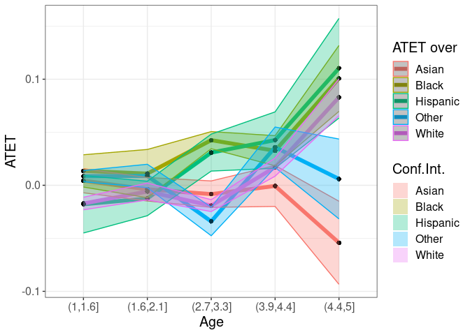
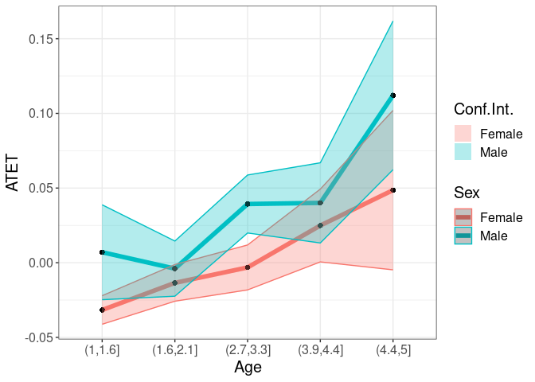

<!-- README.md is generated from README.Rmd. Please edit that file -->

# A model-free differences-in-differences framework

<!-- badges: start -->

[](https://cran.r-project.org/package=npsf)
[](https://cran.r-project.org/package=npsf)
[](https://cran.r-project.org/package=npsf)
[](https://github.com/OlegBadunenko/didnp)
[](https://cran.r-project.org/web/checks/check_results_npsf.html)
[](https://github.com/OlegBadunenko/didnp/commits/main)

<!-- badges: end -->
<!-- README.md is generated from README.Rmd. Please edit that file -->

The **didnp** package contains tools for computing average treatment
effect parameters in a Difference-in-Differences setup without
specifying a model.

## Getting Started

The **didnp** package implements the framework developed in

- 

## Installation

You can install **didnp** from CRAN with:

``` r
install.packages("didnp", dependencies = TRUE)
```

or get the latest version from github with:

``` r
if ( !require("devtools") ) install.packages("devtools"); library(devtools)
devtools::install_github("OlegBadunenko/didnp")
```

## An example

> The following is a simplified example …, which comes from
> [that](https://elsevier.com/).

Data set is shared by [Kuka et al,
2020](https://doi.org/10.1257/pol.20180352). Here we showcase the
functionality of the package by using a subset, which is available in
the package and can be loaded by

``` r
  library(didnp)
  library(ggplot2)
  data(DACAsub, package = "didnp")
  head(DACAsub)
#R>    inschool hs scol post elig fem race var.bpl state year age yrimmig ageimmig
#R>  1        0  1    1    1    0   1    3       4     1 2015  27    1988        0
#R>  2        0  1    1    0    0   1    1       0     1 2007  29    1978        0
#R>  3        1  0    0    1    0   1    4       4     1 2013  16    2000        3
#R>  4        0  0    0    1    1   0    3       3     1 2012  23    1990        1
#R>  5        0  1    1    1    0   1    3       3     1 2014  26    1987       -1
#R>  6        0  1    0    0    0   1    2       3     1 2006  21    1986        1
#R>    a1418 a1922 a2330 htus perwt treatment_period
#R>  1    NA    NA     1   NA    32                1
#R>  2    NA    NA     1   NA    39                0
#R>  3     1    NA    NA   NA   119                1
#R>  4    NA    NA     1   NA    11                1
#R>  5    NA    NA     1   NA   111                1
#R>  6    NA     1    NA   NA   320                0
```

The description of the dataset can be found by typing

``` r
  ?DACAsub
```

Although this can be done on the fly, the subsample can be prepared
beforehand:

``` r
# get the subsample
DACAsub$mysmpl <- mysmpl <-
  DACAsub$a1922==1 & !is.na(DACAsub$a1922) &
  DACAsub$htus==1 & !is.na(DACAsub$htus)

# generate 'treatment_period'
DACAsub$treatment_period <- ifelse( DACAsub[,"year"] > 2011, 1, 0)
```

To estimate the average treatment effects, we use the **didnpreg**
function. Define the formula that we will use:

``` r
form1 <- inschool ~ fem + race + var.bpl + state + age + yrimmig + 
  ageimmig | inschool | year | elig | treatment_period | perwt
```

The **didnpreg** function allows using matrices. The manual explains how
to use matrix syntax (type `?didnpreg`). To obtain standard errors,

> we will use a few number of bootstrap replicaitons here, but we advise
> to set `boot.num = 399` or more.

To speed up the estimation

> on computers with multiple cores, use multiplrocessing by setting
> option `cores`.

Suppress output by setting `print.level = 0`. The default value is 1.

``` r
# suppress output
tym1a <- didnpreg(
  form1,
  data = DACAsub,
  subset = mysmpl,
  bwmethod = "opt",
  boot.num = 7,
  TTb = FALSE,
  print.level = 0,
  cores = 8)
#R>  Bandwidths are chosen via the plug-in method
```

**didnpreg** returns a class **didnp** object. This object contains
estimates of the average treatment effects and their standard errors. To
see these, we can call the **summary** function.

``` r
# Print the summary of estimation
summary(tym1a)
#R>  Number of Observations is  34768 
#R>  Number of Unordered Categorical Regressors is   4 
#R>  Number of Ordered Categorical Regressors is     3 
#R>  
#R>  Bandwidths are chosen via the plug-in method
#R>  
#R>    Regressor    Type    Bandwidth
#R>  1       fem  factor 9.569206e-04
#R>  2      race  factor 5.831931e-05
#R>  3   var.bpl  factor 8.701817e-05
#R>  4     state  factor 1.772228e-05
#R>  5       age ordered 4.731888e-05
#R>  6   yrimmig ordered 2.763923e-05
#R>  7  ageimmig ordered 8.690101e-05
#R>  
#R>  Bootstrapping standard errors (7 replications) completed in 1 second
#R>  
#R>  Unconditional Treatment Effect on the Treated (ATET):
#R>  
#R>  TTa    = 0.03684
#R>  TTa sd = 0.6787
#R>  N(TTa) = 2337
```

Estimating $TT_b$ will take longer:

``` r
# suppress output
tym1b <- didnpreg(
  form1,
  data = DACAsub,
  subset = mysmpl,
  bwmethod = "opt",
  boot.num = 7,
  TTb = TRUE,
  print.level = 1,
  cores = 8)
#R>  Number of Observations is  34768 
#R>  Number of Unordered Categorical Regressors is   4 
#R>  Number of Ordered Categorical Regressors is     3 
#R>  
#R>  Bandwidths are chosen via the plug-in method
#R>  
#R>    Regressor    Type    Bandwidth
#R>  1       fem  factor 9.569206e-04
#R>  2      race  factor 5.831931e-05
#R>  3   var.bpl  factor 8.701817e-05
#R>  4     state  factor 1.772228e-05
#R>  5       age ordered 4.731888e-05
#R>  6   yrimmig ordered 2.763923e-05
#R>  7  ageimmig ordered 8.690101e-05
#R>  
#R>  Calculating ATET: TTa and TTb (may take some time)
#R>  TTa = 0.03684, N(TTa) = 2337
#R>  TTb = 0.07442, N(TTb) = 24018
#R>  
#R>  Bootstrapping standard errors (7 replications)
#R>  Bootstrapping standard errors completed in 12 seconds
#R>  
#R>  TTa sd = 0.6787 
#R>  TTb sd = 0.6061
```

To plot the heterogenous treatment effects, use the **didnpplothte**
command. Define three variables by and over which the treatment effects
will be plotted:

``` r
DACAsub[tym1b$esample, "race"] -> race
DACAsub[tym1b$esample, "fem"]  -> sex
as.numeric(DACAsub[tym1b$esample, "age"]) -> age
```

Here `age` is quasi-continuous. It will have only 4 values (in fact
fewer than the Race variable), but we use it to showcase the
functionality.

First, use one categorical `by` variable:

``` r
tym1b_gr_race <- didnpplothte(
  obj = tym1b,
  level = 95,
  by = race[tym1b$sample1],
  xlab = "Race",
  ylab = "ATET",
  by.labels.values = data.frame(
    old = c(1,2,3,4,5),
    new = c("Hispanic", "White", "Black", "Asian", "Other")
  ))

tym1b_gr_race$data.a
#R>           atet    atet.sd by      by2
#R>  1  0.03167370 0.02333338  1    Asian
#R>  2  0.23713539 0.02089789  2    Black
#R>  3  0.15831095 0.02347352  3 Hispanic
#R>  4  0.70576875 0.14213935  4    Other
#R>  5 -0.09128866 0.03170650  5    White
tym1b_gr_race$data.b
#R>            atet     atet.sd by      by2
#R>  1  0.074070433 0.018905645  1    Asian
#R>  2  0.217542238 0.009065189  2    Black
#R>  3 -0.004192316 0.028846303  3 Hispanic
#R>  4  0.095995143 0.040010388  4    Other
#R>  5 -0.024492401 0.022590836  5    White

tym1b_gr_race$plot.a
```

<!-- -->

``` r
tym1b_gr_race$plot.b
```

<!-- -->

Here objects `data.a` and `data.b` contain data that is used to produce
`plot.a` and `plot.b`. The graphs are `ggplot` objects and can be
amended further.

Another example is the graph with treatment effects by sex. Note the
sample object `tym1b` is used:

``` r
tym1b_gr_sex <- didnpplothte(
  obj = tym1b,
  level = 95,
  by = sex[tym1b$sample1],
  xlab = "Sex",
  ylab = "ATET",
  by.labels.values = data.frame(c(1,0), c("Female", "Male"))
)

tym1b_gr_sex$data.a
#R>          atet   atet.sd by    by2
#R>  1 0.02387601 0.0256126  0 Female
#R>  2 0.05162081 0.0336748  1   Male
tym1b_gr_sex$data.b
#R>          atet    atet.sd by    by2
#R>  1 0.09835338 0.02464229  0 Female
#R>  2 0.04736845 0.03884442  1   Male

tym1b_gr_sex$plot.a
```

<!-- -->

``` r
tym1b_gr_sex$plot.b
```

<!-- -->

The **didnpplothte** command will recognize if `by` is continuous
variable, split it into given number of intervals `n.intervals` and plot
the treatment effects by the split variable.

``` r
tym1b_gr_age <- didnpplothte(
  obj = tym1b,
  level = 95,
  by = age[tym1b$sample1],
  n.intervals = 10,
  xlab = "Age"
)

tym1b_gr_age$data.a
#R>            atet    atet.sd        by
#R>  1   0.02098298 0.04544840   (6,6.3]
#R>  4   0.12756955 0.05124467 (6.9,7.2]
#R>  7  -0.05394528 0.02034926 (7.8,8.1]
#R>  10  0.05066561 0.04138021   (8.7,9]
tym1b_gr_age$data.b
#R>           atet    atet.sd        by
#R>  1  0.02794484 0.02296994   (6,6.3]
#R>  4  0.10182851 0.02721182 (6.9,7.2]
#R>  7  0.03133934 0.01940082 (7.8,8.1]
#R>  10 0.14553113 0.03190385   (8.7,9]

tym1b_gr_age$plot.a
```

<!-- -->

``` r
tym1b_gr_age$plot.b
```

<!-- -->

Ameding ggplot object is easy. For example adding a 0 horizontal line is

``` r
tym1b_gr_age$plot.a +
  geom_hline(yintercept = 0)
```

<!-- -->

> Anternatively, one can use the `data.a` and `data.b` objects to plot
> from scratch.

The treatment effects can be visualized by and over. Variable `by` can
be both categorical and continuous, while `over` must be categorical.
For example, to plot treatment effects by age over race, specify the
`over` option:

``` r
tym1b_gr_age_race <- didnpplothte(
  obj = tym1b,
  level = 90,
  by = age[tym1b$sample1],
  n.intervals = 7,
  over = race[tym1b$sample1],
  xlab = "Age",
  ylab = "ATET",
  point_size = 2,
  over.labels.values = data.frame(
    old = c(1,2,3,4,5),
    new = c("Hispanic", "White", "Black", "Asian", "Other")
  ),
  text_size = 15)
#R>   d1b:
#R>            atet    atet.sd          by     over
#R>  1  -0.20964103 0.01319274    (6,6.43]    Asian
#R>  2  -0.07605277 0.02439777    (6,6.43]    Black
#R>  3   0.03082975 0.02378958    (6,6.43] Hispanic
#R>  4   0.14379465 0.02734824    (6,6.43]    Other
#R>  5  -0.10829371 0.01355530    (6,6.43]    White
#R>  11 -0.15249069 0.07022176 (6.86,7.29]    Asian
#R>  12 -0.21217141 0.03923253 (6.86,7.29]    Black
#R>  13  0.10561193 0.02800887 (6.86,7.29] Hispanic
#R>  14  0.09982536 0.06150928 (6.86,7.29]    Other
#R>  15  0.20387595 0.01068616 (6.86,7.29]    White
#R>  21  0.17657789 0.05142644 (7.71,8.14]    Asian
#R>  22  0.08737654 0.05330049 (7.71,8.14]    Black
#R>  23  0.02689318 0.01964664 (7.71,8.14] Hispanic
#R>  24 -0.27806531 0.04296285 (7.71,8.14]    Other
#R>  25  0.39222103 0.01691192 (7.71,8.14]    White
#R>  31  0.33645553 0.09689606    (8.57,9]    Asian
#R>  32  0.27223728 0.04334071    (8.57,9]    Black
#R>  33  0.14068491 0.03302176    (8.57,9] Hispanic
#R>  34 -0.18383198 0.04735856    (8.57,9]    Other
#R>  35  0.46651652 0.01969188    (8.57,9]    White

tym1b_gr_age_race$data.a
#R>            atet     atet.sd          by     over
#R>  2   0.22475431 0.003203582    (6,6.43]    Black
#R>  3   0.01334237 0.047541039    (6,6.43] Hispanic
#R>  4   0.09140577 0.071056124    (6,6.43]    Other
#R>  5   0.13707317 0.027991451    (6,6.43]    White
#R>  12 -0.17871291 0.083402708 (6.86,7.29]    Black
#R>  13  0.13554305 0.052548695 (6.86,7.29] Hispanic
#R>  14 -0.08310313 0.250658197 (6.86,7.29]    Other
#R>  15 -0.09325703 0.070244277 (6.86,7.29]    White
#R>  21  0.70576875 0.142139346 (7.71,8.14]    Asian
#R>  22  0.32083881 0.020310142 (7.71,8.14]    Black
#R>  23 -0.06414731 0.021142968 (7.71,8.14] Hispanic
#R>  24 -0.82890907 0.046857866 (7.71,8.14]    Other
#R>  25  0.36450799 0.024178552 (7.71,8.14]    White
#R>  32  0.31886794 0.046907969    (8.57,9]    Black
#R>  33  0.03884674 0.042900616    (8.57,9] Hispanic
#R>  34  0.27960002 0.195326520    (8.57,9]    Other
#R>  35  0.48706793 0.036976917    (8.57,9]    White
tym1b_gr_age_race$plot.a
```

<!-- -->

``` r

tym1b_gr_age_race$data.b
#R>            atet    atet.sd          by     over
#R>  1  -0.20964103 0.01319274    (6,6.43]    Asian
#R>  2  -0.07605277 0.02439777    (6,6.43]    Black
#R>  3   0.03082975 0.02378958    (6,6.43] Hispanic
#R>  4   0.14379465 0.02734824    (6,6.43]    Other
#R>  5  -0.10829371 0.01355530    (6,6.43]    White
#R>  11 -0.15249069 0.07022176 (6.86,7.29]    Asian
#R>  12 -0.21217141 0.03923253 (6.86,7.29]    Black
#R>  13  0.10561193 0.02800887 (6.86,7.29] Hispanic
#R>  14  0.09982536 0.06150928 (6.86,7.29]    Other
#R>  15  0.20387595 0.01068616 (6.86,7.29]    White
#R>  21  0.17657789 0.05142644 (7.71,8.14]    Asian
#R>  22  0.08737654 0.05330049 (7.71,8.14]    Black
#R>  23  0.02689318 0.01964664 (7.71,8.14] Hispanic
#R>  24 -0.27806531 0.04296285 (7.71,8.14]    Other
#R>  25  0.39222103 0.01691192 (7.71,8.14]    White
#R>  31  0.33645553 0.09689606    (8.57,9]    Asian
#R>  32  0.27223728 0.04334071    (8.57,9]    Black
#R>  33  0.14068491 0.03302176    (8.57,9] Hispanic
#R>  34 -0.18383198 0.04735856    (8.57,9]    Other
#R>  35  0.46651652 0.01969188    (8.57,9]    White
tym1b_gr_age_race$plot.b
```

<!-- -->

Note that the graph shows the **90%** confidence interval.

> Alternatively use the data from the object `tym1b_gr_age_race`

to produce another type of graph:

``` r
crit.value <- 2
pd <- position_dodge(0.1) # move them .05 to the left and right
d1 <- tym1b_gr_age_race$data.b
d1$Race <- d1$over
ggplot(d1, aes(x = by, y = atet, color = Race, group = Race)) +
  geom_errorbar(aes(ymin = atet - crit.value*atet.sd, ymax = atet + crit.value*atet.sd), color = "black", width = .1, position = pd) +
  geom_line(position = pd) +
  geom_point(position = pd, size = 3, shape = 21, fill = "white") +
  xlab("Age") +
  ylab("ATET") +
  theme_bw() +
  theme(legend.position = "right", text = element_text(size = 17))
```

<!-- -->

The next plot shows treatment effects by age over sex:

``` r
tym1b_gr_age_sex <- didnpplothte(
  obj = tym1b,
  level = 90,
  by = age[tym1b$sample1],
  n.intervals = 7,
  over = sex[tym1b$sample1],
  xlab = "Age",
  ylab = "ATET",
  point_size = 2,
  over.labels.values = data.frame(c(1,0), c("Female", "Male")),
  text_size = 15)
#R>   d1b:
#R>             atet    atet.sd          by   over
#R>  1  -0.002866212 0.02549606    (6,6.43] Female
#R>  2   0.054954010 0.03725189    (6,6.43]   Male
#R>  5   0.086338267 0.02869658 (6.86,7.29] Female
#R>  6   0.115404434 0.04244762 (6.86,7.29]   Male
#R>  9  -0.007366675 0.04303305 (7.71,8.14] Female
#R>  10  0.066496452 0.03115987 (7.71,8.14]   Male
#R>  13  0.123082019 0.08840179    (8.57,9] Female
#R>  14  0.165280060 0.04458252    (8.57,9]   Male

tym1b_gr_age_sex$data.a
#R>             atet    atet.sd          by   over
#R>  1   0.046508387 0.06098738    (6,6.43] Female
#R>  2  -0.001907052 0.06888927    (6,6.43]   Male
#R>  5   0.152910875 0.05661234 (6.86,7.29] Female
#R>  6   0.106305229 0.06672100 (6.86,7.29]   Male
#R>  9   0.001774249 0.03186786 (7.71,8.14] Female
#R>  10 -0.102699867 0.04465966 (7.71,8.14]   Male
#R>  13  0.004173214 0.07068727    (8.57,9] Female
#R>  14  0.092397690 0.04007201    (8.57,9]   Male
tym1b_gr_age_sex$plot.a
```

<!-- -->

``` r

tym1b_gr_age_sex$data.b
#R>             atet    atet.sd          by   over
#R>  1  -0.002866212 0.02549606    (6,6.43] Female
#R>  2   0.054954010 0.03725189    (6,6.43]   Male
#R>  5   0.086338267 0.02869658 (6.86,7.29] Female
#R>  6   0.115404434 0.04244762 (6.86,7.29]   Male
#R>  9  -0.007366675 0.04303305 (7.71,8.14] Female
#R>  10  0.066496452 0.03115987 (7.71,8.14]   Male
#R>  13  0.123082019 0.08840179    (8.57,9] Female
#R>  14  0.165280060 0.04458252    (8.57,9]   Male
tym1b_gr_age_sex$plot.b
```

<!-- -->

Finally, both `by` and `over` are both categorical:

``` r
tym1b_gr_sex_race <- didnpplothte(
  obj = tym1b,
  level = 95,
  by = sex[tym1b$sample1],
  over = race[tym1b$sample1],
  xlab = "Sex",
  ylab = "ATET",
  point_size = 3,
  by.labels.values = data.frame(c(1,0), c("Female", "Male")),
  over.labels.values = data.frame(
    old = c(1,2,3,4,5),
    new = c("Hispanic", "White", "Black", "Asian", "Other")
  ),
  text_size = 17)

tym1b_gr_sex_race$data.a
#R>            atet    atet.sd     by     over
#R>  2  -0.09825377 0.01891277 Female    Black
#R>  3   0.05093228 0.03484335 Female Hispanic
#R>  4   0.15481958 0.09792690 Female    Other
#R>  5   0.16793775 0.01432895 Female    White
#R>  6   0.70576875 0.14213935   Male    Asian
#R>  7   0.34157147 0.03567464   Male    Black
#R>  8   0.01483445 0.02632963   Male Hispanic
#R>  9  -0.25536083 0.05338534   Male    Other
#R>  10  0.34587453 0.05869224   Male    White
tym1b_gr_sex_race$plot.a
```

<!-- -->

``` r

tym1b_gr_sex_race$data.b
#R>             atet     atet.sd     by     over
#R>  1   0.107027217 0.074520424 Female    Asian
#R>  2   0.009058775 0.046353597 Female    Black
#R>  3   0.046264674 0.039823140 Female Hispanic
#R>  4  -0.113366928 0.038678248 Female    Other
#R>  5   0.228191049 0.008991708 Female    White
#R>  6   0.089375898 0.044636703   Male    Asian
#R>  7  -0.016989085 0.033187452   Male    Black
#R>  8   0.098589546 0.025485545   Male Hispanic
#R>  9   0.080541130 0.026648429   Male    Other
#R>  10  0.207527284 0.020473383   Male    White
tym1b_gr_sex_race$plot.b
```

<!-- -->

## Additional Resources

That
