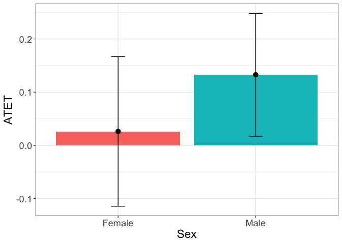
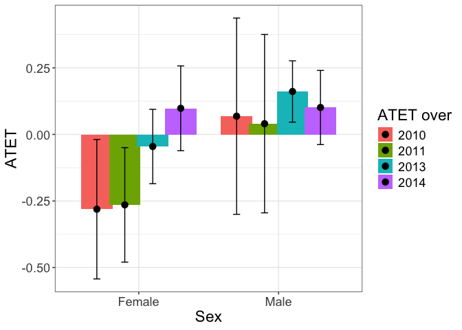
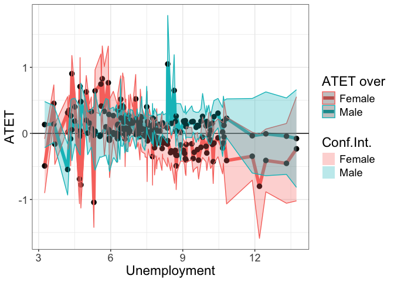

# Illustration

## Data

> The subset of the data from [IPUMS](https://ipums.org) is used to
> illustrate the functionality of the package. The data are available in
> the package and can be loaded by

``` r
  library(didnp)
  library(tidyverse)
#R>  ── Attaching core tidyverse packages ──────────────────────── tidyverse 2.0.0 ──
#R>  ✔ dplyr     1.1.4     ✔ readr     2.1.5
#R>  ✔ forcats   1.0.0     ✔ stringr   1.5.1
#R>  ✔ ggplot2   3.5.1     ✔ tibble    3.2.1
#R>  ✔ lubridate 1.9.4     ✔ tidyr     1.3.1
#R>  ✔ purrr     1.0.2     
#R>  ── Conflicts ────────────────────────────────────────── tidyverse_conflicts() ──
#R>  ✖ dplyr::filter() masks stats::filter()
#R>  ✖ dplyr::lag()    masks stats::lag()
#R>  ℹ Use the conflicted package (<http://conflicted.r-lib.org/>) to force all conflicts to become errors
  data(Unempl, package = "didnp")
  head(Unempl)
#R>    FT YEAR    UNEMP SEX STATEFIP SCHOOL AGE YRIMMIG EDUC AFTER ELIGIBLE
#R>  1  1 2008 5.883333   2        1      1  23    2000    6     0        1
#R>  2  1 2008 5.883333   1        1      1  27    1993    6     0        0
#R>  3  1 2008 5.883333   2        1      1  30    1980    6     0        0
#R>  4  1 2008 5.883333   1        1      1  27    1994    6     0        0
#R>  5  1 2008 5.883333   2        1      1  25    1991    6     0        1
#R>  6  1 2008 6.475000   2        2      1  24    1987    7     0        1
```

The description of the dataset can be found by typing

``` r
  ?Unempl
  table(Unempl$age)
```

The variable `ELIGIBLE` is actually treated. Only those who were
eligible before 2012 can be treated. In 2013 and beyond, eligible
individuals are treated. Conversely, in 2011 and earlier, they are
eligible to be treated starting from 2013.

``` r
table(Unempl$YEAR, Unempl$ELIGIBLE)
#R>        
#R>            0    1
#R>    2008  848 1506
#R>    2009  816 1563
#R>    2010  851 1593
#R>    2011  779 1571
#R>    2013  747 1377
#R>    2014  707 1349
#R>    2015  623 1227
#R>    2016  629 1196
```

For convenience, a data said with a smaller number of variables is
created

``` r
d2 <- data.frame(
  y = as.numeric(Unempl$FT),
  year = Unempl$YEAR,
  unemp = Unempl$UNEMP,
  sex = factor(Unempl$SEX),
  age = ordered(Unempl$AGE),
  yrimmig = ordered(Unempl$YRIMMIG),
  educ = ordered(Unempl$EDUC),
  treatment_period = as.numeric(Unempl$AFTER),
  treated = as.numeric(Unempl$ELIGIBLE)
)
```

There is a gap in the `year`

``` r
table(d2$year)
#R>  
#R>  2008 2009 2010 2011 2013 2014 2015 2016 
#R>  2354 2379 2444 2350 2124 2056 1850 1825
```

Year 2012 is missing. This is when the treatment occurred. A variable
‘t’ is generated, where

| Year |   t |
|:-----|----:|
| 2008 |  -3 |
| 2009 |  -2 |
| 2010 |  -1 |
| 2011 |   0 |
| 2013 |   1 |
| 2014 |   2 |
| 2015 |   3 |
| 2016 |   4 |

An artificial variable `period` that does not have a gap is generated,
where

| Year | period |
|:-----|-------:|
| 2008 |      1 |
| 2009 |      2 |
| 2010 |      3 |
| 2011 |      4 |
| 2013 |      5 |
| 2014 |      6 |
| 2015 |      7 |
| 2016 |      8 |

To make the same more homogeneous and smaller for illustrative purposes,
the subsample of the data with the following conditions is created:

1.  `yrimmig >= 1982 & yrimmig <= 1994`
2.  `educ >= 6 & educ <= 11`

``` r
year_min <- min(Unempl$YEAR)

d0 <- d2 %>%
  filter(yrimmig >= 1982 & yrimmig <= 1994) |>
  filter(educ >= 6 & educ <= 11) |>
  mutate(
    yrimmig = droplevels(yrimmig),
    educ = droplevels(educ),
    age = droplevels(age)
    ) |>
    mutate(period = dplyr::if_else(year < 2012,
      year - year_min + 1,
      year - year_min),
      t = period - min(period[treatment_period == 1]-1))
table(d0$period)
#R>  
#R>     1    2    3    4    5    6    7    8 
#R>  1539 1589 1628 1624 1453 1364 1184 1217
```

> Here is a basic description of the data

Treated over time

``` r
table(d0$year, d0$treated)
#R>        
#R>            0    1
#R>    2008  655  884
#R>    2009  620  969
#R>    2010  641  987
#R>    2011  612 1012
#R>    2013  587  866
#R>    2014  540  824
#R>    2015  464  720
#R>    2016  489  728
table(d0$t, d0$treated)
#R>      
#R>          0    1
#R>    -3  655  884
#R>    -2  620  969
#R>    -1  641  987
#R>    0   612 1012
#R>    1   587  866
#R>    2   540  824
#R>    3   464  720
#R>    4   489  728
```

Recoded variable `t`

``` r
table(d0$t, d0$year)
#R>      
#R>       2008 2009 2010 2011 2013 2014 2015 2016
#R>    -3 1539    0    0    0    0    0    0    0
#R>    -2    0 1589    0    0    0    0    0    0
#R>    -1    0    0 1628    0    0    0    0    0
#R>    0     0    0    0 1624    0    0    0    0
#R>    1     0    0    0    0 1453    0    0    0
#R>    2     0    0    0    0    0 1364    0    0
#R>    3     0    0    0    0    0    0 1184    0
#R>    4     0    0    0    0    0    0    0 1217
```

Treated by the year of immigration

``` r
table(d0$yrimmig, d0$treated)
#R>        
#R>            0    1
#R>    1982  165  126
#R>    1983  158  196
#R>    1984  169  303
#R>    1985  297  448
#R>    1986  252  482
#R>    1987  209  393
#R>    1988  298  587
#R>    1989  509  876
#R>    1990  755 1019
#R>    1991  434  621
#R>    1992  561  649
#R>    1993  424  623
#R>    1994  377  667
```

Treated by education

``` r
table(d0$educ, d0$treated)
#R>      
#R>          0    1
#R>    6  3436 4658
#R>    7   703 1352
#R>    8   228  489
#R>    10  196  437
#R>    11   45   54
```

Treated by age

``` r
table(d0$treated, d0$age)
#R>     
#R>       22  23  24  25  26  27  28  29  30  31  32  33  34  35  36  37  38  39
#R>    0   0   0   0   0   0  72 233 365 609 502 474 457 408 451 470 300 200  67
#R>    1  86 281 514 699 753 737 761 681 733 615 506 350 214  60   0   0   0   0
```

Although this can be done on the fly, the subsample can be prepared
beforehand:

``` r
# get the subsample
d0 <- d0 %>%
  mutate(smpl = year >= 2010 & year <= 2014)
table(d0$smpl)
#R>  
#R>  FALSE  TRUE 
#R>   5529  6069
```

> Define the formula that we will use:

``` r
form1 <- y ~ age + educ + sex + unemp | period | treated | treatment_period
```

To obtain standard errors and perform testing in this *illustration*,

> we will use a few number of bootstrap replicaitons here, but we advise
> to set `boot.num = 399` or larger in an application.

``` r
B <- 99
```

## Testing

To test if there is a violation of the bias stability condition use
command `didnptest`

``` r
tym1test <- didnpbsctest(
  form1,
  data = d0,
  subset = smpl,
  boot.num = B,
  print.level = 2,
  cores = 10)
#R>  Warning in didnpbsctest.default(outcome = Y, regressors = X, time = time, :
#R>  Data starts in 3, while the treatment is in 4
#R>  Number of Observations is  6069 
#R>  
#R>  Number of observations in treated group right after the treatment       (N_ 1, 1) = 866 
#R>  Number of observations in treated group just before the treatment       (N_ 1, 0) = 1012 
#R>  Number of observations in treated group one period before the treatment (N_ 1,-1) = 987 
#R>  Number of observations in control group right after the treatment       (N_ 0, 1) = 587 
#R>  Number of observations in control group just before the treatment       (N_ 0, 0) = 612 
#R>  Number of observations in control group one period before the treatment (N_ 0,-1) = 641 
#R>  
#R>  Number of Continuous Regressors            = 1 
#R>  Number of Unordered Categorical Regressors = 1 
#R>  Number of Ordered Categorical Regressors   = 2 
#R>  
#R>  Bandwidths are chosen via the plug-in method
#R>  
#R>  Calculating BSC 
#R>  BSC = 0.2248732862
#R>  Calculating BSC completed in 0 seconds
#R>  
#R>  Bootstrapping the statistic (99 replications)
#R>  Calculating residuals for the alternative model
#R>  Calculating residuals for the alternative model completed in 0 seconds
#R>  Calculating fitted values under the null hypothesis
#R>  Calculating fitted values under the null hypothesis completed in 0 seconds
#R>  
#R>  The main loop of the bootstrapping started
#R>  
#R>  Bootstrapping will take approximately: 5 seconds
#R>  
#R>    |                                                                              |=                                                                     |   1%  |                                                                              |=                                                                     |   2%  |                                                                              |==                                                                    |   3%  |                                                                              |===                                                                   |   4%  |                                                                              |====                                                                  |   5%  |                                                                              |====                                                                  |   6%  |                                                                              |=====                                                                 |   7%  |                                                                              |======                                                                |   8%  |                                                                              |======                                                                |   9%  |                                                                              |=======                                                               |  10%  |                                                                              |========                                                              |  11%  |                                                                              |=========                                                             |  12%  |                                                                              |=========                                                             |  13%  |                                                                              |==========                                                            |  14%  |                                                                              |===========                                                           |  15%  |                                                                              |===========                                                           |  16%  |                                                                              |============                                                          |  17%  |                                                                              |=============                                                         |  18%  |                                                                              |==============                                                        |  19%  |                                                                              |==============                                                        |  20%  |                                                                              |===============                                                       |  21%  |                                                                              |================                                                      |  22%  |                                                                              |================                                                      |  23%  |                                                                              |=================                                                     |  24%  |                                                                              |==================                                                    |  26%  |                                                                              |===================                                                   |  27%  |                                                                              |===================                                                   |  28%  |                                                                              |====================                                                  |  29%  |                                                                              |=====================                                                 |  30%  |                                                                              |=====================                                                 |  31%  |                                                                              |======================                                                |  32%  |                                                                              |=======================                                               |  33%  |                                                                              |========================                                              |  34%  |                                                                              |========================                                              |  35%  |                                                                              |=========================                                             |  36%  |                                                                              |==========================                                            |  37%  |                                                                              |==========================                                            |  38%  |                                                                              |===========================                                           |  39%  |                                                                              |============================                                          |  40%  |                                                                              |=============================                                         |  41%  |                                                                              |=============================                                         |  42%  |                                                                              |==============================                                        |  43%  |                                                                              |===============================                                       |  44%  |                                                                              |===============================                                       |  45%  |                                                                              |================================                                      |  46%  |                                                                              |=================================                                     |  47%  |                                                                              |==================================                                    |  48%  |                                                                              |==================================                                    |  49%  |                                                                              |===================================                                   |  50%  |                                                                              |====================================                                  |  51%  |                                                                              |====================================                                  |  52%  |                                                                              |=====================================                                 |  53%  |                                                                              |======================================                                |  54%  |                                                                              |=======================================                               |  55%  |                                                                              |=======================================                               |  56%  |                                                                              |========================================                              |  57%  |                                                                              |=========================================                             |  58%  |                                                                              |=========================================                             |  59%  |                                                                              |==========================================                            |  60%  |                                                                              |===========================================                           |  61%  |                                                                              |============================================                          |  62%  |                                                                              |============================================                          |  63%  |                                                                              |=============================================                         |  64%  |                                                                              |==============================================                        |  65%  |                                                                              |==============================================                        |  66%  |                                                                              |===============================================                       |  67%  |                                                                              |================================================                      |  68%  |                                                                              |=================================================                     |  69%  |                                                                              |=================================================                     |  70%  |                                                                              |==================================================                    |  71%  |                                                                              |===================================================                   |  72%  |                                                                              |===================================================                   |  73%  |                                                                              |====================================================                  |  74%  |                                                                              |=====================================================                 |  76%  |                                                                              |======================================================                |  77%  |                                                                              |======================================================                |  78%  |                                                                              |=======================================================               |  79%  |                                                                              |========================================================              |  80%  |                                                                              |========================================================              |  81%  |                                                                              |=========================================================             |  82%  |                                                                              |==========================================================            |  83%  |                                                                              |===========================================================           |  84%  |                                                                              |===========================================================           |  85%  |                                                                              |============================================================          |  86%  |                                                                              |=============================================================         |  87%  |                                                                              |=============================================================         |  88%  |                                                                              |==============================================================        |  89%  |                                                                              |===============================================================       |  90%  |                                                                              |================================================================      |  91%  |                                                                              |================================================================      |  92%  |                                                                              |=================================================================     |  93%  |                                                                              |==================================================================    |  94%  |                                                                              |==================================================================    |  95%  |                                                                              |===================================================================   |  96%  |                                                                              |====================================================================  |  97%  |                                                                              |===================================================================== |  98%  |                                                                              |===================================================================== |  99%  |                                                                              |======================================================================| 100%
#R>  Bootstrapping the statistic completed in 5 seconds
#R>   p.value:
#R>  [1] 0.12
#R>  
#R>  BSC statistic                   = 0.2249 
#R>  BSC bootstrapped standard error = 0.03158 
#R>  Bootstrapped p-value            =  0.12
```

*Interpretation*: We do find evidence against the null hypothesis that
the bias stability condition holds. The desired *p*-value should be much
larger than the 0.1 level.

## Estimation

To estimate the average treatment effects, we use the `didnpreg`
function. The `didnpreg` function allows using matrices. The manual
explains how to use matrix syntax (type `?didnpreg`).

To speed up the estimation

> on computers with multiple cores, use multiplrocessing by setting
> option `cores`.

Suppress output by setting `print.level = 0`. The default value is 1.

``` r
# suppress output
tym1a <- didnpreg(
  form1,
  data = d0,
  subset = smpl,
  bwmethod = "opt",
  boot.num = B,
  TTx = "TTa",
  print.level = 2,
  digits = 8,
  cores = 10)
#R>  Warning in didnpreg.default(outcome = Y, regressors = X, time = time, treated =
#R>  treated, : Data starts in 3, while the treatment is in 4
#R>  Number of observations = 6069 
#R>  Number of observations in the year of the treatment and one year after the treatment = 3077 
#R>  
#R>  Number of observations in treated group after  the treatment (N_ 1, 1) = 1690 
#R>  Number of observations in treated group before the treatment (N_ 1, 0) = 1999 
#R>  Number of observations in control group after  the treatment (N_ 0, 1) = 1127 
#R>  Number of observations in control group before the treatment (N_ 0, 0) = 1253 
#R>  
#R>  Number of Continuous Regressors            = 1 
#R>  Number of Unordered Categorical Regressors = 1 
#R>  Number of Ordered Categorical Regressors   = 2 
#R>  
#R>  Bandwidths are chosen via the plug-in method
#R>  
#R>    Regressor       Type    Bandwidth
#R>  1       age    ordered 9.356700e-05
#R>  2      educ    ordered 9.049838e-05
#R>  3       sex     factor 5.909937e-04
#R>  4     unemp continuous 2.397334e-01
#R>  
#R>  Calculating ATET: TTa
#R>  TTa = 0.076863646, N (TTa; treated in the first period or N_ 1, 1) = 1690
#R>  Calculating ATET completed in 0 seconds
#R>  
#R>  Bootstrapping standard errors (99 replications)
#R>  Calculating residuals completed
#R>  
#R>  Bootstrapping will take approximately: 4 seconds
#R>  
#R>    |                                                                              |=                                                                     |   1%  |                                                                              |=                                                                     |   2%  |                                                                              |==                                                                    |   3%  |                                                                              |===                                                                   |   4%  |                                                                              |====                                                                  |   5%  |                                                                              |====                                                                  |   6%  |                                                                              |=====                                                                 |   7%  |                                                                              |======                                                                |   8%  |                                                                              |======                                                                |   9%  |                                                                              |=======                                                               |  10%  |                                                                              |========                                                              |  11%  |                                                                              |=========                                                             |  12%  |                                                                              |=========                                                             |  13%  |                                                                              |==========                                                            |  14%  |                                                                              |===========                                                           |  15%  |                                                                              |===========                                                           |  16%  |                                                                              |============                                                          |  17%  |                                                                              |=============                                                         |  18%  |                                                                              |==============                                                        |  19%  |                                                                              |==============                                                        |  20%  |                                                                              |===============                                                       |  21%  |                                                                              |================                                                      |  22%  |                                                                              |================                                                      |  23%  |                                                                              |=================                                                     |  24%  |                                                                              |==================                                                    |  26%  |                                                                              |===================                                                   |  27%  |                                                                              |===================                                                   |  28%  |                                                                              |====================                                                  |  29%  |                                                                              |=====================                                                 |  30%  |                                                                              |=====================                                                 |  31%  |                                                                              |======================                                                |  32%  |                                                                              |=======================                                               |  33%  |                                                                              |========================                                              |  34%  |                                                                              |========================                                              |  35%  |                                                                              |=========================                                             |  36%  |                                                                              |==========================                                            |  37%  |                                                                              |==========================                                            |  38%  |                                                                              |===========================                                           |  39%  |                                                                              |============================                                          |  40%  |                                                                              |=============================                                         |  41%  |                                                                              |=============================                                         |  42%  |                                                                              |==============================                                        |  43%  |                                                                              |===============================                                       |  44%  |                                                                              |===============================                                       |  45%  |                                                                              |================================                                      |  46%  |                                                                              |=================================                                     |  47%  |                                                                              |==================================                                    |  48%  |                                                                              |==================================                                    |  49%  |                                                                              |===================================                                   |  50%  |                                                                              |====================================                                  |  51%  |                                                                              |====================================                                  |  52%  |                                                                              |=====================================                                 |  53%  |                                                                              |======================================                                |  54%  |                                                                              |=======================================                               |  55%  |                                                                              |=======================================                               |  56%  |                                                                              |========================================                              |  57%  |                                                                              |=========================================                             |  58%  |                                                                              |=========================================                             |  59%  |                                                                              |==========================================                            |  60%  |                                                                              |===========================================                           |  61%  |                                                                              |============================================                          |  62%  |                                                                              |============================================                          |  63%  |                                                                              |=============================================                         |  64%  |                                                                              |==============================================                        |  65%  |                                                                              |==============================================                        |  66%  |                                                                              |===============================================                       |  67%  |                                                                              |================================================                      |  68%  |                                                                              |=================================================                     |  69%  |                                                                              |=================================================                     |  70%  |                                                                              |==================================================                    |  71%  |                                                                              |===================================================                   |  72%  |                                                                              |===================================================                   |  73%  |                                                                              |====================================================                  |  74%  |                                                                              |=====================================================                 |  76%  |                                                                              |======================================================                |  77%  |                                                                              |======================================================                |  78%  |                                                                              |=======================================================               |  79%  |                                                                              |========================================================              |  80%  |                                                                              |========================================================              |  81%  |                                                                              |=========================================================             |  82%  |                                                                              |==========================================================            |  83%  |                                                                              |===========================================================           |  84%  |                                                                              |===========================================================           |  85%  |                                                                              |============================================================          |  86%  |                                                                              |=============================================================         |  87%  |                                                                              |=============================================================         |  88%  |                                                                              |==============================================================        |  89%  |                                                                              |===============================================================       |  90%  |                                                                              |================================================================      |  91%  |                                                                              |================================================================      |  92%  |                                                                              |=================================================================     |  93%  |                                                                              |==================================================================    |  94%  |                                                                              |==================================================================    |  95%  |                                                                              |===================================================================   |  96%  |                                                                              |====================================================================  |  97%  |                                                                              |===================================================================== |  98%  |                                                                              |===================================================================== |  99%  |                                                                              |======================================================================| 100%
#R>  Bootstrapping standard errors completed in 4 seconds
#R>  
#R>  TTa bootstrapped standard error =  0.078028831 
#R>  
#R>  Bootstrapped confidence interval:
#R>  
#R>                  Coef.        SE  [95% confidence interval]                                                          
#R>  ATET (TTa) 0.07686365 0.07802883 -0.08571281    0.20219651
#R>  
#R>  
#R>  p-value and confidence interval assuming ATET (TTa) is normally distributed:
#R>  
#R>                  Coef.        SE       z      P>|z|  [95% confidence interval]                                                                             
#R>  ATET (TTa) 0.07686365 0.07802883    0.99 0.32459103 -0.07607005    0.22979734
```

`didnpreg` returns a class `didnp` object. This object contains
estimates of the average treatment effects and their standard errors. To
see these, we can call the `summary` function.

``` r
# Print the summary of estimation
summary(tym1a)
#R>  Number of Observations = 6069 
#R>  Number of observations in the year of the treatment and one year after the treatment = 6069 
#R>  
#R>  Number of observations in treated group right after the treatment (N_11) = 1690 
#R>  Number of observations in treated group just before the treatment (N_10) = 1999 
#R>  Number of observations in control group right after the treatment (N_01) = 1127 
#R>  Number of observations in control group just before the treatment (N_00) = 1253 
#R>  
#R>  Number of Continuous Regressors            = 1 
#R>  Number of Unordered Categorical Regressors = 1 
#R>  Number of Ordered Categorical Regressors   = 2 
#R>  
#R>  Bandwidths are chosen via the plug-in method
#R>  
#R>    Regressor       Type    Bandwidth
#R>  1       age    ordered 9.356700e-05
#R>  2      educ    ordered 9.049838e-05
#R>  3       sex     factor 5.909937e-04
#R>  4     unemp continuous 2.397334e-01
#R>  
#R>  Unconditional Treatment Effect on the Treated (ATET):
#R>  
#R>  TTa    = 0.07686
#R>  TTa sd = 0.07803
#R>  N(TTa) = 1690
#R>  Bootstrapped 95% confidence interval: [-0.0857, 0.2022]
#R>  
#R>  p-value and confidence interval assuming ATET is normally distributed:
#R>  
#R>            Coef.        SE       z      P>|z|  [95% confidence interval]                                                                       
#R>  ATET     0.0769     0.0780    0.99     0.3246 -0.0761            0.2298
rm(tym1a)
```

Estimating $TT_b$ will take longer. The bandwidths are cross-validated.

``` r
# Show output as the estimation goes
tym1b <- didnpreg(
  form1,
  data = d0,
  subset = smpl,
  bwmethod = "CV",
  boot.num = B,
  TTx = "TTb",
  print.level = 2,
  digits = 4,
  cores = 10)
#R>  Warning in didnpreg.default(outcome = Y, regressors = X, time = time, treated =
#R>  treated, : Data starts in 3, while the treatment is in 4
#R>  Number of observations = 6069 
#R>  
#R>  Number of observations in treated group after  the treatment (N_ 1, 1) = 1690 
#R>  Number of observations in treated group before the treatment (N_ 1, 0) = 1999 
#R>  Number of observations in control group after  the treatment (N_ 0, 1) = 1127 
#R>  Number of observations in control group before the treatment (N_ 0, 0) = 1253 
#R>  
#R>  Number of Continuous Regressors            = 1 
#R>  Number of Unordered Categorical Regressors = 1 
#R>  Number of Ordered Categorical Regressors   = 2 
#R>  
#R>  Calculating cross-validated bandwidths
#R>  Kernel Type for Continuous Regressors is               Gaussian
#R>  Kernel Type for Unordered Categorical Regressors is    Aitchison and Aitken
#R>  Kernel Type for Ordered Categorical is                 Li and Racine
#R>  Calculating cross-validated bandwidths completed in 1 second
#R>  
#R>    Regressor       Type  Bandwidth
#R>  1       age    ordered 0.10774737
#R>  2      educ    ordered 0.05637391
#R>  3       sex     factor 0.05638123
#R>  4     unemp continuous 0.25507958
#R>  
#R>  Calculating ATET: TTb
#R>  TTb = -0.01958, N (TTb; all treated) = 3689
#R>  Calculating ATET completed in 0 seconds
#R>  
#R>  Bootstrapping standard errors (99 replications)
#R>  Calculating residuals completed
#R>  
#R>  Bootstrapping will take approximately: 8 seconds
#R>  
#R>    |                                                                              |=                                                                     |   1%  |                                                                              |=                                                                     |   2%  |                                                                              |==                                                                    |   3%  |                                                                              |===                                                                   |   4%  |                                                                              |====                                                                  |   5%  |                                                                              |====                                                                  |   6%  |                                                                              |=====                                                                 |   7%  |                                                                              |======                                                                |   8%  |                                                                              |======                                                                |   9%  |                                                                              |=======                                                               |  10%  |                                                                              |========                                                              |  11%  |                                                                              |=========                                                             |  12%  |                                                                              |=========                                                             |  13%  |                                                                              |==========                                                            |  14%  |                                                                              |===========                                                           |  15%  |                                                                              |===========                                                           |  16%  |                                                                              |============                                                          |  17%  |                                                                              |=============                                                         |  18%  |                                                                              |==============                                                        |  19%  |                                                                              |==============                                                        |  20%  |                                                                              |===============                                                       |  21%  |                                                                              |================                                                      |  22%  |                                                                              |================                                                      |  23%  |                                                                              |=================                                                     |  24%  |                                                                              |==================                                                    |  26%  |                                                                              |===================                                                   |  27%  |                                                                              |===================                                                   |  28%  |                                                                              |====================                                                  |  29%  |                                                                              |=====================                                                 |  30%  |                                                                              |=====================                                                 |  31%  |                                                                              |======================                                                |  32%  |                                                                              |=======================                                               |  33%  |                                                                              |========================                                              |  34%  |                                                                              |========================                                              |  35%  |                                                                              |=========================                                             |  36%  |                                                                              |==========================                                            |  37%  |                                                                              |==========================                                            |  38%  |                                                                              |===========================                                           |  39%  |                                                                              |============================                                          |  40%  |                                                                              |=============================                                         |  41%  |                                                                              |=============================                                         |  42%  |                                                                              |==============================                                        |  43%  |                                                                              |===============================                                       |  44%  |                                                                              |===============================                                       |  45%  |                                                                              |================================                                      |  46%  |                                                                              |=================================                                     |  47%  |                                                                              |==================================                                    |  48%  |                                                                              |==================================                                    |  49%  |                                                                              |===================================                                   |  50%  |                                                                              |====================================                                  |  51%  |                                                                              |====================================                                  |  52%  |                                                                              |=====================================                                 |  53%  |                                                                              |======================================                                |  54%  |                                                                              |=======================================                               |  55%  |                                                                              |=======================================                               |  56%  |                                                                              |========================================                              |  57%  |                                                                              |=========================================                             |  58%  |                                                                              |=========================================                             |  59%  |                                                                              |==========================================                            |  60%  |                                                                              |===========================================                           |  61%  |                                                                              |============================================                          |  62%  |                                                                              |============================================                          |  63%  |                                                                              |=============================================                         |  64%  |                                                                              |==============================================                        |  65%  |                                                                              |==============================================                        |  66%  |                                                                              |===============================================                       |  67%  |                                                                              |================================================                      |  68%  |                                                                              |=================================================                     |  69%  |                                                                              |=================================================                     |  70%  |                                                                              |==================================================                    |  71%  |                                                                              |===================================================                   |  72%  |                                                                              |===================================================                   |  73%  |                                                                              |====================================================                  |  74%  |                                                                              |=====================================================                 |  76%  |                                                                              |======================================================                |  77%  |                                                                              |======================================================                |  78%  |                                                                              |=======================================================               |  79%  |                                                                              |========================================================              |  80%  |                                                                              |========================================================              |  81%  |                                                                              |=========================================================             |  82%  |                                                                              |==========================================================            |  83%  |                                                                              |===========================================================           |  84%  |                                                                              |===========================================================           |  85%  |                                                                              |============================================================          |  86%  |                                                                              |=============================================================         |  87%  |                                                                              |=============================================================         |  88%  |                                                                              |==============================================================        |  89%  |                                                                              |===============================================================       |  90%  |                                                                              |================================================================      |  91%  |                                                                              |================================================================      |  92%  |                                                                              |=================================================================     |  93%  |                                                                              |==================================================================    |  94%  |                                                                              |==================================================================    |  95%  |                                                                              |===================================================================   |  96%  |                                                                              |====================================================================  |  97%  |                                                                              |===================================================================== |  98%  |                                                                              |===================================================================== |  99%  |                                                                              |======================================================================| 100%
#R>  Bootstrapping standard errors completed in 8 seconds
#R>  
#R>  TTb bootstrapped standard error = 0.1137 
#R>  
#R>  Bootstrapped confidence interval:
#R>  
#R>                  Coef.        SE  [95% confidence interval]                                                          
#R>  ATET (TTb)    -0.0196     0.1137 -0.1739            0.2285
#R>  
#R>  
#R>  p-value and confidence interval assuming ATET (TTb) is normally distributed:
#R>  
#R>                  Coef.        SE       z      P>|z|  [95% confidence interval]                                                                             
#R>  ATET (TTb)    -0.0196     0.1137   -0.17     0.8633 -0.2423            0.2032
```

### Understanding \[sub\]samples

> To work with the results for the plot, `didnpreg` produces binary
> variables indicating different samples.

The estimation sample is captured by the `esample` value, which is equal
to 1 if this observation was used in the estimation and 0 otherwise:

``` r
table(
  d0$year[tym1b$esample],
  d0$treated[tym1b$esample]
)
#R>        
#R>            0    1
#R>    2010  641  987
#R>    2011  612 1012
#R>    2013  587  866
#R>    2014  540  824
```

The value `sample1` indicates *all treated* (before and after treatment)
observations in the estimation sample `esample`. To subset the treated
observations in the original dataset, double subsetting is required.

``` r
table(
  d0$year[tym1b$esample][tym1b$sample1],
  d0$treated[tym1b$esample][tym1b$sample1]
)
#R>        
#R>            1
#R>    2010  987
#R>    2011 1012
#R>    2013  866
#R>    2014  824
```

The value `sample11` indicates the *treated* observations in the
post-treatment period in the estimation sample `esample`. To subset the
treated observations in the original dataset, double subsetting is
required.

``` r
table(
  d0$year[tym1b$esample][tym1b$sample11],
  d0$treated[tym1b$esample][tym1b$sample11]
)
#R>        
#R>           1
#R>    2013 866
#R>    2014 824
# or the same in case TTx = "TTa" was used by the 'didnpreg' command
table(
  d0$year[tym1b$esample][tym1b$sample1][tym1b$TTa.positions.in.TTb],
  d0$treated[tym1b$esample][tym1b$sample1][tym1b$TTa.positions.in.TTb]
)
#R>        
#R>           1
#R>    2013 866
#R>    2014 824
```

The values of the individual TEs can be put to the dataset using double
subsetting for TTb

``` r
d0$TTbi[tym1b$esample][tym1b$sample1] <- tym1b$TTb.i
d0 %>%
  group_by(year) %>%
  summarize(mean = mean(TTbi, na.rm = TRUE))
#R>  # A tibble: 8 × 2
#R>     year     mean
#R>    <int>    <dbl>
#R>  1  2008 NaN     
#R>  2  2009 NaN     
#R>  3  2010  -0.0907
#R>  4  2011  -0.112 
#R>  5  2013   0.0595
#R>  6  2014   0.0959
#R>  7  2015 NaN     
#R>  8  2016 NaN
```

or TTa

``` r
d0$TTai[tym1b$esample][tym1b$sample11] <- tym1b$TTa.i
d0 %>%
  group_by(year) %>%
  summarize(mean = mean(TTai, na.rm = TRUE))
#R>  # A tibble: 8 × 2
#R>     year     mean
#R>    <int>    <dbl>
#R>  1  2008 NaN     
#R>  2  2009 NaN     
#R>  3  2010 NaN     
#R>  4  2011 NaN     
#R>  5  2013   0.0595
#R>  6  2014   0.0959
#R>  7  2015 NaN     
#R>  8  2016 NaN
```

> Just a remainder that TTa calculates the ATET in the post-treatment
> period, while TTb calculated the ATET in both prior and post-treatment
> periods.

## Plotting Heterogenous Treatment Effects

To plot the heterogenous treatment effects, use the `didnpplot` command.

> The heterogenous treatment effects can be plotted `by` either
> continuous or categorical variable. They can also also be plotted `by`
> either continuous or categorical variable `over` another categorical
> variable.

### ‘by’: factor

#### education

The heterogenous treatment effects are plotted for each level of
education, since the `education` is a categorical variable.

``` r
tym1b_gr_educ <- didnpplot(
  obj = tym1b,
  level = 95,
  by = d0$educ[tym1b$esample][tym1b$sample1],
  xlab = "Education",
  ylab = "ATET"
)
#R>  [1] "1. 'by' is catergorical"
#R>  [1] "1.1 TTa + TTb"
#R>  [1] "1.1.1.1 TTb"
# A
tym1b_gr_educ$data.a
#R>            atet    atet.sd count by
#R>  1  0.081591779 0.06332622  1099  6
#R>  2  0.115493332 0.09538682   315  7
#R>  3 -0.006376054 0.18621308   146  8
#R>  4  0.093951311 0.17350685   108 10
#R>  5 -0.212163701 0.15906875    22 11
tym1b_gr_educ$plot.a
```

<!-- -->

``` r
# B
tym1b_gr_educ$data.b
#R>           atet   atet.sd count by
#R>  1 -0.02439588 0.1285465  2431  6
#R>  2 -0.05993423 0.1416348   731  7
#R>  3  0.01949751 0.1685300   250  8
#R>  4  0.13360339 0.1999141   238 10
#R>  5 -0.14795599 0.1519865    39 11
tym1b_gr_educ$plot.b
```

<!-- -->

``` r
# ggsave(paste0("atet_ci_education.pdf"), width = 15, height = 10, units = c("cm"))
```

Here objects `data.a` and `data.b` contain data that is used to produce
`plot.a` and `plot.b`. The graphs are `ggplot` objects and can be
amended further.

#### time

The heterogenous treatment effects over time show that the effect is
significant in the second year after the treatment.

> Note that the graph shows the *90%* confidence interval bygiving the
> option `level = 90`.

``` r
tym1b_gr_time <- didnpplot(
  obj = tym1b,
  level = 90,
  by = factor(d0$t)[tym1b$esample][tym1b$sample1],
  xlab = "Time",
  ylab = "ATET"
)
#R>  [1] "1. 'by' is catergorical"
#R>  [1] "1.1 TTa + TTb"
#R>  [1] "1.1.1.1 TTb"
# A
tym1b_gr_time$data.a
#R>          atet    atet.sd count by
#R>  1        NaN         NA     0 -1
#R>  2        NaN         NA     0  0
#R>  3 0.05952727 0.05787608   866  1
#R>  4 0.09593129 0.06137911   824  2
tym1b_gr_time$plot.a
#R>  Warning: Removed 2 rows containing missing values or values outside the scale range
#R>  (`geom_bar()`).
#R>  Warning: Removed 2 rows containing missing values or values outside the scale range
#R>  (`geom_point()`).
```

<!-- -->

``` r
# B
tym1b_gr_time$data.b
#R>           atet    atet.sd count by
#R>  1 -0.09065350 0.20887916   987 -1
#R>  2 -0.11199566 0.18369373  1012  0
#R>  3  0.05952727 0.05787608   866  1
#R>  4  0.09593129 0.06137911   824  2
tym1b_gr_time$plot.b
```

<!-- -->

``` r
# ggsave(paste0("atet_ci_time.pdf"), width = 15, height = 10, units = c("cm"))
```

#### sex

Another example is the graph with the heterogenous treatment effects by
sex:

``` r
tym1b_gr_sex <- didnpplot(
  obj = tym1b,
  level = 95,
  by = d0$sex[tym1b$esample][tym1b$sample1],
  xlab = "Sex",
  ylab = "ATET",
  by.labels.values = data.frame(c("1","2"), c("Male", "Female"))
)
#R>  [1] "1. 'by' is catergorical"
#R>  [1] "1.1 TTa + TTb"
#R>  [1] "1.1.1.1 TTb"
# A
tym1b_gr_sex$data.a
#R>          atet    atet.sd count     by byold
#R>  1 0.12242162 0.06007820   830   Male     1
#R>  2 0.03370704 0.08595082   860 Female     2
tym1b_gr_sex$plot.a
```

<!-- -->

``` r
# B
tym1b_gr_sex$data.b
#R>          atet   atet.sd count     by byold
#R>  1  0.1083980 0.1481050  1820   Male     1
#R>  2 -0.1441953 0.1098045  1869 Female     2
tym1b_gr_sex$plot.b
```

<!-- -->

``` r
# ggsave(paste0("atet_ci_sex.pdf"), width = 15, height = 10, units = c("cm"))
```

### ‘by’ continuous: unemp

When the ‘by’ variable is continuous (the `didnpplot` command will
recognize if `by` is a continuous variable) the `didnpplot` offers three
ways of plotting the heterogeneous treatment effects.

#### Scale of the continuous ‘by’ is its range

If `by.continuous.scale` is not specified, `didnpplot` will use each
unique value in the `by` variable to produce the plot, which can be
pretty rugged.

``` r
tym1b_gr_unemp_each_value <- didnpplot(
  obj = tym1b,
  level = 95,
  by = d0$unemp[tym1b$esample][tym1b$sample1],
  xlab = "Unemployment",
  ylab = "ATET",
  add.zero.line = FALSE
)
#R>  [1] "2. 'by' is continuous"
#R>  [1] "Scale of the continuous 'by' is its range"
#R>  [1] "2.1 TTa + TTb"
#R>  [1] "2.1.1 only 'by'"
#R>  [1] "2.1.1.1 TTb"
#R>  [1] "2.1.1.2 TTa"
# A
head(tym1b_gr_unemp_each_value$data.a, 10)
#R>           by        atet   atet.sd count bySorted
#R>  1  3.250000 -0.19049195 0.2161804     5       11
#R>  2  3.633333  0.19263242 0.1690250    12       12
#R>  3  3.675000 -0.23194790 0.2447511     2       13
#R>  4  4.208333 -0.03449124 0.1727407     8       14
#R>  5  4.225000 -0.01457554 0.2121095     2       15
#R>  6  4.266667  0.32313251 0.1950907     3       16
#R>  7  4.333333 -0.12309935 0.3502840     2       17
#R>  8  4.341667  0.25388070 0.1506456     2       18
#R>  9  4.383333  0.46391603 0.1774537     2       19
#R>  10 4.508333  0.34287349 0.1500529     4       20
tym1b_gr_unemp_each_value$plot.a
```

<!-- -->

``` r
# B
head(tym1b_gr_unemp_each_value$data.b, 10)
#R>           by         atet    atet.sd count bySorted
#R>  90 8.158333  0.060637426 0.08137038    22      100
#R>  91 8.166667 -0.004659572 0.11547780     7      101
#R>  92 8.191667 -0.021635638 0.09107322   212      102
#R>  93 8.358333 -0.064491354 0.10115288    11      103
#R>  94 8.375000  0.204438487 0.18313476     4      104
#R>  95 8.491667 -0.287098972 0.18280296     1      105
#R>  96 8.500000  0.007956669 0.14797002     1      106
#R>  97 8.525000 -0.112077329 0.08969210    21      107
#R>  98 8.641667  0.352642084 0.19274900     2      108
#R>  99 8.658333 -0.302495127 0.30617757     1      109
tym1b_gr_unemp_each_value$plot.b
```

<!-- -->

``` r
# ggsave(paste0("atet_ci_unemp_numeric.pdf"), width = 15, height = 10, units = c("cm"))
```

Ameding ggplot object is easy. For example adding a 0 horizontal line is

``` r
tym1b_gr_unemp_each_value$plot.a +
  geom_hline(yintercept = 0)
```

<!-- -->

> Anternatively, one can use the `data.a` and `data.b` objects to plot
> from scratch.

#### Scale of the continuous ‘by’ intervals

Setting `by.continuous.scale` to a single number, instructs `didnpplot`
to split the range of the continuous `by` variable into the number of
intervals specified by `by.continuous.scale` and plot ATET by intervals.

``` r
tym1b_gr_unemp_n_intervals <- didnpplot(
  obj = tym1b,
  level = 95,
  by = d0$unemp[tym1b$esample][tym1b$sample1],
  by.continuous.scale = 10,
  xaxis.label.angle = 90,
  xlab = "Unemployment",
  ylab = "ATET",
  by.labels.values = data.frame(c("1","2"), c("Male", "Female"))
)
#R>  [1] "2. 'by' is continuous"
#R>  [1] "Scale of the continuous 'by' is determined by the number of intervals 'by.continuous.scale'"
#R>  [1] "2.1 TTa + TTb"
#R>  [1] "2.1.1 only 'by'"
#R>  [1] "2.1.1.1 TTb"
#R>  [1] "2.1.1.2 TTa"
# A
tym1b_gr_unemp_n_intervals$data.a
#R>              by        atet    atet.sd count bySorted
#R>  1  (3.24,3.92]  0.04711755 0.17815925    19       11
#R>  2  (3.92,4.59]  0.14022632 0.15460251    23       12
#R>  3  (4.59,5.27]  0.20393764 0.10766894   183       13
#R>  4  (5.27,5.94]  0.14916172 0.10888059    31       14
#R>  5  (5.94,6.61]  0.24172149 0.10871902   235       15
#R>  6  (6.61,7.28]  0.09215862 0.08770587   155       16
#R>  7  (7.28,7.95]  0.04912287 0.08268264   497       17
#R>  8  (7.95,8.62]  0.04168082 0.07661893    38       18
#R>  9   (8.62,9.3] -0.02332736 0.07228854   475       19
#R>  10  (9.3,9.97] -0.04334175 0.08966787    34       20
tym1b_gr_unemp_n_intervals$plot.a
```

<!-- -->

``` r
# B
tym1b_gr_unemp_n_intervals$data.b
#R>              by          atet    atet.sd count bySorted
#R>  4   (3.24,4.3]  0.0487359376 0.16684441    32       11
#R>  5   (4.3,5.35]  0.1939881540 0.10777568   196       12
#R>  6  (5.35,6.39]  0.2576802413 0.11089420   236       13
#R>  7  (6.39,7.44]  0.1041843329 0.08659005   233       14
#R>  8  (7.44,8.49]  0.0241646891 0.07708997   984       15
#R>  9  (8.49,9.54] -0.0382384057 0.07223487   647       16
#R>  10 (9.54,10.6]  0.0002260922 0.11006929   231       17
#R>  1  (10.6,11.6]  0.0182540261 0.18889706    53       18
#R>  2  (11.6,12.7] -0.1795941168 0.34013474  1032       19
#R>  3  (12.7,13.7] -0.2578154370 0.40214556    45       20
tym1b_gr_unemp_n_intervals$plot.b
```

<!-- -->

``` r
# ggsave(paste0("atet_ci_unemp_intervals.pdf"), width = 15, height = 10, units = c("cm"))
```

#### Scale of the continuous ‘by’ a vector

Setting `by.continuous.scale` to a single number, instructs `didnpplot`
to split the range of the continuous `by` variable into intervals
defined by the specified vector and plot ATET by intervals.

``` r
tym1b_gr_unemp_vector_breaks <- didnpplot(
  obj = tym1b,
  level = 95,
  by = d0$unemp[tym1b$esample][tym1b$sample1],
  by.continuous.scale = c(2, 3, 4, 5, 7, 9, 12),
  xlab = "Unemployment",
  ylab = "ATET",
  by.labels.values = data.frame(c("1","2"), c("Male", "Female"))
)
#R>  [1] "2. 'by' is continuous"
#R>  [1] "Scale of the continuous 'by' is determined by the vector in 'by.continuous.scale'"
#R>  [1] "2.1 TTa + TTb"
#R>  [1] "2.1.1 only 'by'"
#R>  [1] "2.1.1.1 TTb"
#R>  [1] "2.1.1.2 TTa"
# A
tym1b_gr_unemp_vector_breaks$data.a
#R>          by        atet    atet.sd count bySorted
#R>  5 [3.25,4]  0.04711755 0.17815925    19       11
#R>  1    (4,5]  0.22313076 0.12660411    42       12
#R>  2    (5,7]  0.19931725 0.08651265   512       13
#R>  3    (7,9]  0.05048265 0.08050934   611       14
#R>  4 (9,9.97] -0.02483015 0.07205712   506       15
tym1b_gr_unemp_vector_breaks$plot.a
```

<!-- -->

``` r
# B
tym1b_gr_unemp_vector_breaks$data.b
#R>           by        atet   atet.sd count bySorted
#R>  6  [3.25,4]  0.04711755 0.1781593    19       11
#R>  2     (4,5]  0.20096410 0.1286259    43       12
#R>  3     (5,7]  0.19979684 0.0870223   538       13
#R>  4     (7,9]  0.02297749 0.0757428  1153       14
#R>  5    (9,12] -0.08431108 0.1464915  1407       15
#R>  1 (12,13.7] -0.18357535 0.3746480   529       16
tym1b_gr_unemp_vector_breaks$plot.b
```

<!-- -->

``` r
# ggsave(paste0("atet_ci_unemp_breaks.pdf"), width = 15, height = 10, units = c("cm"))
```

### ‘by’: factor + ’over

> The heterogeneous treatment effects can be plotted by *either*
> continuous or categorical variable over a *categorical* variable.

#### ‘by’: sex; ‘over’ is time

This is an example with treatment effects by sex over time.

``` r
tym1b_gr_sex_time <- didnpplot(
  obj = tym1b,
  level = 95,
  by = d0$sex[tym1b$esample][tym1b$sample1],
  over = as.factor( d0$t[tym1b$esample][tym1b$sample1]),
  # over = d0$educ[tym1b$esample][tym1b$sample1],
  xlab = "Sex",
  ylab = "ATET",
  by.labels.values = data.frame(c("1","2"), c("Male", "Female"))
)
#R>  [1] "1. 'by' is catergorical"
#R>  [1] "1.1 TTa + TTb"
#R>  [1] "1.1.2 'by' + 'over'"
# A
tym1b_gr_sex_time$data.a
#R>           atet    atet.sd count     by byold over overSorted
#R>  1  0.15487893 0.07080329   435   Male     1    1         13
#R>  3 -0.03670933 0.08748006   431 Female     2    1         13
#R>  2  0.08667750 0.06993625   395   Male     1    2         14
#R>  4  0.10445169 0.09602630   429 Female     2    2         14
tym1b_gr_sex_time$plot.a
```

<!-- -->

``` r
# B
tym1b_gr_sex_time$data.b
#R>           atet    atet.sd count     by byold over overSorted bySorted
#R>  5 -0.29711910 0.18784635   497 Female     2   -1         11       11
#R>  1  0.11876160 0.26955699   490   Male     1   -1         11       12
#R>  6 -0.29457202 0.16067484   512 Female     2    0         12       11
#R>  2  0.07496254 0.24527753   500   Male     1    0         12       12
#R>  7 -0.03670933 0.08748006   431 Female     2    1         13       11
#R>  3  0.15487893 0.07080329   435   Male     1    1         13       12
#R>  8  0.10445169 0.09602630   429 Female     2    2         14       11
#R>  4  0.08667750 0.06993625   395   Male     1    2         14       12
tym1b_gr_sex_time$plot.b
```

<!-- -->

``` r
# ggsave(paste0("atet_ci_sex_time.pdf"), width = 15, height = 10, units = c("cm"))
```

#### ‘by’: time; ‘over’ is sex

This is an example with treatment effects by time over sex, reversing
the order of the previous graph.

``` r
tym1b_gr_time_sex <- didnpplot(
  obj = tym1b,
  level = 95,
  over = d0$sex[tym1b$esample][tym1b$sample1],
  by = as.factor( d0$t[tym1b$esample][tym1b$sample1]),
  # over = d0$educ[tym1b$esample][tym1b$sample1],
  xlab = "Time",
  ylab = "ATET",
  over.labels.values = data.frame(c("1","2"), c("Male", "Female"))
)
#R>  [1] "1. 'by' is catergorical"
#R>  [1] "1.1 TTa + TTb"
#R>  [1] "1.1.2 'by' + 'over'"
# A
tym1b_gr_time_sex$data.a
#R>           atet    atet.sd count by   over overold overSorted
#R>  1  0.15487893 0.07080329   435  1   Male       1         11
#R>  2  0.08667750 0.06993625   395  2   Male       1         11
#R>  3 -0.03670933 0.08748006   431  1 Female       2         12
#R>  4  0.10445169 0.09602630   429  2 Female       2         12
tym1b_gr_time_sex$plot.a
```

<!-- -->

``` r
# B
tym1b_gr_time_sex$data.b
#R>           atet    atet.sd count by   over overold overSorted bySorted
#R>  1  0.11876160 0.26955699   490 -1   Male       1         11       11
#R>  2  0.07496254 0.24527753   500  0   Male       1         11       12
#R>  3  0.15487893 0.07080329   435  1   Male       1         11       13
#R>  4  0.08667750 0.06993625   395  2   Male       1         11       14
#R>  5 -0.29711910 0.18784635   497 -1 Female       2         12       11
#R>  6 -0.29457202 0.16067484   512  0 Female       2         12       12
#R>  7 -0.03670933 0.08748006   431  1 Female       2         12       13
#R>  8  0.10445169 0.09602630   429  2 Female       2         12       14
tym1b_gr_time_sex$plot.b
```

<!-- -->

``` r
# ggsave(paste0("atet_ci_time_sex.pdf"), width = 15, height = 10, units = c("cm"))
```

> Alternatively use the data from the object `tym1b_gr_time_sex`

to produce another type of graph:

``` r
crit.value <- 2
pd <- position_dodge(0.1) # move them .05 to the left and right
d1 <- tym1b_gr_time_sex$data.b
d1$Sex <- d1$over
ggplot(d1, aes(x = by, y = atet, color = Sex, group = Sex)) +
  geom_errorbar(aes(ymin = atet - crit.value*atet.sd, ymax = atet + crit.value*atet.sd), color = "black", width = .1, position = pd) +
  geom_line(position = pd) +
  geom_point(position = pd, size = 3, shape = 21, fill = "white") +
  xlab("Time") +
  ylab("ATET") +
  theme_bw() +
  theme(legend.position = "right", text = element_text(size = 17))
```

<!-- -->

### ‘by’ continuous: unemp + ‘over’

The following examples use continuous `by` variable to plot the
heterogeneous treatment facts over sex.

#### Scale of the continuous ‘by’ is its range

`by.continuous.scale` is not specified or `NULL`.

``` r
tym1b_gr_unemp_each_value_sex <- didnpplot(
  obj = tym1b,
  level = 95,
  by = d0$unemp[tym1b$esample][tym1b$sample1],
  over = d0$sex[tym1b$esample][tym1b$sample1],
  xlab = "Unemployment",
  ylab = "ATET",
  over.labels.values = data.frame(c("1","2"), c("Male", "Female"))
)
#R>  [1] "2. 'by' is continuous"
#R>  [1] "Scale of the continuous 'by' is its range"
#R>  [1] "2.1 TTa + TTb"
#R>  [1] "2.1.2 'by' + 'over'"
#R>  [1] "2.1.2.1 TTb"
#R>  [1] "2.1.2.2 TTa"
# A
head(tym1b_gr_unemp_each_value_sex$data.a)
#R>             atet   atet.sd count       by   over overold bySorted
#R>  1    0.06520778 0.2395764     3 3.250000   Male       1       11
#R>  68  -0.57404154 0.2737443     2 3.250000 Female       2       11
#R>  3    0.11092450 0.1638327     8 3.633333   Male       1       12
#R>  70   0.35604826 0.2438195     4 3.633333 Female       2       12
#R>  111 -0.23194790 0.2447511     2 3.675000 Female       2       13
#R>  6   -0.56573149 0.2339481     3 4.208333   Male       1       14
tym1b_gr_unemp_each_value_sex$plot.a
```

<!-- -->

``` r
# B
head(tym1b_gr_unemp_each_value_sex$data.b)
#R>             atet    atet.sd count       by   over overold bySorted
#R>  1    0.15636670 0.08749505    13 8.158333   Male       1      100
#R>  125 -0.07763820 0.13777055     9 8.158333 Female       2      100
#R>  3    0.06983619 0.13697520     4 8.166667   Male       1      101
#R>  136 -0.10398725 0.18139129     3 8.166667 Female       2      101
#R>  5    0.11313203 0.09662259    95 8.191667   Male       1      102
#R>  120 -0.13106238 0.13713902   117 8.191667 Female       2      102
tym1b_gr_unemp_each_value_sex$plot.b
```

<!-- -->

``` r
# ggsave(paste0("atet_ci_unemp_sex_numeric.pdf"), width = 15, height = 10, units = c("cm"))
```

#### Scale of the continuous ‘by’ intervals

`by.continuous.scale` is a scalar.

``` r
tym1b_gr_unemp_intervals_sex <- didnpplot(
  obj = tym1b,
  level = 95,
  by = d0$unemp[tym1b$esample][tym1b$sample1],
  by.continuous.scale = 15,
  xaxis.label.angle = 90,
  over = d0$sex[tym1b$esample][tym1b$sample1],
  xlab = "Unemployment",
  ylab = "ATET",
  over.labels.values = data.frame(c("1","2"), c("Male", "Female"))
)
#R>  [1] "2. 'by' is continuous"
#R>  [1] "Scale of the continuous 'by' is determined by the number of intervals 'by.continuous.scale'"
#R>  [1] "2.1 TTa + TTb"
#R>  [1] "2.1.2 'by' + 'over'"
#R>  [1] "2.1.2.1 TTb"
#R>  [1] "2.1.2.2 TTa"
# A
tym1b_gr_unemp_intervals_sex$data.a
#R>             atet    atet.sd count          by   over overold bySorted
#R>  1   0.098456304 0.17867055    11  (3.24,3.7]   Male       1       11
#R>  15 -0.023473232 0.23046427     8  (3.24,3.7] Female       2       11
#R>  2  -0.137068706 0.15007676     7 (4.15,4.59]   Male       1       13
#R>  16  0.261542887 0.18567900    16 (4.15,4.59] Female       2       13
#R>  3   0.157909186 0.12990385     9 (4.59,5.04]   Male       1       14
#R>  17  0.472510403 0.14802790    10 (4.59,5.04] Female       2       14
#R>  4   0.049279533 0.12717175    81 (5.04,5.49]   Male       1       15
#R>  18  0.307158623 0.14448235    87 (5.04,5.49] Female       2       15
#R>  5   0.002894773 0.14317464    13 (5.49,5.94]   Male       1       16
#R>  19  0.360445712 0.16504064    14 (5.49,5.94] Female       2       16
#R>  6   0.079842823 0.10571251    75 (5.94,6.38]   Male       1       17
#R>  20  0.374627236 0.17109124   122 (5.94,6.38] Female       2       17
#R>  7   0.044564502 0.09585725    52 (6.38,6.83]   Male       1       18
#R>  21  0.181507154 0.14784742    60 (6.38,6.83] Female       2       18
#R>  8   0.092504823 0.10251900    40 (6.83,7.28]   Male       1       19
#R>  22  0.060693337 0.13025483    41 (6.83,7.28] Female       2       19
#R>  9   0.118606867 0.08881780   199 (7.28,7.73]   Male       1       20
#R>  23 -0.018188397 0.12427686   224 (7.28,7.73] Female       2       20
#R>  10  0.153318459 0.08176967    66 (7.73,8.18]   Male       1       21
#R>  24 -0.101958526 0.12476839    41 (7.73,8.18] Female       2       21
#R>  11  1.127409589 0.48086575     1 (8.18,8.62]   Male       1       22
#R>  25 -0.149188653 0.14946130     4 (8.18,8.62] Female       2       22
#R>  12  0.185701362 0.09176060   232 (8.62,9.07]   Male       1       23
#R>  26 -0.264580918 0.10066810   199 (8.62,9.07] Female       2       23
#R>  13  0.158598831 0.09944043    26 (9.07,9.52]   Male       1       24
#R>  27 -0.312509229 0.11432031    19 (9.07,9.52] Female       2       24
#R>  14  0.109706255 0.12175637    18 (9.52,9.97]   Male       1       25
#R>  28 -0.209722396 0.11929684    15 (9.52,9.97] Female       2       25
tym1b_gr_unemp_intervals_sex$plot.a
```

<!-- -->

``` r
# B
tym1b_gr_unemp_intervals_sex$data.b
#R>            atet    atet.sd count          by   over overold bySorted
#R>  1   0.09845630 0.17867055    11 (3.24,3.95]   Male       1       11
#R>  15 -0.02347323 0.23046427     8 (3.24,3.95] Female       2       11
#R>  2  -0.13706871 0.15007676     7 (3.95,4.65]   Male       1       12
#R>  16  0.26154289 0.18567900    16 (3.95,4.65] Female       2       12
#R>  3   0.06068555 0.12463512    89 (4.65,5.35]   Male       1       13
#R>  17  0.30989459 0.14395960    97 (4.65,5.35] Female       2       13
#R>  4  -0.01585171 0.14481840    17 (5.35,6.05]   Male       1       14
#R>  18  0.39953943 0.16744656    23 (5.35,6.05] Female       2       14
#R>  5   0.06692878 0.10145715   121 (6.05,6.74]   Male       1       15
#R>  19  0.33834834 0.16459375   163 (6.05,6.74] Female       2       15
#R>  6   0.08070519 0.08374006    66 (6.74,7.44]   Male       1       16
#R>  20  0.09609942 0.13348603    79 (6.74,7.44] Female       2       16
#R>  7   0.12643909 0.07965511   355 (7.44,8.14]   Male       1       17
#R>  21 -0.04807191 0.11654395   373 (7.44,8.14] Female       2       17
#R>  8   0.13027289 0.09416414   147 (8.14,8.84]   Male       1       18
#R>  22 -0.15067024 0.12514146   177 (8.14,8.84] Female       2       18
#R>  9   0.18203493 0.09206791   309 (8.84,9.54]   Male       1       19
#R>  23 -0.28387972 0.10200420   270 (8.84,9.54] Female       2       19
#R>  10  0.16225485 0.10956473    70 (9.54,10.2]   Male       1       20
#R>  24 -0.23638766 0.13169548    63 (9.54,10.2] Female       2       20
#R>  11  0.22382345 0.18555163    78 (10.2,10.9]   Male       1       21
#R>  25 -0.17676651 0.17749107    73 (10.2,10.9] Female       2       21
#R>  12  0.02640660 0.40344985   281 (11.6,12.3]   Male       1       23
#R>  26 -0.40322606 0.27150945   269 (11.6,12.3] Female       2       23
#R>  13  0.09131853 0.45380558   248   (12.3,13]   Male       1       24
#R>  27 -0.45701099 0.34534777   234   (12.3,13] Female       2       24
#R>  14 -0.02684283 0.43148563    21   (13,13.7]   Male       1       25
#R>  28 -0.45991647 0.41553105    24   (13,13.7] Female       2       25
tym1b_gr_unemp_intervals_sex$plot.b
```

<!-- -->

``` r
# ggsave(paste0("atet_ci_unemp_sex_intervals.pdf"), width = 15, height = 10, units = c("cm"))
```

#### Scale of the continuous ‘by’ a vector

`by.continuous.scale` is a vector. Note even if the user provides an
interval wider than the range of the continuous `by` variable
`didnpplot` will take care of that and define the plausible range for
plotting. In this example, `print.level = 2` option is used to show the
working of the `didnpplot` command.

``` r
tym1b_gr_unemp_breaks_sex <- didnpplot(
  obj = tym1b,
  level = 95,
  by = d0$unemp[tym1b$esample][tym1b$sample1],
  by.continuous.scale = seq(0, 15, 1), #c(2, 5, 7, 9, 12),
  over = d0$sex[tym1b$esample][tym1b$sample1],
  xlab = "Unemployment",
  ylab = "ATET",
  over.labels.values = data.frame(c("1","2"), c("Male", "Female")),
  print.level = 2
)
#R>  [1] "Female" "Male"  
#R>   over.over.levels:
#R>    over overnew overSorted
#R>  1    1    Male         11
#R>  2    2  Female         12
#R>  [1] "2. 'by' is continuous"
#R>  [1] "Scale of the continuous 'by' is determined by the vector in 'by.continuous.scale'"
#R>            by bySorted
#R>  1   [3.25,4]       11
#R>  2      (4,5]       12
#R>  3      (5,6]       13
#R>  4      (6,7]       14
#R>  5      (7,8]       15
#R>  6      (8,9]       16
#R>  7     (9,10]       17
#R>  8    (10,11]       18
#R>  9    (11,12]       19
#R>  10   (12,13]       20
#R>  11 (13,13.7]       21
#R>  [1] "2.1 TTa + TTb"
#R>  [1] "2.1.2 'by' + 'over'"
#R>  [1] "2.1.2.1 TTb"
#R>   d1b:
#R>            atet    atet.sd count        by   over overold bySorted
#R>  1   0.09845630 0.17867055    11  [3.25,4]   Male       1       11
#R>  12 -0.02347323 0.23046427     8  [3.25,4] Female       2       11
#R>  2   0.02885636 0.12607903    16     (4,5]   Male       1       12
#R>  13  0.30295388 0.16020295    27     (4,5] Female       2       12
#R>  3   0.03825105 0.12669583    97     (5,6]   Male       1       13
#R>  14  0.32343224 0.13989173   109     (5,6] Female       2       13
#R>  4   0.06577368 0.09563579   141     (6,7]   Male       1       14
#R>  15  0.31022067 0.16005182   191     (6,7] Female       2       14
#R>  5   0.12008788 0.08554468   304     (7,8]   Male       1       15
#R>  16 -0.00785910 0.12045011   328     (7,8] Female       2       15
#R>  6   0.12931165 0.08880016   245     (8,9]   Male       1       16
#R>  17 -0.14172913 0.12376289   276     (8,9] Female       2       16
#R>  7   0.18078503 0.09167697   361    (9,10]   Male       1       17
#R>  18 -0.27824320 0.10167769   320    (9,10] Female       2       17
#R>  8   0.20842337 0.17253618    95   (10,11]   Male       1       18
#R>  19 -0.17855446 0.17563299    83   (10,11] Female       2       18
#R>  9   0.02640660 0.40344985   281   (11,12]   Male       1       19
#R>  20 -0.40169183 0.27094852   267   (11,12] Female       2       19
#R>  10  0.09131853 0.45380558   248   (12,13]   Male       1       20
#R>  21 -0.45829093 0.34538932   236   (12,13] Female       2       20
#R>  11 -0.02684283 0.43148563    21 (13,13.7]   Male       1       21
#R>  22 -0.45991647 0.41553105    24 (13,13.7] Female       2       21
#R>   d1b2:
#R>            by bySorted
#R>  1   [3.25,4]       11
#R>  2      (4,5]       12
#R>  3      (5,6]       13
#R>  4      (6,7]       14
#R>  5      (7,8]       15
#R>  6      (8,9]       16
#R>  7     (9,10]       17
#R>  8    (10,11]       18
#R>  9    (11,12]       19
#R>  10   (12,13]       20
#R>  11 (13,13.7]       21
#R>  [1] "2.1.2.2 TTa"
#R>          by bySorted
#R>  1 [3.25,4]       11
#R>  2    (4,5]       12
#R>  3    (5,6]       13
#R>  4    (6,7]       14
#R>  5    (7,8]       15
#R>  6    (8,9]       16
#R>  7 (9,9.97]       17
#R>   d1a:
#R>            atet    atet.sd count       by   over overold bySorted
#R>  1   0.09845630 0.17867055    11 [3.25,4]   Male       1       11
#R>  8  -0.02347323 0.23046427     8 [3.25,4] Female       2       11
#R>  2   0.02885636 0.12607903    16    (4,5]   Male       1       12
#R>  9   0.34268424 0.15783065    26    (4,5] Female       2       12
#R>  3   0.03926202 0.12703054    96    (5,6]   Male       1       13
#R>  10  0.31110207 0.14066307   102    (5,6] Female       2       13
#R>  4   0.07019503 0.09751659   128    (6,7]   Male       1       14
#R>  11  0.30948335 0.16007515   186    (6,7] Female       2       14
#R>  5   0.12055339 0.08702376   283    (7,8]   Male       1       15
#R>  12 -0.01695304 0.12292749   287    (7,8] Female       2       15
#R>  6   0.20660049 0.08723904    22    (8,9]   Male       1       16
#R>  13 -0.15533690 0.11275760    19    (8,9] Female       2       16
#R>  7   0.17755214 0.09230122   274 (9,9.97]   Male       1       17
#R>  14 -0.26385061 0.10009165   232 (9,9.97] Female       2       17
#R>   d1a2:
#R>          by bySorted
#R>  1 [3.25,4]       11
#R>  2    (4,5]       12
#R>  3    (5,6]       13
#R>  4    (6,7]       14
#R>  5    (7,8]       15
#R>  6    (8,9]       16
#R>  7 (9,9.97]       17
# A
tym1b_gr_unemp_breaks_sex$data.a
#R>            atet    atet.sd count       by   over overold bySorted
#R>  1   0.09845630 0.17867055    11 [3.25,4]   Male       1       11
#R>  8  -0.02347323 0.23046427     8 [3.25,4] Female       2       11
#R>  2   0.02885636 0.12607903    16    (4,5]   Male       1       12
#R>  9   0.34268424 0.15783065    26    (4,5] Female       2       12
#R>  3   0.03926202 0.12703054    96    (5,6]   Male       1       13
#R>  10  0.31110207 0.14066307   102    (5,6] Female       2       13
#R>  4   0.07019503 0.09751659   128    (6,7]   Male       1       14
#R>  11  0.30948335 0.16007515   186    (6,7] Female       2       14
#R>  5   0.12055339 0.08702376   283    (7,8]   Male       1       15
#R>  12 -0.01695304 0.12292749   287    (7,8] Female       2       15
#R>  6   0.20660049 0.08723904    22    (8,9]   Male       1       16
#R>  13 -0.15533690 0.11275760    19    (8,9] Female       2       16
#R>  7   0.17755214 0.09230122   274 (9,9.97]   Male       1       17
#R>  14 -0.26385061 0.10009165   232 (9,9.97] Female       2       17
tym1b_gr_unemp_breaks_sex$plot.a
```

<!-- -->

``` r
# B
tym1b_gr_unemp_breaks_sex$data.b
#R>            atet    atet.sd count        by   over overold bySorted
#R>  1   0.09845630 0.17867055    11  [3.25,4]   Male       1       11
#R>  12 -0.02347323 0.23046427     8  [3.25,4] Female       2       11
#R>  2   0.02885636 0.12607903    16     (4,5]   Male       1       12
#R>  13  0.30295388 0.16020295    27     (4,5] Female       2       12
#R>  3   0.03825105 0.12669583    97     (5,6]   Male       1       13
#R>  14  0.32343224 0.13989173   109     (5,6] Female       2       13
#R>  4   0.06577368 0.09563579   141     (6,7]   Male       1       14
#R>  15  0.31022067 0.16005182   191     (6,7] Female       2       14
#R>  5   0.12008788 0.08554468   304     (7,8]   Male       1       15
#R>  16 -0.00785910 0.12045011   328     (7,8] Female       2       15
#R>  6   0.12931165 0.08880016   245     (8,9]   Male       1       16
#R>  17 -0.14172913 0.12376289   276     (8,9] Female       2       16
#R>  7   0.18078503 0.09167697   361    (9,10]   Male       1       17
#R>  18 -0.27824320 0.10167769   320    (9,10] Female       2       17
#R>  8   0.20842337 0.17253618    95   (10,11]   Male       1       18
#R>  19 -0.17855446 0.17563299    83   (10,11] Female       2       18
#R>  9   0.02640660 0.40344985   281   (11,12]   Male       1       19
#R>  20 -0.40169183 0.27094852   267   (11,12] Female       2       19
#R>  10  0.09131853 0.45380558   248   (12,13]   Male       1       20
#R>  21 -0.45829093 0.34538932   236   (12,13] Female       2       20
#R>  11 -0.02684283 0.43148563    21 (13,13.7]   Male       1       21
#R>  22 -0.45991647 0.41553105    24 (13,13.7] Female       2       21
tym1b_gr_unemp_breaks_sex$plot.b
```

<!-- -->

``` r
# ggsave(paste0("atet_ci_unemp_sex_breaks.pdf"), width = 15, height = 10, units = c("cm"))
```

## Additional Resources

To be added
