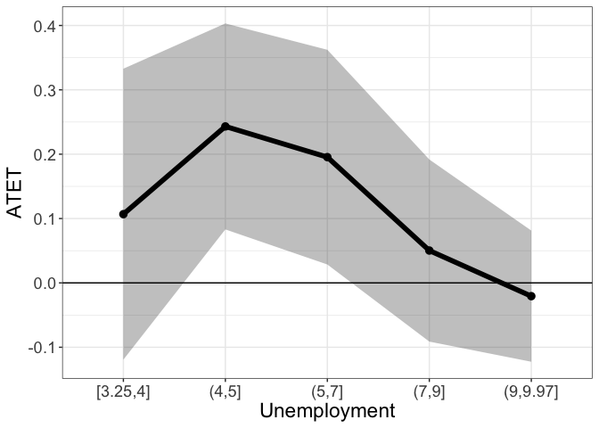
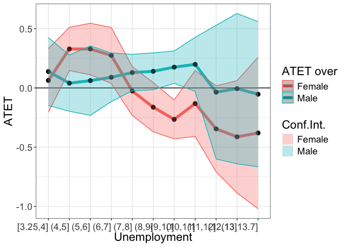

# Illustration

## Data

> The subset of the data from [Integrated Public Use Microdata Series
> (IPUMS)](https://ipums.org) is used to illustrate the functionality of
> the package. The data are available in the package and can be loaded
> by

``` r
  library(didnp)
  library(tidyverse)
#R>  ── Attaching core tidyverse packages ──────────────────────── tidyverse 2.0.0 ──
#R>  ✔ dplyr     1.1.4     ✔ readr     2.1.5
#R>  ✔ forcats   1.0.0     ✔ stringr   1.5.1
#R>  ✔ ggplot2   3.5.1     ✔ tibble    3.2.1
#R>  ✔ lubridate 1.9.4     ✔ tidyr     1.3.1
#R>  ✔ purrr     1.0.2     
#R>  ── Conflicts ────────────────────────────────────────── tidyverse_conflicts() ──
#R>  ✖ dplyr::filter() masks stats::filter()
#R>  ✖ dplyr::lag()    masks stats::lag()
#R>  ℹ Use the conflicted package (<http://conflicted.r-lib.org/>) to force all conflicts to become errors
  data(Unempl, package = "didnp")
  head(Unempl)
#R>    FT YEAR    UNEMP SEX STATEFIP SCHOOL AGE YRIMMIG EDUC AFTER ELIGIBLE
#R>  1  1 2008 5.883333   2        1      1  23    2000    6     0        1
#R>  2  1 2008 5.883333   1        1      1  27    1993    6     0        0
#R>  3  1 2008 5.883333   2        1      1  30    1980    6     0        0
#R>  4  1 2008 5.883333   1        1      1  27    1994    6     0        0
#R>  5  1 2008 5.883333   2        1      1  25    1991    6     0        1
#R>  6  1 2008 6.475000   2        2      1  24    1987    7     0        1
```

The description of the dataset can be found by typing

``` r
  ?Unempl
  table(Unempl$age)
```

The variable ELIGIBLE is equal to 1 if the observation is in the treated
group and 0 if in the control group.

``` r
table(Unempl$YEAR, Unempl$ELIGIBLE)
#R>        
#R>            0    1
#R>    2008  848 1506
#R>    2009  816 1563
#R>    2010  851 1593
#R>    2011  779 1571
#R>    2013  747 1377
#R>    2014  707 1349
#R>    2015  623 1227
#R>    2016  629 1196
```

Consider the treated by age

``` r
table(Unempl$ELIGIBLE, Unempl$AGE)
#R>     
#R>        22   23   24   25   26   27   28   29   30   31   32   33   34   35   36
#R>    0    0    0    0    0    0  106  308  489  765  670  609  578  536  599  617
#R>    1  180  574  968 1198 1180 1123 1167 1150 1189  996  746  513  309   89    0
#R>     
#R>        37   38   39
#R>    0  386  251   86
#R>    1    0    0    0
```

Both treated and control groups must have comparable individuals. So we
need to restrict the sample where age of individuals is between 27 and
35.

For convenience, a dataset with a smaller number of variables is created

``` r
d2 <- data.frame(
  y = as.numeric(Unempl$FT),
  year = Unempl$YEAR,
  unemp = Unempl$UNEMP,
  sex = factor(Unempl$SEX),
  age = ordered(Unempl$AGE),
  yrimmig = ordered(Unempl$YRIMMIG),
  educ = ordered(Unempl$EDUC),
  treatment_period = as.numeric(Unempl$AFTER),
  treated = as.numeric(Unempl$ELIGIBLE)
)
```

There is a gap in the `year`

``` r
table(d2$year)
#R>  
#R>  2008 2009 2010 2011 2013 2014 2015 2016 
#R>  2354 2379 2444 2350 2124 2056 1850 1825
```

Year 2012 is missing from this dataset because while the treatment
occurred in 2012 IPUMS does not record when the survey was filled out
and we therefore do not know whether observations from 2012 are in the
pre- or post-treatment time period. A variable `t` is generated, where

| Year |   t |
|:-----|----:|
| 2008 |  -3 |
| 2009 |  -2 |
| 2010 |  -1 |
| 2011 |   0 |
| 2013 |   1 |
| 2014 |   2 |
| 2015 |   3 |
| 2016 |   4 |

An artificial variable `period` that does not have a gap is generated,
where

| Year | period |
|:-----|-------:|
| 2008 |      1 |
| 2009 |      2 |
| 2010 |      3 |
| 2011 |      4 |
| 2013 |      5 |
| 2014 |      6 |
| 2015 |      7 |
| 2016 |      8 |

To make the sample more homogeneous and smaller for illustrative
purposes, the subsample of the data with the following conditions is
created:

1.  `age >= 27 & age <= 35`
2.  `yrimmig >= 1982 & yrimmig <= 1994`
3.  `educ >= 6 & educ <= 11`

``` r
year_min <- min(Unempl$YEAR)

d0 <- d2 %>%
  filter(age >= 27 & age <= 35) |>
  filter(yrimmig >= 1982 & yrimmig <= 1994) |>
  filter(educ >= 6 & educ <= 11) |>
  mutate(
    yrimmig = droplevels(yrimmig),
    educ = droplevels(educ),
    age = droplevels(age)
    ) |>
    mutate(period = dplyr::if_else(year < 2012,
      year - year_min + 1,
      year - year_min),
      t = period - min(period[treatment_period == 1]-1))
table(d0$period)
#R>  
#R>     1    2    3    4    5    6    7    8 
#R>   739  867 1131 1310 1356 1151  895  779
```

> Here is a basic description of the data

Treated over time

``` r
table(d0$year, d0$treated)
#R>        
#R>           0   1
#R>    2008 655  84
#R>    2009 620 247
#R>    2010 641 490
#R>    2011 612 698
#R>    2013 490 866
#R>    2014 327 824
#R>    2015 175 720
#R>    2016  51 728
table(d0$t, d0$treated)
#R>      
#R>         0   1
#R>    -3 655  84
#R>    -2 620 247
#R>    -1 641 490
#R>    0  612 698
#R>    1  490 866
#R>    2  327 824
#R>    3  175 720
#R>    4   51 728
```

Recoded variable `t`

``` r
table(d0$t, d0$year)
#R>      
#R>       2008 2009 2010 2011 2013 2014 2015 2016
#R>    -3  739    0    0    0    0    0    0    0
#R>    -2    0  867    0    0    0    0    0    0
#R>    -1    0    0 1131    0    0    0    0    0
#R>    0     0    0    0 1310    0    0    0    0
#R>    1     0    0    0    0 1356    0    0    0
#R>    2     0    0    0    0    0 1151    0    0
#R>    3     0    0    0    0    0    0  895    0
#R>    4     0    0    0    0    0    0    0  779
```

Treated by the year of immigration

``` r
table(d0$yrimmig, d0$treated)
#R>        
#R>           0   1
#R>    1982 129 107
#R>    1983 122 147
#R>    1984 139 214
#R>    1985 228 297
#R>    1986 183 312
#R>    1987 158 265
#R>    1988 240 371
#R>    1989 387 563
#R>    1990 579 691
#R>    1991 332 432
#R>    1992 415 415
#R>    1993 336 404
#R>    1994 323 439
```

Treated by education

``` r
table(d0$educ, d0$treated)
#R>      
#R>          0    1
#R>    6  2647 3128
#R>    7   559  845
#R>    8   178  334
#R>    10  151  301
#R>    11   36   49
```

Treated by age

``` r
table(d0$treated, d0$age)
#R>     
#R>       27  28  29  30  31  32  33  34  35
#R>    0  72 233 365 609 502 474 457 408 451
#R>    1 737 761 681 733 615 506 350 214  60
```

Although this can be done on the fly, the subsample can be prepared
beforehand:

``` r
# get the subsample
d0 <- d0 %>%
  mutate(smpl = year >= 2010 & year <= 2014)
table(d0$smpl)
#R>  
#R>  FALSE  TRUE 
#R>   3280  4948
```

> Define the formula that we will use:

``` r
form1 <- y ~ age + educ + sex + unemp | period | treated | treatment_period
```

To obtain standard errors and perform testing in this *illustration*,

> we will use a few number of bootstrap replicaitons here, but we advise
> to set `boot.num = 399` or larger in an application.

``` r
B <- 99
```

## Testing

To test if there is a violation of the bias stability condition use
command `didnptest`

``` r
tym1test <- didnpbsctest(
  form1,
  data = d0,
  subset = smpl,
  boot.num = B,
  print.level = 2,
  cores = 10)
#R>  Warning in didnpbsctest.default(outcome = Y, regressors = X, time = time, :
#R>  Data starts in 3, while the treatment is in 4
#R>  Number of Observations is  4948 
#R>  
#R>  Number of observations in treated group right after the treatment       (N_ 1, 1) = 866 
#R>  Number of observations in treated group just before the treatment       (N_ 1, 0) = 698 
#R>  Number of observations in treated group one period before the treatment (N_ 1,-1) = 490 
#R>  Number of observations in control group right after the treatment       (N_ 0, 1) = 490 
#R>  Number of observations in control group just before the treatment       (N_ 0, 0) = 612 
#R>  Number of observations in control group one period before the treatment (N_ 0,-1) = 641 
#R>  
#R>  Number of Continuous Regressors            = 1 
#R>  Number of Unordered Categorical Regressors = 1 
#R>  Number of Ordered Categorical Regressors   = 2 
#R>  
#R>  Bandwidths are chosen via the plug-in method
#R>  
#R>  Calculating BSC 
#R>  BSC = 0.193390839
#R>  Calculating BSC completed in 0 seconds
#R>  
#R>  Bootstrapping the statistic (99 replications)
#R>  Calculating residuals for the alternative model
#R>  Calculating residuals for the alternative model completed in 0 seconds
#R>  Calculating fitted values under the null hypothesis
#R>  Calculating fitted values under the null hypothesis completed in 0 seconds
#R>  
#R>  The main loop of the bootstrapping started
#R>  
#R>  Bootstrapping will take approximately: 2 seconds
#R>  
#R>    |                                                                              |=                                                                     |   1%  |                                                                              |=                                                                     |   2%  |                                                                              |==                                                                    |   3%  |                                                                              |===                                                                   |   4%  |                                                                              |====                                                                  |   5%  |                                                                              |====                                                                  |   6%  |                                                                              |=====                                                                 |   7%  |                                                                              |======                                                                |   8%  |                                                                              |======                                                                |   9%  |                                                                              |=======                                                               |  10%  |                                                                              |========                                                              |  11%  |                                                                              |=========                                                             |  12%  |                                                                              |=========                                                             |  13%  |                                                                              |==========                                                            |  14%  |                                                                              |===========                                                           |  15%  |                                                                              |===========                                                           |  16%  |                                                                              |============                                                          |  17%  |                                                                              |=============                                                         |  18%  |                                                                              |==============                                                        |  19%  |                                                                              |==============                                                        |  20%  |                                                                              |===============                                                       |  21%  |                                                                              |================                                                      |  22%  |                                                                              |================                                                      |  23%  |                                                                              |=================                                                     |  24%  |                                                                              |==================                                                    |  26%  |                                                                              |===================                                                   |  27%  |                                                                              |===================                                                   |  28%  |                                                                              |====================                                                  |  29%  |                                                                              |=====================                                                 |  30%  |                                                                              |=====================                                                 |  31%  |                                                                              |======================                                                |  32%  |                                                                              |=======================                                               |  33%  |                                                                              |========================                                              |  34%  |                                                                              |========================                                              |  35%  |                                                                              |=========================                                             |  36%  |                                                                              |==========================                                            |  37%  |                                                                              |==========================                                            |  38%  |                                                                              |===========================                                           |  39%  |                                                                              |============================                                          |  40%  |                                                                              |=============================                                         |  41%  |                                                                              |=============================                                         |  42%  |                                                                              |==============================                                        |  43%  |                                                                              |===============================                                       |  44%  |                                                                              |===============================                                       |  45%  |                                                                              |================================                                      |  46%  |                                                                              |=================================                                     |  47%  |                                                                              |==================================                                    |  48%  |                                                                              |==================================                                    |  49%  |                                                                              |===================================                                   |  50%  |                                                                              |====================================                                  |  51%  |                                                                              |====================================                                  |  52%  |                                                                              |=====================================                                 |  53%  |                                                                              |======================================                                |  54%  |                                                                              |=======================================                               |  55%  |                                                                              |=======================================                               |  56%  |                                                                              |========================================                              |  57%  |                                                                              |=========================================                             |  58%  |                                                                              |=========================================                             |  59%  |                                                                              |==========================================                            |  60%  |                                                                              |===========================================                           |  61%  |                                                                              |============================================                          |  62%  |                                                                              |============================================                          |  63%  |                                                                              |=============================================                         |  64%  |                                                                              |==============================================                        |  65%  |                                                                              |==============================================                        |  66%  |                                                                              |===============================================                       |  67%  |                                                                              |================================================                      |  68%  |                                                                              |=================================================                     |  69%  |                                                                              |=================================================                     |  70%  |                                                                              |==================================================                    |  71%  |                                                                              |===================================================                   |  72%  |                                                                              |===================================================                   |  73%  |                                                                              |====================================================                  |  74%  |                                                                              |=====================================================                 |  76%  |                                                                              |======================================================                |  77%  |                                                                              |======================================================                |  78%  |                                                                              |=======================================================               |  79%  |                                                                              |========================================================              |  80%  |                                                                              |========================================================              |  81%  |                                                                              |=========================================================             |  82%  |                                                                              |==========================================================            |  83%  |                                                                              |===========================================================           |  84%  |                                                                              |===========================================================           |  85%  |                                                                              |============================================================          |  86%  |                                                                              |=============================================================         |  87%  |                                                                              |=============================================================         |  88%  |                                                                              |==============================================================        |  89%  |                                                                              |===============================================================       |  90%  |                                                                              |================================================================      |  91%  |                                                                              |================================================================      |  92%  |                                                                              |=================================================================     |  93%  |                                                                              |==================================================================    |  94%  |                                                                              |==================================================================    |  95%  |                                                                              |===================================================================   |  96%  |                                                                              |====================================================================  |  97%  |                                                                              |===================================================================== |  98%  |                                                                              |===================================================================== |  99%  |                                                                              |======================================================================| 100%
#R>  Bootstrapping the statistic completed in 2 seconds
#R>   p.value:
#R>  [1] 0.37
#R>  
#R>  BSC statistic                   = 0.1934 
#R>  BSC bootstrapped standard error = 0.04252 
#R>  Bootstrapped p-value            =  0.37
```

*Interpretation*: We do not find evidence against the null hypothesis
that the bias stability condition holds. The desired *p*-value should be
much larger than the 0.1 level.

## Estimation

To estimate the average treatment effects, we use the `didnpreg`
function. The `didnpreg` function allows using matrices. The manual
explains how to use matrix syntax (type `?didnpreg`).

> Just a remainder that TTa calculates the ATET in the post-treatment
> period, while TTb calculated the ATET in both prior and post-treatment
> periods.

To speed up the estimation

> on computers with multiple cores, use multiplrocessing by setting
> option `cores`.

Suppress output by setting `print.level = 0`. The default value is 1.

``` r
# suppress output
tym1a <- didnpreg(
  form1,
  data = d0,
  subset = smpl,
  bwmethod = "opt",
  boot.num = B,
  TTx = "TTa",
  print.level = 2,
  digits = 8,
  cores = 10)
#R>  Warning in didnpreg.default(outcome = Y, regressors = X, time = time, treated =
#R>  treated, : Data starts in 3, while the treatment is in 4
#R>  Number of observations = 4948 
#R>  Number of observations in the year of the treatment and one year after the treatment = 2666 
#R>  
#R>  Number of observations in treated group after  the treatment (N_ 1, 1) = 1690 
#R>  Number of observations in treated group before the treatment (N_ 1, 0) = 1188 
#R>  Number of observations in control group after  the treatment (N_ 0, 1) = 817 
#R>  Number of observations in control group before the treatment (N_ 0, 0) = 1253 
#R>  
#R>  Number of Continuous Regressors            = 1 
#R>  Number of Unordered Categorical Regressors = 1 
#R>  Number of Ordered Categorical Regressors   = 2 
#R>  
#R>  Bandwidths are chosen via the plug-in method
#R>  
#R>    Regressor       Type    Bandwidth
#R>  1       age    ordered 9.356700e-05
#R>  2      educ    ordered 9.049838e-05
#R>  3       sex     factor 5.909937e-04
#R>  4     unemp continuous 2.397334e-01
#R>  
#R>  Calculating ATET: TTa
#R>  TTa = 0.074190278, N (TTa; treated in the first period or N_ 1, 1) = 1690
#R>  Calculating ATET completed in 0 seconds
#R>  
#R>  Bootstrapping standard errors (99 replications)
#R>  Calculating residuals completed
#R>  
#R>  Bootstrapping will take approximately: 3 seconds
#R>  
#R>    |                                                                              |=                                                                     |   1%  |                                                                              |=                                                                     |   2%  |                                                                              |==                                                                    |   3%  |                                                                              |===                                                                   |   4%  |                                                                              |====                                                                  |   5%  |                                                                              |====                                                                  |   6%  |                                                                              |=====                                                                 |   7%  |                                                                              |======                                                                |   8%  |                                                                              |======                                                                |   9%  |                                                                              |=======                                                               |  10%  |                                                                              |========                                                              |  11%  |                                                                              |=========                                                             |  12%  |                                                                              |=========                                                             |  13%  |                                                                              |==========                                                            |  14%  |                                                                              |===========                                                           |  15%  |                                                                              |===========                                                           |  16%  |                                                                              |============                                                          |  17%  |                                                                              |=============                                                         |  18%  |                                                                              |==============                                                        |  19%  |                                                                              |==============                                                        |  20%  |                                                                              |===============                                                       |  21%  |                                                                              |================                                                      |  22%  |                                                                              |================                                                      |  23%  |                                                                              |=================                                                     |  24%  |                                                                              |==================                                                    |  26%  |                                                                              |===================                                                   |  27%  |                                                                              |===================                                                   |  28%  |                                                                              |====================                                                  |  29%  |                                                                              |=====================                                                 |  30%  |                                                                              |=====================                                                 |  31%  |                                                                              |======================                                                |  32%  |                                                                              |=======================                                               |  33%  |                                                                              |========================                                              |  34%  |                                                                              |========================                                              |  35%  |                                                                              |=========================                                             |  36%  |                                                                              |==========================                                            |  37%  |                                                                              |==========================                                            |  38%  |                                                                              |===========================                                           |  39%  |                                                                              |============================                                          |  40%  |                                                                              |=============================                                         |  41%  |                                                                              |=============================                                         |  42%  |                                                                              |==============================                                        |  43%  |                                                                              |===============================                                       |  44%  |                                                                              |===============================                                       |  45%  |                                                                              |================================                                      |  46%  |                                                                              |=================================                                     |  47%  |                                                                              |==================================                                    |  48%  |                                                                              |==================================                                    |  49%  |                                                                              |===================================                                   |  50%  |                                                                              |====================================                                  |  51%  |                                                                              |====================================                                  |  52%  |                                                                              |=====================================                                 |  53%  |                                                                              |======================================                                |  54%  |                                                                              |=======================================                               |  55%  |                                                                              |=======================================                               |  56%  |                                                                              |========================================                              |  57%  |                                                                              |=========================================                             |  58%  |                                                                              |=========================================                             |  59%  |                                                                              |==========================================                            |  60%  |                                                                              |===========================================                           |  61%  |                                                                              |============================================                          |  62%  |                                                                              |============================================                          |  63%  |                                                                              |=============================================                         |  64%  |                                                                              |==============================================                        |  65%  |                                                                              |==============================================                        |  66%  |                                                                              |===============================================                       |  67%  |                                                                              |================================================                      |  68%  |                                                                              |=================================================                     |  69%  |                                                                              |=================================================                     |  70%  |                                                                              |==================================================                    |  71%  |                                                                              |===================================================                   |  72%  |                                                                              |===================================================                   |  73%  |                                                                              |====================================================                  |  74%  |                                                                              |=====================================================                 |  76%  |                                                                              |======================================================                |  77%  |                                                                              |======================================================                |  78%  |                                                                              |=======================================================               |  79%  |                                                                              |========================================================              |  80%  |                                                                              |========================================================              |  81%  |                                                                              |=========================================================             |  82%  |                                                                              |==========================================================            |  83%  |                                                                              |===========================================================           |  84%  |                                                                              |===========================================================           |  85%  |                                                                              |============================================================          |  86%  |                                                                              |=============================================================         |  87%  |                                                                              |=============================================================         |  88%  |                                                                              |==============================================================        |  89%  |                                                                              |===============================================================       |  90%  |                                                                              |================================================================      |  91%  |                                                                              |================================================================      |  92%  |                                                                              |=================================================================     |  93%  |                                                                              |==================================================================    |  94%  |                                                                              |==================================================================    |  95%  |                                                                              |===================================================================   |  96%  |                                                                              |====================================================================  |  97%  |                                                                              |===================================================================== |  98%  |                                                                              |===================================================================== |  99%  |                                                                              |======================================================================| 100%
#R>  Bootstrapping standard errors completed in 3 seconds
#R>  
#R>  TTa bootstrapped standard error =  0.087125125 
#R>  
#R>  Bootstrapped confidence interval:
#R>  
#R>                  Coef.        SE  [95% confidence interval]                                                          
#R>  ATET (TTa) 0.07419028 0.08712513 -0.14806851    0.17499465
#R>  
#R>  
#R>  p-value and confidence interval assuming ATET (TTa) is normally distributed:
#R>  
#R>                  Coef.        SE       z      P>|z|  [95% confidence interval]                                                                             
#R>  ATET (TTa) 0.07419028 0.08712513    0.85 0.39447105 -0.09657183    0.24495238
```

`didnpreg` returns a class `didnp` object. This object contains
estimates of the average treatment effects and their standard errors. To
see these, we can call the `summary` function.

``` r
# Print the summary of estimation
summary(tym1a)
#R>  Number of Observations = 4948 
#R>  Number of observations in the year of the treatment and one year after the treatment = 4948 
#R>  
#R>  Number of observations in treated group right after the treatment (N_11) = 1690 
#R>  Number of observations in treated group just before the treatment (N_10) = 1188 
#R>  Number of observations in control group right after the treatment (N_01) = 817 
#R>  Number of observations in control group just before the treatment (N_00) = 1253 
#R>  
#R>  Number of Continuous Regressors            = 1 
#R>  Number of Unordered Categorical Regressors = 1 
#R>  Number of Ordered Categorical Regressors   = 2 
#R>  
#R>  Bandwidths are chosen via the plug-in method
#R>  
#R>    Regressor       Type    Bandwidth
#R>  1       age    ordered 9.356700e-05
#R>  2      educ    ordered 9.049838e-05
#R>  3       sex     factor 5.909937e-04
#R>  4     unemp continuous 2.397334e-01
#R>  
#R>  Unconditional Treatment Effect on the Treated (ATET):
#R>  
#R>  TTa    = 0.07419
#R>  TTa sd = 0.08713
#R>  N(TTa) = 1690
#R>  Bootstrapped 95% confidence interval: [-0.1481, 0.1750]
#R>  
#R>  p-value and confidence interval assuming ATET is normally distributed:
#R>  
#R>            Coef.        SE       z      P>|z|  [95% confidence interval]                                                                       
#R>  ATET     0.0742     0.0871    0.85     0.3945 -0.0966            0.2450
rm(tym1a)
```

Estimating $TT_b$ will take longer. The bandwidths are cross-validated.

``` r
# Show output as the estimation goes
tym1b <- didnpreg(
  form1,
  data = d0,
  subset = smpl,
  bwmethod = "CV",
  boot.num = B,
  TTx = "TTb",
  print.level = 2,
  digits = 4,
  cores = 10)
#R>  Warning in didnpreg.default(outcome = Y, regressors = X, time = time, treated =
#R>  treated, : Data starts in 3, while the treatment is in 4
#R>  Number of observations = 4948 
#R>  
#R>  Number of observations in treated group after  the treatment (N_ 1, 1) = 1690 
#R>  Number of observations in treated group before the treatment (N_ 1, 0) = 1188 
#R>  Number of observations in control group after  the treatment (N_ 0, 1) = 817 
#R>  Number of observations in control group before the treatment (N_ 0, 0) = 1253 
#R>  
#R>  Number of Continuous Regressors            = 1 
#R>  Number of Unordered Categorical Regressors = 1 
#R>  Number of Ordered Categorical Regressors   = 2 
#R>  
#R>  Calculating cross-validated bandwidths
#R>  Kernel Type for Continuous Regressors is               Gaussian
#R>  Kernel Type for Unordered Categorical Regressors is    Aitchison and Aitken
#R>  Kernel Type for Ordered Categorical is                 Li and Racine
#R>  Calculating cross-validated bandwidths completed in 1 second
#R>  
#R>    Regressor       Type  Bandwidth
#R>  1       age    ordered 0.10774737
#R>  2      educ    ordered 0.05637391
#R>  3       sex     factor 0.05638123
#R>  4     unemp continuous 0.25507958
#R>  
#R>  Calculating ATET: TTb
#R>  TTb = 0.00269, N (TTb; all treated) = 2878
#R>  Calculating ATET completed in 0 seconds
#R>  
#R>  Bootstrapping standard errors (99 replications)
#R>  Calculating residuals completed
#R>  
#R>  Bootstrapping will take approximately: 5 seconds
#R>  
#R>    |                                                                              |=                                                                     |   1%  |                                                                              |=                                                                     |   2%  |                                                                              |==                                                                    |   3%  |                                                                              |===                                                                   |   4%  |                                                                              |====                                                                  |   5%  |                                                                              |====                                                                  |   6%  |                                                                              |=====                                                                 |   7%  |                                                                              |======                                                                |   8%  |                                                                              |======                                                                |   9%  |                                                                              |=======                                                               |  10%  |                                                                              |========                                                              |  11%  |                                                                              |=========                                                             |  12%  |                                                                              |=========                                                             |  13%  |                                                                              |==========                                                            |  14%  |                                                                              |===========                                                           |  15%  |                                                                              |===========                                                           |  16%  |                                                                              |============                                                          |  17%  |                                                                              |=============                                                         |  18%  |                                                                              |==============                                                        |  19%  |                                                                              |==============                                                        |  20%  |                                                                              |===============                                                       |  21%  |                                                                              |================                                                      |  22%  |                                                                              |================                                                      |  23%  |                                                                              |=================                                                     |  24%  |                                                                              |==================                                                    |  26%  |                                                                              |===================                                                   |  27%  |                                                                              |===================                                                   |  28%  |                                                                              |====================                                                  |  29%  |                                                                              |=====================                                                 |  30%  |                                                                              |=====================                                                 |  31%  |                                                                              |======================                                                |  32%  |                                                                              |=======================                                               |  33%  |                                                                              |========================                                              |  34%  |                                                                              |========================                                              |  35%  |                                                                              |=========================                                             |  36%  |                                                                              |==========================                                            |  37%  |                                                                              |==========================                                            |  38%  |                                                                              |===========================                                           |  39%  |                                                                              |============================                                          |  40%  |                                                                              |=============================                                         |  41%  |                                                                              |=============================                                         |  42%  |                                                                              |==============================                                        |  43%  |                                                                              |===============================                                       |  44%  |                                                                              |===============================                                       |  45%  |                                                                              |================================                                      |  46%  |                                                                              |=================================                                     |  47%  |                                                                              |==================================                                    |  48%  |                                                                              |==================================                                    |  49%  |                                                                              |===================================                                   |  50%  |                                                                              |====================================                                  |  51%  |                                                                              |====================================                                  |  52%  |                                                                              |=====================================                                 |  53%  |                                                                              |======================================                                |  54%  |                                                                              |=======================================                               |  55%  |                                                                              |=======================================                               |  56%  |                                                                              |========================================                              |  57%  |                                                                              |=========================================                             |  58%  |                                                                              |=========================================                             |  59%  |                                                                              |==========================================                            |  60%  |                                                                              |===========================================                           |  61%  |                                                                              |============================================                          |  62%  |                                                                              |============================================                          |  63%  |                                                                              |=============================================                         |  64%  |                                                                              |==============================================                        |  65%  |                                                                              |==============================================                        |  66%  |                                                                              |===============================================                       |  67%  |                                                                              |================================================                      |  68%  |                                                                              |=================================================                     |  69%  |                                                                              |=================================================                     |  70%  |                                                                              |==================================================                    |  71%  |                                                                              |===================================================                   |  72%  |                                                                              |===================================================                   |  73%  |                                                                              |====================================================                  |  74%  |                                                                              |=====================================================                 |  76%  |                                                                              |======================================================                |  77%  |                                                                              |======================================================                |  78%  |                                                                              |=======================================================               |  79%  |                                                                              |========================================================              |  80%  |                                                                              |========================================================              |  81%  |                                                                              |=========================================================             |  82%  |                                                                              |==========================================================            |  83%  |                                                                              |===========================================================           |  84%  |                                                                              |===========================================================           |  85%  |                                                                              |============================================================          |  86%  |                                                                              |=============================================================         |  87%  |                                                                              |=============================================================         |  88%  |                                                                              |==============================================================        |  89%  |                                                                              |===============================================================       |  90%  |                                                                              |================================================================      |  91%  |                                                                              |================================================================      |  92%  |                                                                              |=================================================================     |  93%  |                                                                              |==================================================================    |  94%  |                                                                              |==================================================================    |  95%  |                                                                              |===================================================================   |  96%  |                                                                              |====================================================================  |  97%  |                                                                              |===================================================================== |  98%  |                                                                              |===================================================================== |  99%  |                                                                              |======================================================================| 100%
#R>  Bootstrapping standard errors completed in 5 seconds
#R>  
#R>  TTb bootstrapped standard error = 0.0796 
#R>  
#R>  Bootstrapped confidence interval:
#R>  
#R>                  Coef.        SE  [95% confidence interval]                                                          
#R>  ATET (TTb)     0.0027     0.0796 -0.1049            0.2061
#R>  
#R>  
#R>  p-value and confidence interval assuming ATET (TTb) is normally distributed:
#R>  
#R>                  Coef.        SE       z      P>|z|  [95% confidence interval]                                                                             
#R>  ATET (TTb)     0.0027     0.0796    0.03     0.9730 -0.1533            0.1587
```

### Understanding \[sub\]samples

> To work with the results for the plot, `didnpreg` produces binary
> variables indicating different samples.

The estimation sample is captured by the `esample` value, which is equal
to 1 if this observation was used in the estimation and 0 otherwise:

``` r
table(
  d0$year[tym1b$esample],
  d0$treated[tym1b$esample]
)
#R>        
#R>           0   1
#R>    2010 641 490
#R>    2011 612 698
#R>    2013 490 866
#R>    2014 327 824
```

The value `sample1` indicates *all treated* (before and after treatment)
observations in the estimation sample `esample`. To subset the treated
observations in the original dataset, double subsetting is required.

``` r
table(
  d0$year[tym1b$esample][tym1b$sample1],
  d0$treated[tym1b$esample][tym1b$sample1]
)
#R>        
#R>           1
#R>    2010 490
#R>    2011 698
#R>    2013 866
#R>    2014 824
```

The value `sample11` indicates the *treated* observations in the
post-treatment period in the estimation sample `esample`. To subset the
treated observations in the original dataset, double subsetting is
required.

``` r
table(
  d0$year[tym1b$esample][tym1b$sample11],
  d0$treated[tym1b$esample][tym1b$sample11]
)
#R>        
#R>           1
#R>    2013 866
#R>    2014 824
# or the same in case TTx = "TTa" was used by the 'didnpreg' command
table(
  d0$year[tym1b$esample][tym1b$sample1][tym1b$TTa.positions.in.TTb],
  d0$treated[tym1b$esample][tym1b$sample1][tym1b$TTa.positions.in.TTb]
)
#R>        
#R>           1
#R>    2013 866
#R>    2014 824
```

The values of the individual TEs can be put to the dataset using double
subsetting for TTb

``` r
d0$TTbi[tym1b$esample][tym1b$sample1] <- tym1b$TTb.i
d0 %>%
  group_by(year) %>%
  summarize(mean = mean(TTbi, na.rm = TRUE))
#R>  # A tibble: 8 × 2
#R>     year     mean
#R>    <int>    <dbl>
#R>  1  2008 NaN     
#R>  2  2009 NaN     
#R>  3  2010  -0.0976
#R>  4  2011  -0.110 
#R>  5  2013   0.0584
#R>  6  2014   0.0995
#R>  7  2015 NaN     
#R>  8  2016 NaN
```

or TTa

``` r
d0$TTai[tym1b$esample][tym1b$sample11] <- tym1b$TTa.i
d0 %>%
  group_by(year) %>%
  summarize(mean = mean(TTai, na.rm = TRUE))
#R>  # A tibble: 8 × 2
#R>     year     mean
#R>    <int>    <dbl>
#R>  1  2008 NaN     
#R>  2  2009 NaN     
#R>  3  2010 NaN     
#R>  4  2011 NaN     
#R>  5  2013   0.0584
#R>  6  2014   0.0995
#R>  7  2015 NaN     
#R>  8  2016 NaN
```

## Plotting Heterogenous Treatment Effects

> Just a remainder that TTa calculates the ATET in the post-treatment
> period, while TTb calculated the ATET in both prior and post-treatment
> periods.

To plot the heterogenous treatment effects, use the `didnpplot` command.

> The heterogenous treatment effects can be plotted `by` either
> continuous or categorical variable. They can also also be plotted `by`
> either continuous or categorical variable `over` another categorical
> variable.

### ‘by’: factor

#### education

The heterogenous treatment effects are plotted for each level of
education, since the `education` is a categorical variable.

``` r
tym1b_gr_educ <- didnpplot(
  obj = tym1b,
  level = 95,
  by = d0$educ[tym1b$esample][tym1b$sample1],
  xlab = "Education",
  ylab = "ATET"
)
#R>  [1] "1. 'by' is catergorical"
#R>  [1] "1.1 TTa + TTb"
#R>  [1] "1.1.1.1 TTb"
# A
tym1b_gr_educ$data.a
#R>           atet    atet.sd count by
#R>  1  0.10792531 0.10360520   315  7
#R>  2  0.08590395 0.07209783  1099  6
#R>  3 -0.01155122 0.16378588   146  8
#R>  4  0.09638786 0.15952821   108 10
#R>  5 -0.20622072 0.14607889    22 11
tym1b_gr_educ$plot.a
```

<!-- -->

``` r
# B
tym1b_gr_educ$data.b
#R>            atet    atet.sd count by
#R>  1 -0.013384275 0.11395764   544  7
#R>  2 -0.004822337 0.09689843  1911  6
#R>  3  0.025177550 0.14252837   201  8
#R>  4  0.139390533 0.16681813   187 10
#R>  5 -0.196831130 0.15695523    35 11
tym1b_gr_educ$plot.b
```

<!-- -->

``` r
# ggsave(paste0("atet_ci_education.pdf"), width = 15, height = 10, units = c("cm"))
```

Here objects `data.a` and `data.b` contain data that is used to produce
`plot.a` and `plot.b`. The graphs are `ggplot` objects and can be
amended further.

#### time

The heterogenous treatment effects over time show that the effect is
significant in the second year after the treatment.

> Note that the graph shows the *90%* confidence interval bygiving the
> option `level = 90`.

``` r
tym1b_gr_time <- didnpplot(
  obj = tym1b,
  level = 90,
  by = factor(d0$t)[tym1b$esample][tym1b$sample1],
  by.labels.values = data.frame(c("-1","0","1","2"), c("2010", "2011", "2013", "2014")),
  xlab = "Year",
  ylab = "ATET"
)
#R>  [1] "1. 'by' is catergorical"
#R>  [1] "1.1 TTa + TTb"
#R>  [1] "1.1.1.1 TTb"
# A
tym1b_gr_time$data.a
#R>          atet    atet.sd count   by byold
#R>  1        NaN         NA     0 2010    -1
#R>  2        NaN         NA     0 2011     0
#R>  3 0.05840563 0.05889966   866 2013     1
#R>  4 0.09952936 0.07018234   824 2014     2
tym1b_gr_time$plot.a
#R>  Warning: Removed 2 rows containing missing values or values outside the scale range
#R>  (`geom_bar()`).
#R>  Warning: Removed 2 rows containing missing values or values outside the scale range
#R>  (`geom_point()`).
```

<!-- -->

``` r
# B
tym1b_gr_time$data.b
#R>           atet    atet.sd count   by byold
#R>  1 -0.09763422 0.17194937   490 2010    -1
#R>  2 -0.11032894 0.14665580   698 2011     0
#R>  3  0.05840563 0.05889966   866 2013     1
#R>  4  0.09952936 0.07018234   824 2014     2
tym1b_gr_time$plot.b
```

<!-- -->

``` r
# ggsave(paste0("atet_ci_time.pdf"), width = 15, height = 10, units = c("cm"))
```

#### sex

Another example is the graph with the heterogenous treatment effects by
sex:

``` r
tym1b_gr_sex <- didnpplot(
  obj = tym1b,
  level = 95,
  by = d0$sex[tym1b$esample][tym1b$sample1],
  xlab = "Sex",
  ylab = "ATET",
  by.labels.values = data.frame(c("1","2"), c("Male", "Female"))
)
#R>  [1] "1. 'by' is catergorical"
#R>  [1] "1.1 TTa + TTb"
#R>  [1] "1.1.1.1 TTb"
# A
tym1b_gr_sex$data.a
#R>          atet    atet.sd count     by byold
#R>  1 0.13263322 0.07018602   830   Male     1
#R>  2 0.02616964 0.08545339   860 Female     2
tym1b_gr_sex$plot.a
```

<!-- -->

``` r
# B
tym1b_gr_sex$data.b
#R>           atet    atet.sd count     by byold
#R>  1  0.09857137 0.10754282  1440   Male     1
#R>  2 -0.09332522 0.08357793  1438 Female     2
tym1b_gr_sex$plot.b
```

<!-- -->

``` r
# ggsave(paste0("atet_ci_sex.pdf"), width = 15, height = 10, units = c("cm"))
```

### ‘by’ continuous: unemp

When the ‘by’ variable is continuous (the `didnpplot` command will
recognize if `by` is a continuous variable) the `didnpplot` offers three
ways of plotting the heterogeneous treatment effects.

#### Scale of the continuous ‘by’ is its range

If `by.continuous.scale` is not specified, `didnpplot` will use each
unique value in the `by` variable to produce the plot, which can be
pretty rugged.

``` r
tym1b_gr_unemp_each_value <- didnpplot(
  obj = tym1b,
  level = 95,
  by = d0$unemp[tym1b$esample][tym1b$sample1],
  xlab = "Unemployment",
  ylab = "ATET",
  add.zero.line = FALSE
)
#R>  [1] "2. 'by' is continuous"
#R>  [1] "Scale of the continuous 'by' is its range"
#R>  [1] "2.1 TTa + TTb"
#R>  [1] "2.1.1 only 'by'"
#R>  [1] "2.1.1.1 TTb"
#R>  [1] "2.1.1.2 TTa"
# A
head(tym1b_gr_unemp_each_value$data.a, 10)
#R>           by         atet   atet.sd count bySorted
#R>  1  3.250000 -0.116735486 0.1730414     5       11
#R>  2  3.633333  0.244916417 0.1391599    12       12
#R>  3  3.675000 -0.163110524 0.1857630     2       13
#R>  4  4.208333 -0.008850374 0.1380482     8       14
#R>  5  4.225000  0.021161353 0.1588585     2       15
#R>  6  4.266667  0.352318401 0.1378871     3       16
#R>  7  4.333333 -0.082006287 0.2486211     2       17
#R>  8  4.341667  0.265753703 0.1448199     2       18
#R>  9  4.383333  0.478780569 0.1678811     2       19
#R>  10 4.508333  0.347497049 0.1274053     4       20
tym1b_gr_unemp_each_value$plot.a
```

<!-- -->

``` r
# B
head(tym1b_gr_unemp_each_value$data.b, 10)
#R>           by          atet    atet.sd count bySorted
#R>  90 8.358333  0.0001284317 0.10936676     6      100
#R>  91 8.375000  0.1804007431 0.16428889     4      101
#R>  92 8.491667 -0.2909395634 0.16592609     1      102
#R>  93 8.525000 -0.1996837095 0.09767867    13      103
#R>  94 8.641667  0.6499037291 0.32873993     1      104
#R>  95 8.658333 -0.2872246202 0.28476744     1      105
#R>  96 8.691667 -0.0228657597 0.08704620    15      106
#R>  97 8.716667 -0.1457732130 0.12718286     2      107
#R>  98 8.725000  0.0103503330 0.11788690     3      108
#R>  99 8.758333 -0.3328329294 0.15271056     2      109
tym1b_gr_unemp_each_value$plot.b
```

<!-- -->

``` r
# ggsave(paste0("atet_ci_unemp_numeric.pdf"), width = 15, height = 10, units = c("cm"))
```

Ameding a ggplot object is easy. For example adding a 0 horizontal line
is

``` r
tym1b_gr_unemp_each_value$plot.a +
  geom_hline(yintercept = 0)
```

<!-- -->

> Anternatively, one can use the `data.a` and `data.b` objects to plot
> from scratch.

#### Scale of the continuous ‘by’ intervals

Setting `by.continuous.scale` to a single number, instructs `didnpplot`
to split the range of the continuous `by` variable into the number of
intervals specified by `by.continuous.scale` and plot ATET by intervals.

``` r
tym1b_gr_unemp_n_intervals <- didnpplot(
  obj = tym1b,
  level = 95,
  by = d0$unemp[tym1b$esample][tym1b$sample1],
  by.continuous.scale = 10,
  xaxis.label.angle = 90,
  xlab = "Unemployment",
  ylab = "ATET",
  by.labels.values = data.frame(c("1","2"), c("Male", "Female"))
)
#R>  [1] "2. 'by' is continuous"
#R>  [1] "Scale of the continuous 'by' is determined by the number of intervals 'by.continuous.scale'"
#R>  [1] "2.1 TTa + TTb"
#R>  [1] "2.1.1 only 'by'"
#R>  [1] "2.1.1.1 TTb"
#R>  [1] "2.1.1.2 TTa"
# A
tym1b_gr_unemp_n_intervals$data.a
#R>              by        atet    atet.sd count bySorted
#R>  1  (3.24,3.92]  0.10679466 0.13742108    19       11
#R>  2  (3.92,4.59]  0.16276170 0.10615043    23       12
#R>  3  (4.59,5.27]  0.21783610 0.11400609   183       13
#R>  4  (5.27,5.94]  0.15026060 0.14598266    31       14
#R>  5  (5.94,6.61]  0.22523441 0.11723207   235       15
#R>  6  (6.61,7.28]  0.08989266 0.08594099   155       16
#R>  7  (7.28,7.95]  0.04889052 0.08833423   497       17
#R>  8  (7.95,8.62]  0.04050111 0.08335645    38       18
#R>  9   (8.62,9.3] -0.01945809 0.06259306   475       19
#R>  10  (9.3,9.97] -0.03416828 0.08323956    34       20
tym1b_gr_unemp_n_intervals$plot.a
```

<!-- -->

``` r
# B
tym1b_gr_unemp_n_intervals$data.b
#R>              by         atet    atet.sd count bySorted
#R>  4   (3.24,4.3]  0.095549170 0.11519134    32       11
#R>  5   (4.3,5.35]  0.208246917 0.11170587   196       12
#R>  6  (5.35,6.39]  0.242905084 0.12155989   233       13
#R>  7  (6.39,7.44]  0.101167850 0.08528435   218       14
#R>  8  (7.44,8.49]  0.028286072 0.08494846   805       15
#R>  9  (8.49,9.54] -0.031809629 0.06191695   577       16
#R>  10 (9.54,10.6]  0.007166155 0.08511938   146       17
#R>  1  (10.6,11.6]  0.026221646 0.15061713    31       18
#R>  2  (11.6,12.7] -0.188963523 0.27263386   612       19
#R>  3  (12.7,13.7] -0.193354811 0.35653591    28       20
tym1b_gr_unemp_n_intervals$plot.b
```

<!-- -->

``` r
# ggsave(paste0("atet_ci_unemp_intervals.pdf"), width = 15, height = 10, units = c("cm"))
```

#### Scale of the continuous ‘by’ a vector

Setting `by.continuous.scale` to a single number, instructs `didnpplot`
to split the range of the continuous `by` variable into intervals
defined by the specified vector and plot ATET by intervals.

``` r
tym1b_gr_unemp_vector_breaks <- didnpplot(
  obj = tym1b,
  level = 95,
  by = d0$unemp[tym1b$esample][tym1b$sample1],
  by.continuous.scale = c(2, 3, 4, 5, 7, 9, 12),
  xlab = "Unemployment",
  ylab = "ATET",
  by.labels.values = data.frame(c("1","2"), c("Male", "Female"))
)
#R>  [1] "2. 'by' is continuous"
#R>  [1] "Scale of the continuous 'by' is determined by the vector in 'by.continuous.scale'"
#R>  [1] "2.1 TTa + TTb"
#R>  [1] "2.1.1 only 'by'"
#R>  [1] "2.1.1.1 TTb"
#R>  [1] "2.1.1.2 TTa"
# A
tym1b_gr_unemp_vector_breaks$data.a
#R>          by        atet    atet.sd count bySorted
#R>  5 [3.25,4]  0.10679466 0.13742108    19       11
#R>  1    (4,5]  0.24313543 0.09729941    42       12
#R>  2    (5,7]  0.19543022 0.10141037   512       13
#R>  3    (7,9]  0.05028768 0.08603009   611       14
#R>  4 (9,9.97] -0.02062325 0.06195741   506       15
tym1b_gr_unemp_vector_breaks$plot.a
```

<!-- -->

``` r
# B
tym1b_gr_unemp_vector_breaks$data.b
#R>           by        atet    atet.sd count bySorted
#R>  6  [3.25,4]  0.10679466 0.13742108    19       11
#R>  2     (4,5]  0.22143408 0.09725556    43       12
#R>  3     (5,7]  0.19881192 0.10147109   525       13
#R>  4     (7,9]  0.02712679 0.08311250   937       14
#R>  5    (9,12] -0.07482362 0.10357186  1085       15
#R>  1 (12,13.7] -0.19487026 0.31170720   269       16
tym1b_gr_unemp_vector_breaks$plot.b
```

<!-- -->

``` r
# ggsave(paste0("atet_ci_unemp_breaks.pdf"), width = 15, height = 10, units = c("cm"))
```

### ‘by’: factor + ’over

> The heterogeneous treatment effects can be plotted by *either* a
> continuous or categorical variable over a *categorical* variable.

#### ‘by’: sex; ‘over’ is time

This is an example with treatment effects by sex over time.

``` r
tym1b_gr_sex_time <- didnpplot(
  obj = tym1b,
  level = 95,
  by = d0$sex[tym1b$esample][tym1b$sample1],
  over = as.factor( d0$t[tym1b$esample][tym1b$sample1]),
  # over = d0$educ[tym1b$esample][tym1b$sample1],
  xlab = "Sex",
  ylab = "ATET",
  by.labels.values = data.frame(c("1","2"), c("Male", "Female")),
  over.labels.values = data.frame(c("-1","0","1","2"), c("2010", "2011", "2013", "2014")),
)
#R>  [1] "1. 'by' is catergorical"
#R>  [1] "1.1 TTa + TTb"
#R>  [1] "1.1.2 'by' + 'over'"
# A
tym1b_gr_sex_time$data.a
#R>           atet    atet.sd count     by byold over overold overSorted
#R>  1  0.16122300 0.06998495   435   Male     1 2013       1         13
#R>  2 -0.04536597 0.08490582   431 Female     2 2013       1         13
#R>  3  0.10114827 0.08466214   395   Male     1 2014       2         14
#R>  4  0.09803875 0.09676866   429 Female     2 2014       2         14
tym1b_gr_sex_time$plot.a
```

<!-- -->

``` r
# B
tym1b_gr_sex_time$data.b
#R>           atet    atet.sd count     by byold over overold overSorted bySorted
#R>  2 -0.28086872 0.15917328   233 Female     2 2010      -1         11       11
#R>  1  0.06848888 0.22402857   257   Male     1 2010      -1         11       12
#R>  4 -0.26453668 0.13076795   345 Female     2 2011       0         12       11
#R>  3  0.04038400 0.20358962   353   Male     1 2011       0         12       12
#R>  6 -0.04536597 0.08490582   431 Female     2 2013       1         13       11
#R>  5  0.16122300 0.06998495   435   Male     1 2013       1         13       12
#R>  8  0.09803875 0.09676866   429 Female     2 2014       2         14       11
#R>  7  0.10114827 0.08466214   395   Male     1 2014       2         14       12
tym1b_gr_sex_time$plot.b
```

<!-- -->

``` r
# ggsave(paste0("atet_ci_sex_time.pdf"), width = 15, height = 10, units = c("cm"))
```

#### ‘by’: time; ‘over’ is sex

This is an example with treatment effects by time over sex, reversing
the order of the previous graph.

``` r
tym1b_gr_time_sex <- didnpplot(
  obj = tym1b,
  level = 95,
  over = d0$sex[tym1b$esample][tym1b$sample1],
  by = as.factor( d0$t[tym1b$esample][tym1b$sample1]),
  xlab = "Year",
  ylab = "ATET",
  by.labels.values = data.frame(c("-1","0","1","2"), c("2010", "2011", "2013", "2014")),
  over.labels.values = data.frame(c("1","2"), c("Male", "Female"))
)
#R>  [1] "1. 'by' is catergorical"
#R>  [1] "1.1 TTa + TTb"
#R>  [1] "1.1.2 'by' + 'over'"
# A
tym1b_gr_time_sex$data.a
#R>           atet    atet.sd count   by byold   over overold overSorted
#R>  1  0.16122300 0.06998495   435 2013     1   Male       1         11
#R>  2  0.10114827 0.08466214   395 2014     2   Male       1         11
#R>  3 -0.04536597 0.08490582   431 2013     1 Female       2         12
#R>  4  0.09803875 0.09676866   429 2014     2 Female       2         12
tym1b_gr_time_sex$plot.a
```

<!-- -->

``` r
# B
tym1b_gr_time_sex$data.b
#R>           atet    atet.sd count   by byold   over overold overSorted bySorted
#R>  1  0.06848888 0.22402857   257 2010    -1   Male       1         11       11
#R>  2  0.04038400 0.20358962   353 2011     0   Male       1         11       12
#R>  3  0.16122300 0.06998495   435 2013     1   Male       1         11       13
#R>  4  0.10114827 0.08466214   395 2014     2   Male       1         11       14
#R>  5 -0.28086872 0.15917328   233 2010    -1 Female       2         12       11
#R>  6 -0.26453668 0.13076795   345 2011     0 Female       2         12       12
#R>  7 -0.04536597 0.08490582   431 2013     1 Female       2         12       13
#R>  8  0.09803875 0.09676866   429 2014     2 Female       2         12       14
tym1b_gr_time_sex$plot.b
```

<!-- -->

``` r
# ggsave(paste0("atet_ci_time_sex.pdf"), width = 15, height = 10, units = c("cm"))
```

> Alternatively use the data from the object `tym1b_gr_time_sex`

to produce another type of graph:

``` r
crit.value <- 2
pd <- position_dodge(0.1) # move them .05 to the left and right
d1 <- tym1b_gr_time_sex$data.b
d1$Sex <- d1$over
ggplot(d1, aes(x = by, y = atet, color = Sex, group = Sex)) +
  geom_errorbar(aes(ymin = atet - crit.value*atet.sd, ymax = atet + crit.value*atet.sd), color = "black", width = .1, position = pd) +
  geom_line(position = pd) +
  geom_point(position = pd, size = 3, shape = 21, fill = "white") +
  xlab("Time") +
  ylab("ATET") +
  theme_bw() +
  theme(legend.position = "right", text = element_text(size = 17))
```

<!-- -->

### ‘by’ continuous: unemp + ‘over’

The following examples use continuous `by` variable to plot the
heterogeneous treatment effects over sex.

#### Scale of the continuous ‘by’ is its range

`by.continuous.scale` is not specified or `NULL`.

``` r
tym1b_gr_unemp_each_value_sex <- didnpplot(
  obj = tym1b,
  level = 95,
  by = d0$unemp[tym1b$esample][tym1b$sample1],
  over = d0$sex[tym1b$esample][tym1b$sample1],
  xlab = "Unemployment",
  ylab = "ATET",
  over.labels.values = data.frame(c("1","2"), c("Male", "Female"))
)
#R>  [1] "2. 'by' is continuous"
#R>  [1] "Scale of the continuous 'by' is its range"
#R>  [1] "2.1 TTa + TTb"
#R>  [1] "2.1.2 'by' + 'over'"
#R>  [1] "2.1.2.1 TTb"
#R>  [1] "2.1.2.2 TTa"
# A
head(tym1b_gr_unemp_each_value_sex$data.a)
#R>            atet   atet.sd count       by   over overold bySorted
#R>  1    0.1335883 0.2119510     3 3.250000   Male       1       11
#R>  68  -0.4922212 0.2495373     2 3.250000 Female       2       11
#R>  3    0.1404041 0.1695159     8 3.633333   Male       1       12
#R>  70   0.4539411 0.1701409     4 3.633333 Female       2       12
#R>  111 -0.1631105 0.1857630     2 3.675000 Female       2       13
#R>  6   -0.5463821 0.2344738     3 4.208333   Male       1       14
tym1b_gr_unemp_each_value_sex$plot.a
```

<!-- -->

``` r
# B
head(tym1b_gr_unemp_each_value_sex$data.b)
#R>             atet   atet.sd count       by   over overold bySorted
#R>  1    0.08142841 0.1395427     4 8.358333   Male       1      100
#R>  134 -0.16247152 0.2084496     2 8.358333 Female       2      100
#R>  3    1.05007326 0.4467315     1 8.375000   Male       1      101
#R>  136 -0.10949010 0.1572680     3 8.375000 Female       2      101
#R>  109 -0.29093956 0.1659261     1 8.491667 Female       2      102
#R>  6    0.15073181 0.1084040     2 8.525000   Male       1      103
tym1b_gr_unemp_each_value_sex$plot.b
```

<!-- -->

``` r
# ggsave(paste0("atet_ci_unemp_sex_numeric.pdf"), width = 15, height = 10, units = c("cm"))
```

#### Scale of the continuous ‘by’ intervals

`by.continuous.scale` is a scalar.

``` r
tym1b_gr_unemp_intervals_sex <- didnpplot(
  obj = tym1b,
  level = 95,
  by = d0$unemp[tym1b$esample][tym1b$sample1],
  by.continuous.scale = 15,
  xaxis.label.angle = 90,
  over = d0$sex[tym1b$esample][tym1b$sample1],
  xlab = "Unemployment",
  ylab = "ATET",
  over.labels.values = data.frame(c("1","2"), c("Male", "Female"))
)
#R>  [1] "2. 'by' is continuous"
#R>  [1] "Scale of the continuous 'by' is determined by the number of intervals 'by.continuous.scale'"
#R>  [1] "2.1 TTa + TTb"
#R>  [1] "2.1.2 'by' + 'over'"
#R>  [1] "2.1.2.1 TTb"
#R>  [1] "2.1.2.2 TTa"
# A
tym1b_gr_unemp_intervals_sex$data.a
#R>            atet    atet.sd count          by   over overold bySorted
#R>  1   0.13854523 0.17418488    11  (3.24,3.7]   Male       1       11
#R>  15  0.06313763 0.16342893     8  (3.24,3.7] Female       2       11
#R>  2  -0.12389278 0.15962855     7 (4.15,4.59]   Male       1       13
#R>  16  0.28817303 0.11967339    16 (4.15,4.59] Female       2       13
#R>  3   0.16775941 0.15247430     9 (4.59,5.04]   Male       1       14
#R>  17  0.49583342 0.13514583    10 (4.59,5.04] Female       2       14
#R>  4   0.07191305 0.17439950    81 (5.04,5.49]   Male       1       15
#R>  18  0.31234619 0.13182851    87 (5.04,5.49] Female       2       15
#R>  5   0.02971840 0.22015522    13 (5.49,5.94]   Male       1       16
#R>  19  0.33346430 0.16649108    14 (5.49,5.94] Female       2       16
#R>  6   0.10131513 0.14462815    75 (5.94,6.38]   Male       1       17
#R>  20  0.32993938 0.15069689   122 (5.94,6.38] Female       2       17
#R>  7   0.06300613 0.11079547    52 (6.38,6.83]   Male       1       18
#R>  21  0.15992589 0.13896489    60 (6.38,6.83] Female       2       18
#R>  8   0.10386199 0.09200865    40 (6.83,7.28]   Male       1       19
#R>  22  0.04843555 0.12207732    41 (6.83,7.28] Female       2       19
#R>  9   0.12714149 0.09586106   199 (7.28,7.73]   Male       1       20
#R>  23 -0.02703933 0.12796298   224 (7.28,7.73] Female       2       20
#R>  10  0.16055074 0.09740943    66 (7.73,8.18]   Male       1       21
#R>  24 -0.10813962 0.12899924    41 (7.73,8.18] Female       2       21
#R>  11  1.05007326 0.44673151     1 (8.18,8.62]   Male       1       22
#R>  25 -0.15485246 0.14147183     4 (8.18,8.62] Female       2       22
#R>  12  0.18707317 0.08462696   232 (8.62,9.07]   Male       1       23
#R>  26 -0.25853150 0.09984337   199 (8.62,9.07] Female       2       23
#R>  13  0.16406398 0.08962362    26 (9.07,9.52]   Male       1       24
#R>  27 -0.30250744 0.10623489    19 (9.07,9.52] Female       2       24
#R>  14  0.11466916 0.09779138    18 (9.52,9.97]   Male       1       25
#R>  28 -0.19597262 0.14204376    15 (9.52,9.97] Female       2       25
tym1b_gr_unemp_intervals_sex$plot.a
```

<!-- -->

``` r
# B
tym1b_gr_unemp_intervals_sex$data.b
#R>            atet    atet.sd count          by   over overold bySorted
#R>  1   0.13854523 0.17418488    11 (3.24,3.95]   Male       1       11
#R>  15  0.06313763 0.16342893     8 (3.24,3.95] Female       2       11
#R>  2  -0.12389278 0.15962855     7 (3.95,4.65]   Male       1       12
#R>  16  0.28817303 0.11967339    16 (3.95,4.65] Female       2       12
#R>  3   0.08203792 0.16792176    89 (4.65,5.35]   Male       1       13
#R>  17  0.31752554 0.12976499    97 (4.65,5.35] Female       2       13
#R>  4   0.01106405 0.21509676    17 (5.35,6.05]   Male       1       14
#R>  18  0.41503084 0.16648173    20 (5.35,6.05] Female       2       14
#R>  5   0.09112630 0.13355624   116 (6.05,6.74]   Male       1       15
#R>  19  0.29934171 0.14764786   161 (6.05,6.74] Female       2       15
#R>  6   0.09355733 0.08469647    63 (6.74,7.44]   Male       1       16
#R>  20  0.07437828 0.12651839    74 (6.74,7.44] Female       2       16
#R>  7   0.13546254 0.09225585   329 (7.44,8.14]   Male       1       17
#R>  21 -0.06344739 0.12461916   333 (7.44,8.14] Female       2       17
#R>  8   0.14549336 0.09632050    84 (8.14,8.84]   Male       1       18
#R>  22 -0.17199636 0.12251963    97 (8.14,8.84] Female       2       18
#R>  9   0.17998778 0.08470152   292 (8.84,9.54]   Male       1       19
#R>  23 -0.27172992 0.09843304   247 (8.84,9.54] Female       2       19
#R>  10  0.12593461 0.09318934    50 (9.54,10.2]   Male       1       20
#R>  24 -0.21417580 0.13970175    46 (9.54,10.2] Female       2       20
#R>  11  0.22553765 0.14910030    45 (10.2,10.9]   Male       1       21
#R>  25 -0.13151966 0.17163645    36 (10.2,10.9] Female       2       21
#R>  12 -0.03548073 0.34293848   192 (11.6,12.3]   Male       1       23
#R>  26 -0.34792833 0.22087235   180 (11.6,12.3] Female       2       23
#R>  13 -0.00614826 0.38551391   129   (12.3,13]   Male       1       24
#R>  27 -0.40912748 0.28862963   111   (12.3,13] Female       2       24
#R>  14 -0.05335951 0.37246881    16   (13,13.7]   Male       1       25
#R>  28 -0.38001521 0.38901319    12   (13,13.7] Female       2       25
tym1b_gr_unemp_intervals_sex$plot.b
```

<!-- -->

``` r
# ggsave(paste0("atet_ci_unemp_sex_intervals.pdf"), width = 15, height = 10, units = c("cm"))
```

#### Scale of the continuous ‘by’ a vector

`by.continuous.scale` is a vector. Note even if the user provides an
interval wider than the range of the continuous `by` variable
`didnpplot` will take care of that and define the plausible range for
plotting. In this example, `print.level = 2` option is used to show the
working of the `didnpplot` command.

``` r
tym1b_gr_unemp_breaks_sex <- didnpplot(
  obj = tym1b,
  level = 95,
  by = d0$unemp[tym1b$esample][tym1b$sample1],
  by.continuous.scale = seq(0, 15, 1), #c(2, 5, 7, 9, 12),
  over = d0$sex[tym1b$esample][tym1b$sample1],
  xlab = "Unemployment",
  ylab = "ATET",
  over.labels.values = data.frame(c("1","2"), c("Male", "Female")),
  print.level = 2
)
#R>  [1] "Female" "Male"  
#R>   over.over.levels:
#R>    over overnew overSorted
#R>  1    1    Male         11
#R>  2    2  Female         12
#R>  [1] "2. 'by' is continuous"
#R>  [1] "Scale of the continuous 'by' is determined by the vector in 'by.continuous.scale'"
#R>            by bySorted
#R>  1   [3.25,4]       11
#R>  2      (4,5]       12
#R>  3      (5,6]       13
#R>  4      (6,7]       14
#R>  5      (7,8]       15
#R>  6      (8,9]       16
#R>  7     (9,10]       17
#R>  8    (10,11]       18
#R>  9    (11,12]       19
#R>  10   (12,13]       20
#R>  11 (13,13.7]       21
#R>  [1] "2.1 TTa + TTb"
#R>  [1] "2.1.2 'by' + 'over'"
#R>  [1] "2.1.2.1 TTb"
#R>   d1b:
#R>            atet    atet.sd count        by   over overold bySorted
#R>  1   0.13854523 0.17418488    11  [3.25,4]   Male       1       11
#R>  12  0.06313763 0.16342893     8  [3.25,4] Female       2       11
#R>  2   0.04016158 0.14429305    16     (4,5]   Male       1       12
#R>  13  0.32885483 0.11108723    27     (4,5] Female       2       12
#R>  3   0.06164566 0.17819887    97     (5,6]   Male       1       13
#R>  14  0.32860643 0.13221780   106     (5,6] Female       2       13
#R>  4   0.08969653 0.12484310   134     (6,7]   Male       1       14
#R>  15  0.27417561 0.14359173   188     (6,7] Female       2       14
#R>  5   0.12961801 0.09338113   295     (7,8]   Male       1       15
#R>  16 -0.02620078 0.12531064   307     (7,8] Female       2       15
#R>  6   0.14033220 0.09453717   164     (8,9]   Male       1       16
#R>  17 -0.16251668 0.12633197   171     (8,9] Female       2       16
#R>  7   0.17531574 0.08320480   330    (9,10]   Male       1       17
#R>  18 -0.26574815 0.09987550   286    (9,10] Female       2       17
#R>  8   0.19875742 0.13870169    56   (10,11]   Male       1       18
#R>  19 -0.13154181 0.16909861    42   (10,11] Female       2       18
#R>  9  -0.03548073 0.34293848   192   (11,12]   Male       1       19
#R>  20 -0.34540341 0.22072871   179   (11,12] Female       2       19
#R>  10 -0.00614826 0.38551391   129   (12,13]   Male       1       20
#R>  21 -0.41261642 0.28848880   112   (12,13] Female       2       20
#R>  11 -0.05335951 0.37246881    16 (13,13.7]   Male       1       21
#R>  22 -0.38001521 0.38901319    12 (13,13.7] Female       2       21
#R>   d1b2:
#R>            by bySorted
#R>  1   [3.25,4]       11
#R>  2      (4,5]       12
#R>  3      (5,6]       13
#R>  4      (6,7]       14
#R>  5      (7,8]       15
#R>  6      (8,9]       16
#R>  7     (9,10]       17
#R>  8    (10,11]       18
#R>  9    (11,12]       19
#R>  10   (12,13]       20
#R>  11 (13,13.7]       21
#R>  [1] "2.1.2.2 TTa"
#R>          by bySorted
#R>  1 [3.25,4]       11
#R>  2    (4,5]       12
#R>  3    (5,6]       13
#R>  4    (6,7]       14
#R>  5    (7,8]       15
#R>  6    (8,9]       16
#R>  7 (9,9.97]       17
#R>   d1a:
#R>            atet    atet.sd count       by   over overold bySorted
#R>  1   0.13854523 0.17418488    11 [3.25,4]   Male       1       11
#R>  8   0.06313763 0.16342893     8 [3.25,4] Female       2       11
#R>  2   0.04016158 0.14429305    16    (4,5]   Male       1       12
#R>  9   0.36804241 0.11160670    26    (4,5] Female       2       12
#R>  3   0.06252843 0.17917111    96    (5,6]   Male       1       13
#R>  10  0.31142244 0.13154404   102    (5,6] Female       2       13
#R>  4   0.09026293 0.12570475   128    (6,7]   Male       1       14
#R>  11  0.27278924 0.14304280   186    (6,7] Female       2       14
#R>  5   0.12946909 0.09386141   283    (7,8]   Male       1       15
#R>  12 -0.02607691 0.12604353   287    (7,8] Female       2       15
#R>  6   0.20524667 0.09866418    22    (8,9]   Male       1       16
#R>  13 -0.15501755 0.12045411    19    (8,9] Female       2       16
#R>  7   0.17958915 0.08401601   274 (9,9.97]   Male       1       17
#R>  14 -0.25708101 0.09966941   232 (9,9.97] Female       2       17
#R>   d1a2:
#R>          by bySorted
#R>  1 [3.25,4]       11
#R>  2    (4,5]       12
#R>  3    (5,6]       13
#R>  4    (6,7]       14
#R>  5    (7,8]       15
#R>  6    (8,9]       16
#R>  7 (9,9.97]       17
# A
tym1b_gr_unemp_breaks_sex$data.a
#R>            atet    atet.sd count       by   over overold bySorted
#R>  1   0.13854523 0.17418488    11 [3.25,4]   Male       1       11
#R>  8   0.06313763 0.16342893     8 [3.25,4] Female       2       11
#R>  2   0.04016158 0.14429305    16    (4,5]   Male       1       12
#R>  9   0.36804241 0.11160670    26    (4,5] Female       2       12
#R>  3   0.06252843 0.17917111    96    (5,6]   Male       1       13
#R>  10  0.31142244 0.13154404   102    (5,6] Female       2       13
#R>  4   0.09026293 0.12570475   128    (6,7]   Male       1       14
#R>  11  0.27278924 0.14304280   186    (6,7] Female       2       14
#R>  5   0.12946909 0.09386141   283    (7,8]   Male       1       15
#R>  12 -0.02607691 0.12604353   287    (7,8] Female       2       15
#R>  6   0.20524667 0.09866418    22    (8,9]   Male       1       16
#R>  13 -0.15501755 0.12045411    19    (8,9] Female       2       16
#R>  7   0.17958915 0.08401601   274 (9,9.97]   Male       1       17
#R>  14 -0.25708101 0.09966941   232 (9,9.97] Female       2       17
tym1b_gr_unemp_breaks_sex$plot.a
```

<!-- -->

``` r
# B
tym1b_gr_unemp_breaks_sex$data.b
#R>            atet    atet.sd count        by   over overold bySorted
#R>  1   0.13854523 0.17418488    11  [3.25,4]   Male       1       11
#R>  12  0.06313763 0.16342893     8  [3.25,4] Female       2       11
#R>  2   0.04016158 0.14429305    16     (4,5]   Male       1       12
#R>  13  0.32885483 0.11108723    27     (4,5] Female       2       12
#R>  3   0.06164566 0.17819887    97     (5,6]   Male       1       13
#R>  14  0.32860643 0.13221780   106     (5,6] Female       2       13
#R>  4   0.08969653 0.12484310   134     (6,7]   Male       1       14
#R>  15  0.27417561 0.14359173   188     (6,7] Female       2       14
#R>  5   0.12961801 0.09338113   295     (7,8]   Male       1       15
#R>  16 -0.02620078 0.12531064   307     (7,8] Female       2       15
#R>  6   0.14033220 0.09453717   164     (8,9]   Male       1       16
#R>  17 -0.16251668 0.12633197   171     (8,9] Female       2       16
#R>  7   0.17531574 0.08320480   330    (9,10]   Male       1       17
#R>  18 -0.26574815 0.09987550   286    (9,10] Female       2       17
#R>  8   0.19875742 0.13870169    56   (10,11]   Male       1       18
#R>  19 -0.13154181 0.16909861    42   (10,11] Female       2       18
#R>  9  -0.03548073 0.34293848   192   (11,12]   Male       1       19
#R>  20 -0.34540341 0.22072871   179   (11,12] Female       2       19
#R>  10 -0.00614826 0.38551391   129   (12,13]   Male       1       20
#R>  21 -0.41261642 0.28848880   112   (12,13] Female       2       20
#R>  11 -0.05335951 0.37246881    16 (13,13.7]   Male       1       21
#R>  22 -0.38001521 0.38901319    12 (13,13.7] Female       2       21
tym1b_gr_unemp_breaks_sex$plot.b
```

<!-- -->

``` r
# ggsave(paste0("atet_ci_unemp_sex_breaks.pdf"), width = 15, height = 10, units = c("cm"))
```

## Additional Resources

To be added
